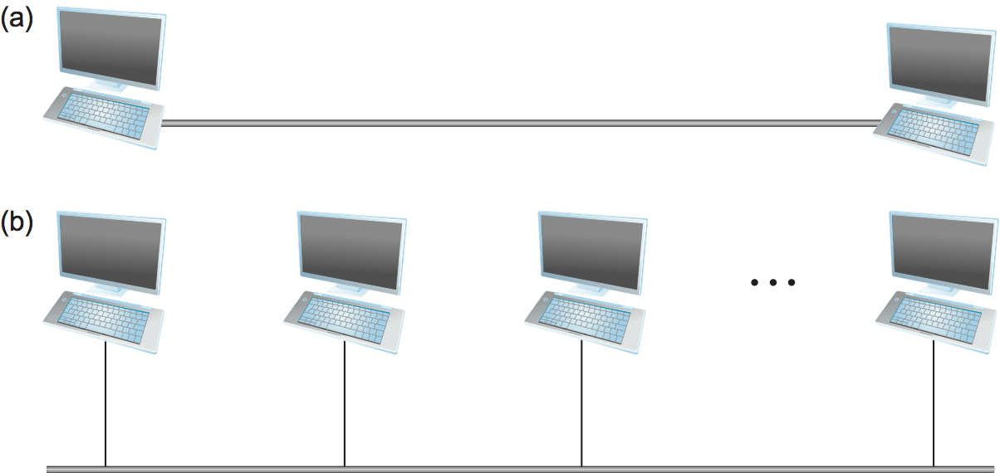
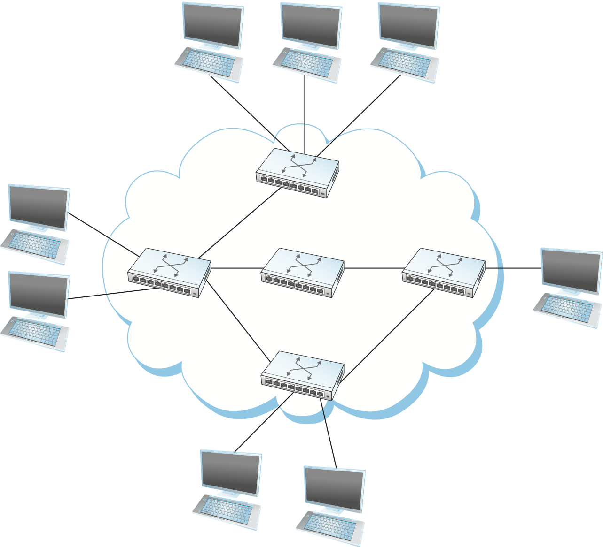
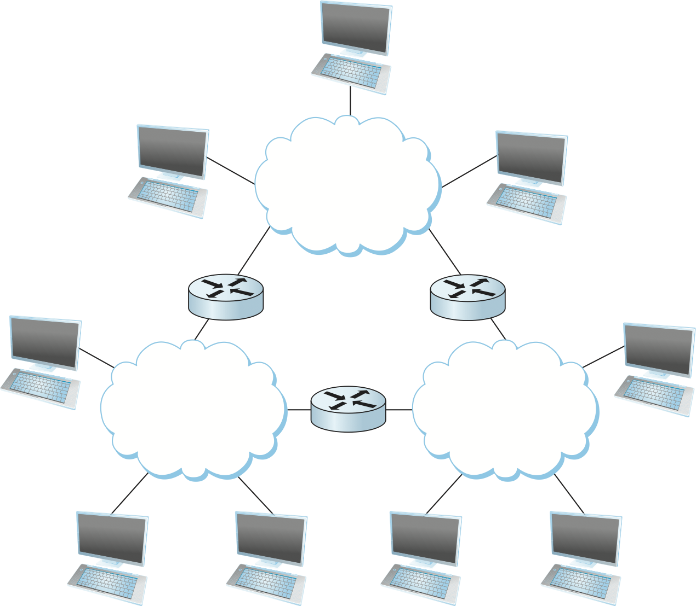

# Сеть — это...
## Определение сети
Прежде чем приступать к изучению и проектированию компьютерных сетей, следует точно определиться с тем, что такое компьютерная сеть.

Энциклопедическое определение компьютерной сети звучит так:

**Компьютерная сеть — это компьютерная система, которая соединяет множество компьютеров и периферийных устройств, обладающих независимыми функциями и расположенных в разных географических точках, с помощью линий связи и коммуникационного оборудования.**

Когда-то термин «сеть» означал набор последовательных линий, используемых для подключения простых терминалов к мэйнфреймам. Другие важные сети включают в себя телефонную сеть и сеть кабельного телевидения, используемую для распространения видеосигналов. Главное, что объединяет эти сети, — это специализация на обработке одного конкретного типа данных (нажатия клавиш, голос или видео) и, как правило, подключение к специализированным устройствам (терминалам, портативным приёмникам и телевизорам).
Чем компьютерная сеть отличается от других типов сетей? Наиболее важной характеристикой компьютерной сети является её универсальность. Компьютерные сети строятся в основном на основе универсального программируемого оборудования и не оптимизированы для конкретного приложения, такого как телефонные звонки или передача телевизионных сигналов. Вместо этого они способны передавать множество различных типов данных и поддерживают широкий и постоянно растущий спектр приложений. Сегодняшние компьютерные сети практически полностью переняли функции, ранее выполняемые сетями узкого назначения.

## Узлы и каналы

**Узел сети (англ. node) — устройство, соединённое с другими устройствами как часть компьютерной сети.**

**Канал связи — это физическая или логическая среда, используемая для передачи данных между двумя или более узлами.**

Все компьютеры, подключённые к сети и непосредственно участвующие в сетевом взаимодействии, считаются узлами или хостами. Самую простую сеть можно представить в виде двух узлов, соединённых друг с другом напрямую. Такие физические соединения мы называем каналами. Иногда такие физические каналы ограничены парой узлов, и тогда мы называем их «точка — точка», тогда как в других случаях более двух узлов могут использовать один физический канал — такой канал называется каналом со «множественным доступом».

Если бы компьютерные сети были ограничены ситуациями, когда все узлы должны быть напрямую соединены друг с другом через общий физический канал, то либо эти сети были бы очень ограничены в количестве узлов, либо количество проводов, выходящих из каждого узла, быстро стало бы неуправляемым и очень дорогим. 

Но соединение между двумя узлами не обязательно означает прямое физическое соединение. Мы можем достигнуть косвенного, то есть непрямого, соединения благодаря набору «сотрудничающих» друг с другом узлов.

Мы можем подключить к какому-то узлу сразу несколько физических каналов (как минимум два) и запустить на нём специальное программное обеспечение, которое пересылает данные, полученные по одному каналу, через другой. Теперь этот узел сможет «помогать» общаться узлам, которые не имеют прямого подключения. 

## Сети коммутации каналов и пакетов

Если мы систематически организуем оконечные и транзитные узлы в сеть, то сформируем таким образом коммутируемую сеть.
Коммутируемые сети бывают двух основных видов:
- Сети на основе коммутации каналов
- Сети на основе коммутации пакетов

Примером первого типа могут служить аналоговые телефонные сети. В сетях с коммутацией каналов перед началом передачи данных между оконечными узлами по всей цепочке транзитных узлов резервируется и закрепляется выделенный физический канал на всё время сеанса. Главный минус такого подхода — это неэффективное использование ресурсов. Пока мы занимаем физический канал — никто другой им воспользоваться не может. 

Второй вариант — сеть на основе коммутации пакетов — используется в подавляющем большинстве компьютерных сетей и будет для нас основным объектом изучения. Главной особенностью пакетных сетей является то, что узлы в такой сети делят информацию на отдельные кусочки (дискретные блоки, пакеты). Думайте об этом как о длинном письме на нескольких листах, каждый из которых вы отправляете отдельным конвертом. Такие дискретные блоки мы называем пакетами или сообщениями. 

В сетях с коммутацией пакетов обычно используется стратегия, называемая «store-and-forward». Каждый узел в такой сети сначала получает полный пакет по одному из своих каналов, сохраняет его во внутренней памяти, а затем пересылает полный пакет следующему узлу. 

<!-- Записать определение сети с коммутацией каналов и пакетов -->

## Оконечные и транзитные узлы

Теперь мы можем глобально разделить узлы на два вида:
- Оконечные узлы. Традиционно их называют хостами. Это тот тип узлов, с которым обычные пользователи знакомы лучше всего. Ноутбуки, смартфоны, планшеты — всё это обычно является оконечным устройством. Оконечные устройства обычно являются либо отправителем (источником), либо получателем (назначением). На картинке они находятся вне облака. 
- Промежуточные или транзитные узлы. Эти узлы своими функциями реализуют нам сеть. Они подключают оконечные или другие промежуточные узлы к сети, объединяют отдельные сети. Такие устройства обеспечивают подключение и прохождение потоков данных по сети. На рисунке они внутри облака.

<!-- Записать определение типов узлов -->

Символ облака имеет важное значение в контексте компьютерных сетей. В общем случае мы используем облако, чтобы обозначить любой тип сети, будь то соединение «точка — точка», сеть с множественным доступом или коммутируемая сеть. 

На рисунке при помощи облака изображена коммутируемая сеть, в которой оконечные узлы (они же хосты) могут получить косвенный доступ друг к другу через транзитные узлы. Такие транзитные узлы обычно называют коммутаторами (или свичами, от англ. switch).

Второй способ, при котором оконечные узлы могут быть косвенно соединены, изображён на рисунке ниже:

В этой ситуации несколько независимых сетей (облаков) соединены для формирования интерсети, или просто — интернета. Транзитный узел, подключённый к двум или более отдельным сетям, обычно называют маршрутизатором или шлюзом — они пересылают сообщения из одной сети в другую.

## Адреса

Тот факт, что набор хостов напрямую или косвенно подключён друг к другу, ещё не означает, что мы успешно обеспечили связь между хостами. Последним требованием является то, что каждый узел в сети должен иметь возможность указать, с каким из других узлов он хочет общаться. Это достигается путём присвоения каждому узлу адреса. 

Адрес представляет собой число или номер, записанный в виде строки из байтов, которая однозначно идентифицирует узел. То есть узлы могут использовать адрес узла, чтобы отличить его от других узлов. Когда исходный узел хочет, чтобы сеть доставила сообщение определённому получателю, он указывает адрес этого узла-получателя в сообщении. 

Если отправляющий и принимающий узлы не подключены напрямую, то коммутаторы и маршрутизаторы сети используют этот адрес для принятия решения о том, как перенаправить сообщение к узлу-получателю. Процесс определения того, как перенаправить сообщение к узлу-получателю на основе его адреса, называется маршрутизацией. 

# Классы приложений

Рассмотрим некоторые классы приложений, которые работают поверх компьютерных сетей. 

Всемирная паутина (World Wide Web) — это интернет-приложение, которое превратило Интернет и компьютерные сети в целом из малоизвестного инструмента, использовавшегося в основном учёными и инженерами, в массовое явление, каким оно является сегодня. Сама по себе паутина стала настолько мощной платформой, что многие путают её с Интернетом.

В своём базовом виде Web представляет интуитивно простой интерфейс. Пользователи просматривают страницы с текстовыми и графическими объектами и кликают на объекты, о которых хотят узнать больше, после чего появляется соответствующая новая страница. 

При этом большинство веб-пользователей не подозревают, что при нажатии всего на один такой объект в Интернете может быть передано более десятка сообщений, а если страница сложная и содержит множество объектов — гораздо больше. Этот обмен сообщениями включает до шести сообщений для преобразования имени сервера в его IP-адрес, три сообщения для установления соединения по протоколу управления передачей (Transmission Control Protocol, TCP) между вашим браузером и этим сервером, четыре сообщения для отправки браузером HTTP-запроса «GET» и ответа сервера с запрошенной страницей (а также для подтверждения получения этого сообщения каждой из сторон) и четыре сообщения для разрыва TCP-соединения. Разумеется, сюда не входят миллионы сообщений, которыми интернет-узлы обмениваются в течение дня только для того, чтобы дать знать друг другу о своём существовании, готовности обслуживать веб-страницы, переводить имена в адреса и пересылать сообщения к конечному пункту назначения.

Другим распространённым классом интернет-приложений является доставка «потокового» (streaming) аудио и видео. Эту технологию используют такие сервисы, как видео по запросу (video on demand) и интернет-радио. Хотя для запуска потокового сеанса мы часто заходим на какой-либо веб-сайт, доставка аудио и видео имеет важные отличия от загрузки простой веб-страницы с текстом и изображениями. Например, вы зачастую не хотите загружать весь видеофайл целиком (процесс, который может занять несколько минут), прежде чем посмотреть первую сцену. Потоковое аудио и видео подразумевает более своевременную передачу сообщений от отправителя к получателю, при этом получатель воспроизводит видео или аудио практически по мере его поступления.

Обратите внимание: разница между потоковыми приложениями и более традиционной доставкой текста, графики и статических изображений заключается в том, что люди воспринимают аудио- и видеопотоки непрерывно, и прерывистость — в виде пропадания звука или зависания видео — недопустима. Напротив, обычную (непотоковую) страницу можно доставлять и читать частями. Это различие влияет на то, как сеть поддерживает данные классы приложений.

Несколько иным классом приложений является аудио и видео *в реальном времени* (real-time). Эти приложения имеют значительно более строгие временные ограничения, чем потоковые приложения. При использовании приложений IP-телефонии (Voice-over-IP), таких как Skype, или систем видео-конференц-связи взаимодействие между участниками должно происходить своевременно. Когда человек на одном конце делает жест, это действие должно быть отображено на другом конце как можно быстрее.

Когда один человек пытается перебить другого, собеседник должен услышать это как можно скорее и решить, уступить ли слово или продолжать говорить поверх прерывавшего. Слишком большая задержка в такой среде делает систему непригодной для использования. Сравните это с видео по запросу, где задержка в несколько секунд с момента запуска пользователем видео до отображения первого кадра всё равно считается приемлемой. Кроме того, интерактивные приложения обычно предполагают двунаправленные потоки аудио и/или видео, тогда как потоковое приложение чаще всего передаёт видео или аудио только в одном направлении.

Хотя это всего лишь два примера, загрузка веб-страниц и участие в видеоконференции демонстрируют разнообразие приложений, которые можно построить поверх Интернета, и намекают на сложность его архитектуры.

Пока этого краткого обзора нескольких типичных приложений будет достаточно, чтобы начать рассмотрение проблем, которые необходимо решить для построения сети, поддерживающей подобное разнообразие приложений.