# Основы Cisco Packet Tracer

Cisco Packet Tracer - это эмулятор сети, созданный компанией Cisco. Данное приложение позволяет строить сети на разнообразном оборудовании в произвольных топологиях с поддержкой разных протоколов.

## Установка Cisco Packet Tracer 

Cisco Packet Tracer доступен для скачивания на [сайте](https://netacad.sadlab.su/). Установка не требует особых инструкций. 

После установки требуется запретить приложению доступ к сети средствами встроенного Firewall'а ОС. В случае Windows bat-скриптом (можно скачать там же, где и exe-шник для установки)

```
@echo OFF
rem This bat file check if PacketTracer is installed and add firewall rule for block any trafiic from application
net session >nul 2>&1
if %errorLevel% == 0 (
		echo Success: Administrative permissions confirmed.
) else (
        echo Error: Try again with Administrator access!
		pause
		exit
)
echo Firewall must be turn on for this PT hack:
netsh advfirewall show allprofiles state
IF EXIST "%PT7HOME%\bin\PacketTracer7.exe" netsh advfirewall firewall add rule name="PT7_BlockTraffic" dir=out program="%PT7HOME%\bin\PacketTracer7.exe" profile=any action=block
IF EXIST "%PT8HOME%\bin\PacketTracer.exe" netsh advfirewall firewall add rule name="PT8_BlockTraffic" dir=out program="%PT8HOME%\bin\PacketTracer.exe" profile=any action=block
pause
```

Или через графический интерфейс по [инструкции](https://netacad.schelcol.ru/soft/%D0%98%D0%BD%D1%81%D1%82%D1%80%D1%83%D0%BA%D1%86%D0%B8%D1%8F.pdf).

## Интерфейс Cisco Packet Tracer

В интерфейсе Cisco Packet Tracert нас будут интересовать следующие элементы:
1. Рабочее пространство. Тут будут размещаться сетевые устройства. 
2. Переключатель режима курсора. Select (Esc) - выделение объектов на рабочем пространстве, режим по умолчанию, Delete (Del) - удаляет элемент выбранный элемент из рабочего пространства.
3. Панель с группами сетевых устройств и линиями связи. Нам в первую очередь будут интересны *Network Devices* - *Routers* и *Switches*, а также *End Devices* и *Connetctions*.
4. Сами устройства, здесь содержатся всевозможные коммутаторы, узлы, точки доступа, проводники и так далее.
5. Переключатель между реальным режимом (Real-Time) и режимом симуляции. Режим симуляции "останавливает время" в виртуальной сети и позволяет пошагово проследить путь каждого пакета, и его содержимое, а так же отследить реакцию устройств на пакеты. 


### Виды оборудования и линий связи

Посмотрим подробнее на оборудование и линии связи в Cisco Packet Tracer:

1. Маршрутизаторы. Маршрутизаторы используется для поиска оптимального маршрута передачи данных на основании специальных алгоритмов маршрутизации, например выбор маршрута (пути) с наименьшим числом транзитных узлов. Работают на сетевом уровне модели OSI.

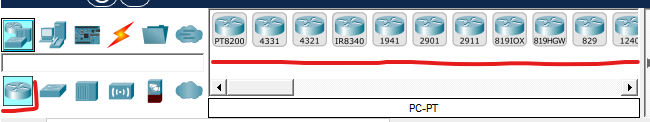

2. Коммутаторы. Коммутаторы - это устройства, работающие на канальном уровне модели OSI и предназначенные для объединения нескольких узлов в пределах одного или нескольких сегментов сети. Передаёт пакеты коммутатор на основании внутренней таблицы - таблицы коммутации, следовательно трафик идёт только на тот MAC-адрес, которому он предназначается, а не повторяется на всех портах (как на концентраторе).

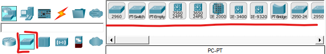

3. Концентраторы. Концентратор повторяет пакет, принятый на одном порту на всех остальных портах. 

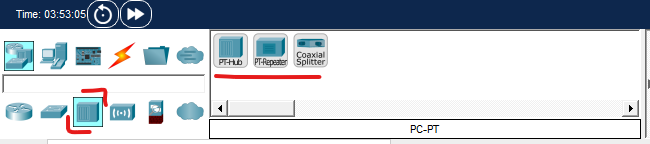

4. Беспроводные устройства. Беспроводные технологии Wi-Fi и сети на их основе. Включает в себя точки доступа. 

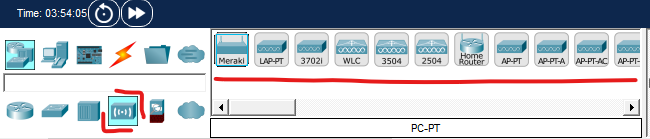

5. Сетевая безопасность. Включает в себя межсетевые экраны.

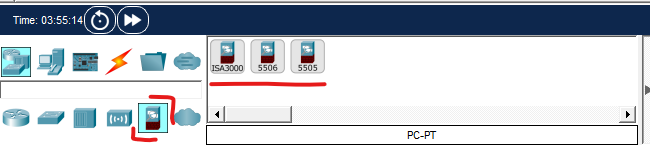

6. Оконечные устройства. Тут представлены различные оконечные устройства, такие как ПК, серверы, принтеры, VoIP устройства и т.д.

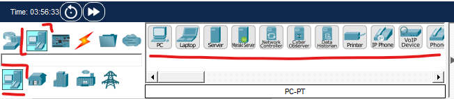

7. Линии связи. С помощью этих компонентов создаются соединения узлов в единую схему. Packet Tracer поддерживает широкий диапазон сетевых соединений. Каждый тип кабеля может быть соединен лишь с определенными типами интерфейсов.

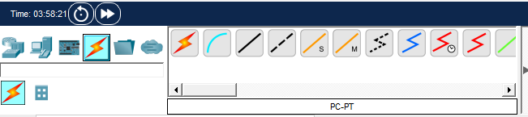

### Добавление устройств, настройки устройства

Устройства в Cisco Packet Tracer добавляются по принципу Drag-and-Drop. Чтобы добавить устройство на рабочее пространство, нужно выбрать соответсвующую категорию устройств и перетащить иконку нужного устройства на рабочее пространство.

После добавления устройства на рабочее пространство, нажатием на его иконку можно открыть настройки устройства. Настройки устройства отрываются в отдельно интерфейсном окне и сворачиваются при нажатии мышки за пределами этого окна.

Настройки устройства содержат несколько вкладок, количество и название которых могут отличаться в зависимости от типа устройства. 

Работая с сетевыми устройствами, такими как маршрутизаторы и коммутаторы, чаще всего вы будете использовать вкладку *CLI*, эмулирующую *консольное* подключение к устройству.
Посмотреть внешний вид устройства, а также изменить его физическую комплектацию (добавить, удалить или заменить модули) можно во вкладке *Physical*. 

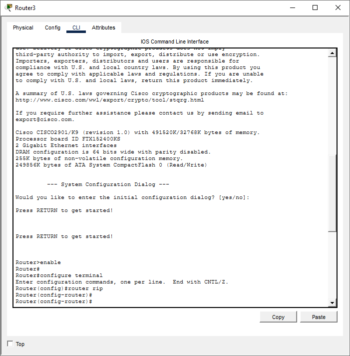

Настройки оконечных устройств, таких как ПК и серверы содержат вкладку *Desktop*, эмулирующую базовые приложения, такие как сетевые настройки, терминал, Web-браузер, почта, SSH/Telnet клиент и т.д.

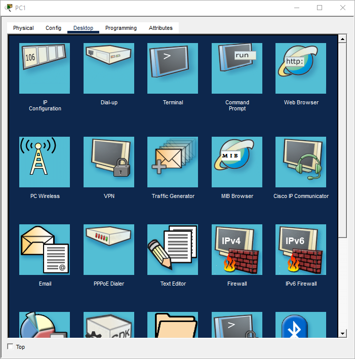

Также настройки устройства *Server* содержат вкладку *Services* в которой можно посмотреть настройки различных серверных приложений, например HTTP сервера или сервера DHCP.

### Соединение устройств

Packet Tracer предоставляет широкий набор соединительных линий. 

|Icon|Name|Description|
|---|---|---|
|        |Console          |Консольный кабель для подключения последовательного порта ПК к консольному порту оборудования|
||Copper Straight  |Прямой медный кабель, стандартная среда передачи для Ethernet|
|   |Copper Cross     |Кроссовый медный кабель, с распространением технологии Auto-MDIX вытеснен прямым кабелем|
|        |Fiber Single-Mode|Одномодовый оптоволоконный кабель|
|        |Fiber Multi-Mode |Многомодовый оптоволоконный кабель|

Чтобы соединить два устройства, нужно выбрать тип соединительной линии (курсор изменится на миниатюрный патч-корд). Курсором нужно нажать на устройство и выбрать интерфейс для подключения (выбранный интерфейс должен соответствовать типу соединительной линии). Затем соединительную линию нужно дотянуть до второго устройства, кликнуть на него, и выбрать ответный интерфейс. 

При наведении курса на линию всплывет подсказка с названиями подключенных интерфейсов. В зависимости от типа интерфейса на линии может отражаться её состояние (треугольниками различного цвета).

### Режим симуляции

Режим симуляции - это мощнейший инструмент Packet Tracer'а. Он позволяет отслеживать передачу всех пакетов, интерактивно исследовать их содержимое, а также отлавливать состояния устройств, которые в обычном режиме протекают крайне быстро.

Перейти в режим симуляции можно нажав на соответствующую кнопку в правом нижнем углу интерфейса или комбинацией клавиш *Shift+S*. Обратно в режим реального времени можно перейти комбинацией *Shift+R*.

При переходе в режим симуляции открывается новое окно: *Simulation Panel*. Панель симуляции содержит:
1. Список событий. Тут перечисляются все передаваемые PDU в каждый момент времени. По нажатию на событие можно открыть любой PDU и рассмотреть его подробно. 
2. Кнопки управления проигрыванием. Кнопки вперед и назад позволяют перелистывать события, кнопка Play\Pause проиграть события без остановки (с небольшой паузой между событиями) и остановить проигрывание. 
3. Фильтры событий. При большом количестве работающих протоколов и приложений может происходить очень много событий. Чтобы убрать визуальный шум и сосредоточиться только на нужной информации можно настроить фильтры событий.
4. Сброс симуляции. Эта кнопка очищает список событий, но не отменяет факт передачи пакетов и не отматывает состояние устроств.

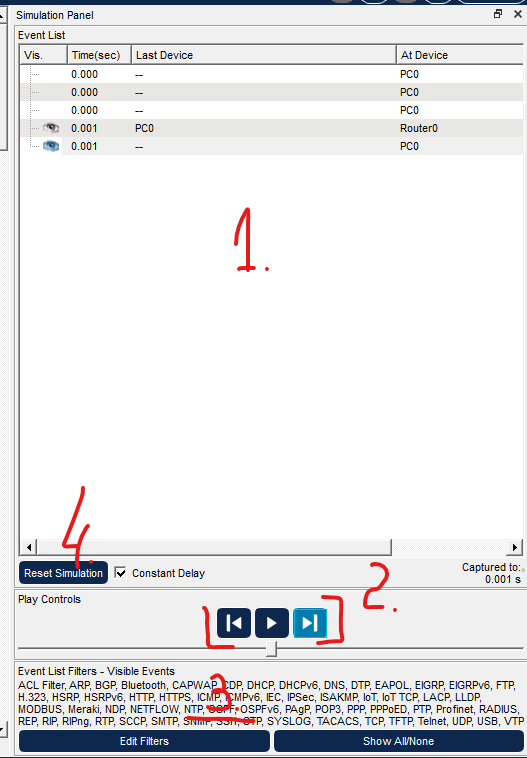

# Cisco IOS

Компания Cisco использует на своём сетевом оборудовании несколько основных операционных систем, включая:
- Cisco IOS - самая известная и классическая система.
- Cisco IOS XE - современная версия IOS работающая поверх ядра Linux. Для начинающих специалистов разницам между IOS и IOS XE нет.
- Cisco NX-OS - система, работающая на коммутаторах серии Nexus, предназначенных для центров обработки данных. В базовом функционале похожа на IOS.
- Cisco IOS XR - специализированная модульная ОС для крупных магистральных ОС и маршрутизаторов операторского класса. 
- Cisco ASA - ПО для межсетевых экранов.

Packet Tracer симулирует функционал Cisco IOS на коммутаторах и маршрутизаторах. Функционал Cisco IOS внутри Packet Tracer урезан, но достаточно обширен для изучения самых основ.

Для знакомства с основами Cisco IOS и Packet Tracer создадим простейшую топологию: два ПК, коммутатор 2960 и маршрутизатор 2901. 

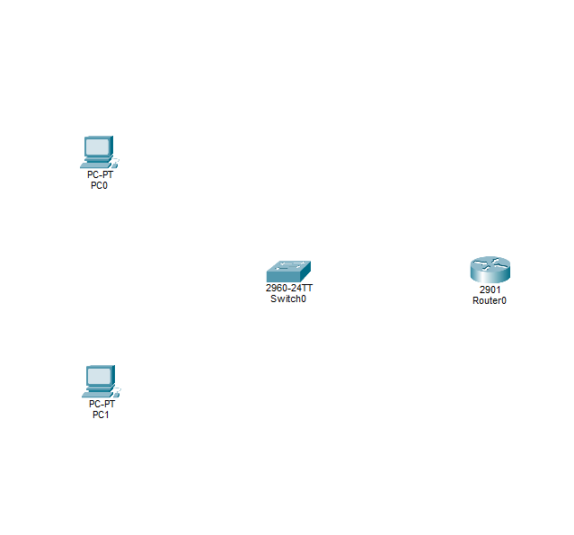

Теперь соединим подключим все устройства прямым медным кабелем с коммутатором:

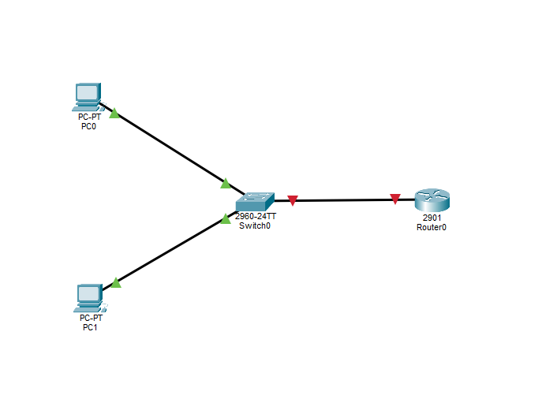

На всех линиях Ethernet в Cisco Packet Tracer есть цветные индикаторы, означающие текущее состояние канала (в реальной жизни это делают LED индикаторы на интерфейсах):
- Зеленый - линк активен физически и готов к передаче данных.
- Желтый - линк активен физически, но пока не может передавать данные (в процессе согласования параметров, или "логически" выключен по служебным причинам).
- Красный - линк неактивен физически.

Когда мы соединяем ПК с коммутатором мы можем наблюдать следующую картину: индикатор со стороны ПК почти сразу загорается зеленым, а со стороны коммутатора некоторое время горит желтым. Так происходит, потому что коммутатор, прежде чем полностью включить канал, проверяет, не помешает ли этот канал бесперебойной работе сети (в дальнейшем мы будем подробно разбирать, что именно делает коммутатор). 

Тем временем линк между коммутатором и маршрутизатором, сколько бы мы не ждали, будет гореть красным. Дело в том, что на маршрутизаторах под управление Cisco IOS по умолчанию все интерфейсы выключены. Чтобы это исправить нужно подключиться к включенному маршрутизатору и произвести начальную настройку.

Но прежде чем приступать к настройке оборудования, давайте убедимся в том, что наша сеть уже минимально работоспособна. Для этого настроим IP адреса на интерфейсах ПК, а затем воспользуемся утилитой **ping**. IP-адрес на ПК настраивается во вкладке `Desktop`, в приложении `IP Configuration`.

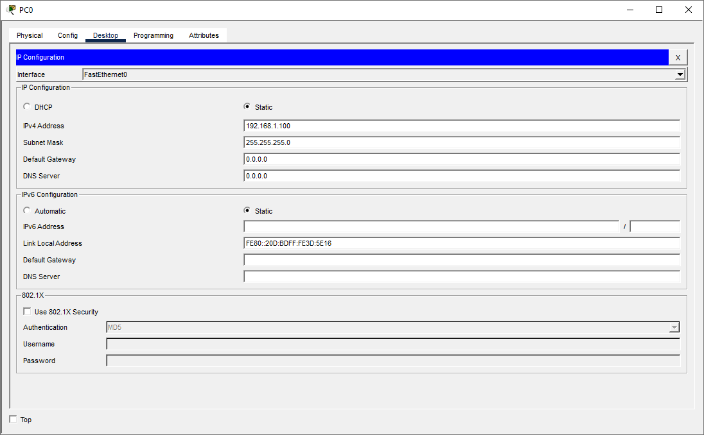

Проверяем, что ПК "видят" друг друга утилитой `ping`:

```
C:\>
C:\>ping 192.168.1.101

Pinging 192.168.1.101 with 32 bytes of data:

Reply from 192.168.1.101: bytes=32 time<1ms TTL=128
Reply from 192.168.1.101: bytes=32 time<1ms TTL=128
Reply from 192.168.1.101: bytes=32 time<1ms TTL=128
Reply from 192.168.1.101: bytes=32 time<1ms TTL=128

Ping statistics for 192.168.1.101:
    Packets: Sent = 4, Received = 4, Lost = 0 (0% loss),
Approximate round trip times in milli-seconds:
    Minimum = 0ms, Maximum = 0ms, Average = 0ms

C:\>
```

## Доступ к Cisco IOS

Cisco IOS управляется через CLI. Получить доступ к CLI можно:
- Через Console - специальный интерфейс на устройстве для локального подключения, обычно голубого цвета. Консольный порт подключается в последовательный интерфейс ПК, на ПК запускается программа эмулятор терминала. В Cisco Packet Tracer, чтобы получить доступ к Console устройства, нужно открыть его настройки и перейти во вкладку CLI. Кроме этого имеется возможность эмулировать подключение консолью, если соединить ПК и устройство консольным кабелем, и запустить на ПК соответствующую программу.
- Удаленный доступ с помощью протоколов SSH и Telnet. 

В норме администратор управляет сетевым устройствами удаленно, но когда новое устройство запускается впервые, оно зачастую не имеет настроек для удаленного подключения. В таком случае приходится пользоваться консольными интерфейсами. Так и поступим: соединим консольным кабелем маршрутизатор и обычный ПК. Затем соединим порт RS232 ПК и порт Console маршрутизатора консольным кабелем.

Реализация консольного подключения может отличаться от вендора к вендору. Это может быть разъём 8P8C, USB, DB-9 со стороны оборудования и DB-9 (COM-порт) или USB со стороны ПК. Современные ПК, особенно ноутбуки, зачастую не имеют COM-порта. В таком случае используются USB-to-COM конвертеры.

Теперь во вкладке Desktop ПК откроем приложение Terminal и нажмём ОК. Откроется эмулятор терминала в котором мы получим доступ к CLI маршрутизатора. Это такой визард, позволяющий шаг за шагом настроить основные параметры устройства (hostname, пароли, интерфейсы). Но нам это неинтересно, поэтому отвечаем `no` и видим приглашение.

## Режимы доступа к Cisco IOS

По соображениям безопасности Cisco IOS использует два отдельных командных режима:

- Пользовательский режим EXEC - это режим ограниченных возможностей, в нём доступны только базовые операции мониторинга и недоступно изменение конфигурации устройства.
- Привилегированный режим EXEC - это режим для администратора устройства. Конфигурация устройства доступна только из этого режима.

Понять в каком режиме вы находитесь можно по приглашению к вводу. Если приглашение заканчивается символом **>** - это пользовательский режим, если **#** - привилегированный.

```
Switch>
или
Router>
```

```
Switch#
или
Router#
```

Чтобы перейти в привилегированный режим используется команда `enable`, чтобы выйти из него `disable`.

```
Router> enable
Router# disable
Rotuer>
```

Доступ к привилегированному режиму обычно защищается паролем.

Чтобы начать настраивать оборудование, из режима привилегированного доступа нужно перейти в режим глобальной конфигурации.

Попасть в режим глобальной конфигурации можно командой `configure terminal`. Режим глобальной конфигурации можно определить по командной строке:

```
Router# configure terminal
Router(config)#
```

В режиме глобальной конфигурации доступны команды, влияющие на работу устройства в целом. Из режима глобальной конфигурации можно перейти в другие, более специализированные режимы конфигурации. Например, в настройки конкретного интерфейса или протокола. Тогда приглашение к вводу будет меняться в зависимости от текущего режима:

```
Router# configure terminal
Router(config)# interface FastEthernet 0/0
Router(config-if)# 
```

Чтобы выйти из режима подконфигурации (вернуться на один уровень вверх) используйте команду `exit`:

```
Router# configure terminal
Router(config)# interface FastEthernet 0/0
Router(config-if)# exit
Router(config)#
```

Чтобы выйти полностью покинуть режим конфигурации и вернуться в привилегированный режим используйте команду `end`:

```
Router# configure terminal
Router(config)# interface FastEthernet 0/0
Router(config-if)# end
Router#
```

Кроме команды `end` можно использовать сочетания клавиш `Ctrl+Z` и `Ctrl+C`. Между двумя этими вариантами есть разница:
- Комбинация `Ctrl+Z` равносильна нажатию клавиши Enter и вводу команды End. То есть если перед нажатием комбинации вы ввели какую-то команду - сначала она применится, и только потом вы покините режим конфигурации.
- Комбинация `Ctrl+C` не применяет введенную команду, а просто покидает режим конфигурации.

## Структура команд в Cisco IOS

Базовая структура команд в Cisco IOS состоит из:
1. Самой команды.
2. Ключевых слов - параметров, определенных в самой команде.
3. Аргументов - значений и переменных, вводимых пользователем.

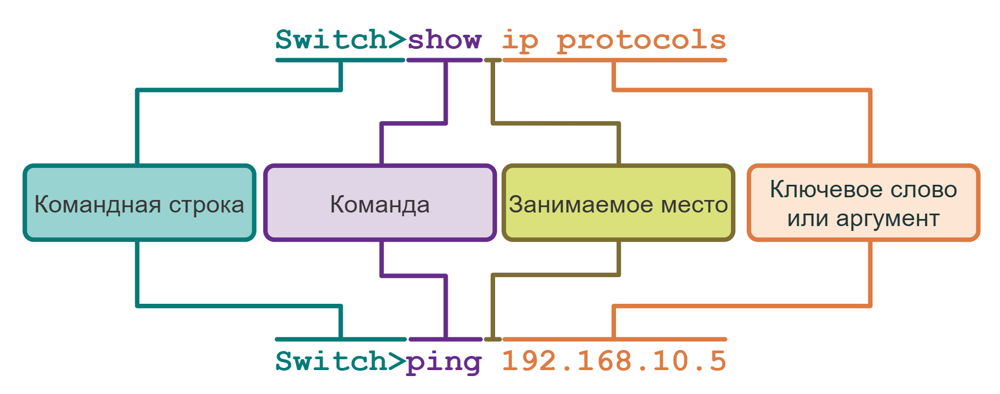

Для команды могут требовать один или несколько аргументов. Чтобы определить, какие ключевые слова и аргументы нужны для команды, требуется обратиться к её синтаксису. 

В документации к Cisco IOS команды обычно описываются по одному шаблону:

| Условное обозначение | Описание |
| :--- | :--- |
| **полужирный** | Вводимые команды и ключевые слова отображаются полужирным шрифтом, как показано на рисунке. |
| *курсив* | Курсивом отображаются аргументы, для которых нужно указать значения. |
| `[x]` | В квадратных скобках отображаются дополнительные элементы (ключевое слово или аргумент). |
| `{x}` | В фигурных скобках отображаются обязательные элементы (ключевое слово или аргумент). |
| `[x {y \| z }]` | Фигурные скобки и вертикальные линии в квадратных скобках означают, что необходимо выбрать дополнительный элемент. Пробелы используются для четкого разграничения частей команды. |

В Cisco IOS предусмотрена контекстная справочная информация по командам.

Контекстная справка позволяет быстро найти ответы на следующие вопросы:

- Какие команды доступны в каждом командном режиме?
- Какие команды начинаются с определенных символов или группы символов?
- Какие аргументы и ключевые слова доступны для определенных команд?

Для доступа к контекстной справке просто введите вопросительный знак **?** в командной строке CLI.

Команды и ключевые слова в Cisco IOS можно сокращать до минимального количества символов, который однозначно идентифицирует выбранную команду и слово. Например, команду `configure terminal` обычно сокращают до простого `conf t`. А вот сокращение `con t` использовать уже нельзя, потому что с символов `con` начинается сразу несколько команд. 

Кроме этого Cisco IOS поддерживает набор горячих клавиш, которые сильно упрощают процесс ввода команд. 

| Сочетание клавиш | Описание |
| :--- | :--- |
| `Tab` | Завершает частично введенную команду. |
| `Backspace` | Удаляет один символ слева от курсора. |
| `Ctrl-D` | Удаляет символ, на котором стоит курсор. |
| `Ctrl-K` | Удаляет все символы от курсора до конца командной строки. |
| `Esc D` | Удаляет все символы от курсора до конца слова. |
| `Ctrl+U` или `Ctrl+x` | Удаляет все символы от курсора до начала командной строки. |
| `Ctrl-W` | Удаляет слово слева от курсора. |
| `Ctrl-A` | Перемещает курсор в начало строки. |
| Клавиша со стрелкой влево или `Ctrl+B` | Перемещает курсор на один символ влево. |
| `Esc B` | Перемещает курсор на одно слово назад влево. |
| `Esc F` | Перемещает курсор на одно слово вперед вправо. |
| Клавиша со стрелкой вправо или `Ctrl+F` | Перемещает курсор на один символ вправо. |
| `Ctrl-E` | Перемещает курсор в конец командной строки. |
| Клавиша со стрелкой вверх или `Ctrl+P` | Вызывает команды в буфере истории, начиная с самых последних команд. |
| `Ctrl+R` или `Ctrl+I` или `Ctrl+L` | Заново открывает командную строку системы после получения сообщения из консоли. |

Иногда вывод команд Cisco IOS не помещается на один экран терминала. Тогда IOS отобразит приглашение `--More--`. В таком случае нажатие клавиши Enter отобразил следующую строку, нажатие Пробела - следующий экран, любая другая клавиша закрывает вывод. 

Кроме этого существуют комбинации прерывания. Две их них (`Ctrl+Z` и `Ctrl+С`) мы уже обсудили. Важно знать последнюю - `Ctrl+Shift+6` - универсальная комбинация прерывания, которую используют, чтобы прерывать выполнение различных команд, таких как DNS-запрос, трассировка маршрута или Ping.

## Базовая настройка Cisco IOS

Первое, что стоит сделать, когда вы первый раз подключаетесь на любое устройство под управление Cisco IOS:
1. Отключить DNS-трансляцию. По умолчанию, каждый раз, когда вы вводите команду, которая не является валидной командой Cisco IOS, устройство считает, что это доменное имя и пытается его отрезолвить. Ошибаться вы будете и часто. Так что лучше сразу отключить эту функцию.
2. Настроить синхронный вывод логов в консоль. Устройства по умолчанию отправляют системные сообщения и лог-оповещения в консоль. Если в этот момент вы вводите команду, то сообщение появится прямо посреди вашей строчки. Из-за этого строка ввода визуально ломается и приходится перепечатывать команду заново. С настроенным синхронным логом устройство дождется, пока вы закончите ввод, аккуратно выведет лог на экран, а затем заново нарисует уже введенную часть команды с новой строки. 

Первое делается командой `no ip domain-lookup` в режиме глобальной конфигурации:

```
Router#conf t
Enter configuration commands, one per line.  End with CNTL/Z.
Router(config)#no ip domain-lookup
```

Второе в режиме настройки консольного интерфейса:

```
Router(config)#line console 0
Router(config-line)#loggin synchronous 
Router(config-line)#end
Router#
```

Посмотрите подробнее как настраивается консольное подключение:
1. Первым делом мы вводим команду `line`, которая используется для перехода в настройки линии управления устройством.
2. Затем идёт обязательное ключевое слово `console` - оно указывает линию какого типа мы хотим настраивать. `console` не единственный вариант, другие можно посмотреть вызвав контекстную справку **?**:
```
Router(config)#line ?
  <2-499>  First Line number - уникальный номер линии в пределах всего устройства
  aux      Auxiliary line - устаревший вариант подключения через телефонную линию
  console  Primary terminal line - наш консольный интерфейс
  tty      Terminal controller - устаревшие последовательные интерфейсы для подключения терминалов
  vty      Virtual terminal - виртуальные терминалы (используются для подключений по SSH и Telnet)
  x/y/z    Slot/Subslot/Port for Modems - устаревшее подключение через модемы
```
3. В конце мы указываем аргумент в виде номера конкретного консольного интерфейса, который собираемся настраивать. Консольных интерфейсов редко больше одного и нумеруются они с 0. Но в случае, например, `vty` количество линий может отличаться:
```
Router(config)#line vty ?
  <0-15>  First Line number
```

В итоге мы попадаем в режим подконфигурации (это видно по изменившемуся приглашению), где вводим нужную нам команду. 

### Настройка имени устройства

Первая реальная задача конфигурации на любом устройстве - дать ему уникальное имя. У всех устройств есть имя по умолчанию, например `Switch` или `Router`. Оставлять их такими нельзя, всем сетевым устройствам следует присваивать уникальные (в пределах вашей зоны ответственности). 

Имена для устройств следует выбирать осмыслено, в рамках организации должно существовать общее правило именования устройств (name convention), чтобы их проще было идентифицировать и документировать. 
Например, имя должно содержать тип устройства, место установки, порядковый номер и так далее. В рамках лабораторных работ коммутаторы обычно обозначают как `SW№`, а маршрутизаторы как `R№`. 

Кроме того имя устройства должно соответствовать ограничениям ОС. Для Cisco IOS это:
- Минимальная длина 2 символа, максимальная 63.
- Разрешенные символы Letters (A-Z, a-z), numbers (0-9), and hyphens (-).
- Начинаться и заканчиваться имя должно буквой или цифрой.

Настраивается имя устройства в режиме глобальной конфигурации командой `hostname`:

```
Switch# configure terminal
Switch(config)# hostname Sw-Floor-1
Sw-Floor-1(config)#
```

### Настройка паролей 

Опустим рассуждения на тему требований к паролям, вместо этого договоримся, что все пароли в рамках лабораторных работ будут `cisco`.

Первым делом настроим пароль для консольного подключения. Для этого перейдите в настройки консольного подключения и задайте пароль командой **password**, затем включите вход по паролю командой **login**.

```
Sw-Floor-1# configure terminal 
Sw-Floor-1(config)# line console 0 
Sw-Floor-1(config-line)# password cisco 
Sw-Floor-1(config-line)# login
Sw-Floor-1#
```

Используйте команду `show running-config` привилегированного режима EXEC, чтобы посмотреть файл текущей конфигурации. Найдите в нём секцию настроек консольного порта `line con 0`. На текущий момент, пароли, заданные с использованием ключевого слова `password` хранятся в открытом виде. Чтобы включить шифрование паролей, используйте команду **service password-encryption** в режиме глобальной конфигурации. Теперь все пароли в конфигурации будут храниться в виде хешей. 

Теперь защитим паролем доступ к привилегированному режиму EXEC. Для этого в режиме глобальной конфигурации используйте команду **enable secret**:

```
Sw-Floor-1# configure terminal
Sw-Floor-1(config)# enable secret cisco
Sw-Floor-1(config)# exit
Sw-Floor-1#
```

Пароли, настраиваемые при помощи команд `secret` хранятся в зашифрованном виде всегда. 

### Файлы конфигурации

После изменения настроек устройства их следует сохранить. Дело в том, что конфигурация устройств под управлением Cisco IOS состоит из двух файлов:
- startup-config - Это сохраненный файл конфигурации, который хранится в NVRAM. Он содержит все команды, которые будут использоваться при загрузке или перезагрузке. Содержимое Флеш-накопителя не теряется при выключении питания устройства.
- running-config - Это файл текущей конфигурации, хранится в оперативной памяти (RAM). Он отражает текущую конфигурацию. Изменения текущей конфигурации незамедлительно влияют на работу устройства Cisco. ОЗУ — энергозависимая память. После отключения питания или перезагрузки устройства ОЗУ теряет все свое содержимое.

Как было сказано выше, команда привилегированного режима EXEC `show running-config` используется для просмотра текущей конфигурации. Для просмотра файла загрузочной конфигурации используйте команду привилегированного режима EXEC `show startup-config`.

Чтобы сохранить изменения текущей конфигурации в файле загрузочной конфигурации, используйте команду привилегированного режима EXEC **copy running-config startup-config**.

Иногда внесенные изменения могут не дать желаемого результата. Тогда, если они ещё не были сохранены, можно произвести обратную операцию: **copy startup-config running-config**

### Настройка IP-адресов

Для того чтобы устройства в сети могли полноценно друг с другом взаимодействовать им нужно IP-адрес. На сетевых устройствах, таких как маршрутизаторы и коммутаторы, IP-адреса задаются статически, чтобы сеть оставалась предсказуемой и управляемой.

#### Маршрутизаторы

Для начала разберем как IP-адреса настраиваются на маршрутизаторах под управлением Cisco IOS. Маршрутизаторы - это устройства, работающие на сетевом уровне модели OSI. Маршрутизаторы объединяют между собой отдельные физические сети и пересылают трафик компьютеров, которые находятся в разных сетях. Для того чтобы успешно выполнять эту задачу, маршрутизаторы подключаются отдельным интерфейсом в каждую физическую сеть и имеют IP-адрес в этой сети.

Первым делом посмотрим какие на устройстве есть интерфейсы. В привилегированном режиме EXEC введем команду `show ip interface brief`:

```
Router#show ip interface brief 
Interface              IP-Address      OK? Method Status                Protocol 
GigabitEthernet0/0     unassigned      YES unset  administratively down down 
GigabitEthernet0/1     unassigned      YES unset  administratively down down 
Vlan1                  unassigned      YES unset  administratively down down
```

Рассмотрим вывод команды подробнее. На маршрутизаторе 3 физических интерфейса (интерфейс Vlan1 виртуальный, на текущий момент он нас не интересует): GigabitEthernet0/0, GigabitEthernet0/1 и GigabitEthernet0/2. Исходя из названия, эти интерфейсы работают по технологии Ethernet. Сначала указывается Interface Type (тип интерфейса):
Типы интерфейсов обозначают технологию и скорость интерфейса:

- Fa (FastEthernet): 10/100 Мбит/с
- Gi (GigabitEthernet): 1 Гбит/с
- Te (TenGigabitEthernet): 10 Гбит/с
- Twe (TwentyFiveGigE): 25 Гбит/с
- Fo (FortyGigabitEthernet): 40 Гбит/с
- Hu (HundredGigE): 100 Гбит/с
- Loopback — виртуальный интерфейс 
- Serial — для последовательных портов.

Затем идёт номер интерфейса. Нумерация всегда начинается с 0, а сама схема обозначает физический путь от интерфейса к процессору маршрутизатора.

`[Тип] [Устройство/Слот]/[Модуль]/[Порт]`

- Номер слота/субслота (Slot/Subslot Number): Указывает на номер шасси, модуля или карты расширения, куда установлен интерфейс.
- Номер порта (Port Number): Порядковый номер конкретного порта на этом модуле или встроенном блоке.

Встроенные порты обычно находятся в слоте 0 (и сабслоте 0).

Далее идёт столбец IP-адресами интерфейсов. Сейчас на интерфейсах не настроены IP-адреса, поэтому везде указано `unassigned`, столбец `ОК?` указывает на наличие конфликтов у настроенного IP-адреса, столбец `Method` - на способ настройки. 

Столбцы `Status` и `Protocol` указывают на состояние самого интерфейса. 
- `Status` - на физическое соединение, `up` - кабель вставлен, электрический/оптический сигнал обнаружен, интерфейс включен. `down` - физический сигнал отсутствует, `administratively down` - интерфейс программно выключен.
- `Protocol` - Показывает логическое состояние передачи данных (кадров/фреймов), инкапсуляцию и обмен служебными пакетами (keepalive). `up` - канальный уровень функционирует. Кадры успешно передаются, настройки инкапсуляции и протоколов с обеих сторон совпадают. `down` - канальный уровень не работает (даже если физическое соединение есть).

Настроим IP-адрес на интерфейсе GigabitEthernet0/0. Для этого надо зайти в режим глобальной конфигурации и оттуда в режим конфигурации конкретного интерфейса командой `interface GigabitEthernet0/0`.

```
Router#conf t
Router(config)#
Router(config)#int g0/0
Router(config-if)#ip address 192.168.1.1 255.255.255.0
Router(config-if)#no shutdown
Router(config-if)#end
Router#
```

Обратите внимание на то, как использована команда `interface GigabitEthernet0/0`. Имена интерфейсов также поддаются сокращению, потому что являются ключевыми словами для команды `interface`:
IP-адрес назначается интерфейсу командой `ip` с ключевым словом `address` и двумя обязательными аргументами в виде адреса и маски сети. Маска сети обязательно записывается в десятичном виде с точками, префиксная запись не допускается.

Далее нам нужно включить интерфейс. Выключается интерфейс командой `shutdown`. Чтобы включить интерфейс, нужно отменить команду, которой он выключен. Для отмены действия команды в Cisco IOS мы повторяем команду и пишем перед ней ключевое слово `no`. Таким образом, чтобы включить интерфейс, используется команда `no shutdown`.

Снова проверим состояние интерфейсов:

```
Router#show ip interface brief 
Interface              IP-Address      OK? Method Status                Protocol 
GigabitEthernet0/0     192.168.1.1     YES manual up                    up 
GigabitEthernet0/1     unassigned      YES unset  administratively down down 
```

Теперь в выводе команды есть настроенный IP-адрес, поле Method сменило значение на `manual`. `Status` из `Protocol` перешли в `up`.

Проверим утилитой `ping`, что с маршрутизатора теперь доступны ПК:

```
R1#ping 192.168.1.101

Type escape sequence to abort.
Sending 5, 100-byte ICMP Echos to 192.168.1.101, timeout is 2 seconds:
.!!!!
Success rate is 80 percent (4/5), round-trip min/avg/max = 0/0/1 ms

R1#
```

#### Коммутаторы

Если маршрутизатору IP-адреса необходимы для выполнения его главной функции и настраиваются прямо на интерфейсах, то с коммутаторами ситуация обстоит иначе.

Главная задача коммутатора пересылать Ethernet-кадры в пределах одной "физической" сети. Решение о пересылке коммутатор принимает на основе MAC-адреса источника и назначения, и о IP-адреса как таковых ничего не знает. Более того, интерфейсы коммутатора не имеют собственного MAC-адрес (т.е. как бы не могут быть получателями unicast кадров) и работают в неразборчивом режиме, так что даже если бы мы захотели, мы бы не смогли назначить IP-адрес на интерфейс коммутатора так, как делали это с маршрутизатором. 

Проще говоря, коммутатор - это устройство работающее на канальном уровне модели OSI (L2), так что IP-адрес для непосредственного выполнения своей главной функции ему не нужны. 

И на самом деле на простейших коммутаторах, которые могут выполнять только базовую функцию, IP-адрес не настраивается. Такие коммутаторы могут называться неуправляемыми.

Но в абсолютном большинстве случаев современные коммутаторы обладают широким набором функционала и требует управления, и мониторинга. Как в таком случае быть?

Чтобы получать доступ к коммутатору по IP адрес для управления и мониторинга используются **SVI** (Switched Virtual Interface) - виртуальный сетевой интерфейс третьего уровня. Утрировано можно представить себе это так, чтобы кроме физических интерфейсов, у коммутатора есть ещё интерфейс внутри корпуса, и мы как бы подключаем мозги коммутатора к этому интерфейсу. 

SVI интерфейсы нужно создавать самому. Они создаются на коммутаторе, когда мы заходим в режим их конфигурации из глобального режима. Но на коммутаторах Cisco есть SVI интерфейс по умолчанию.

```
Switch#sh ip interface br
Interface              IP-Address      OK? Method Status                Protocol 
FastEthernet0/1        unassigned      YES manual down                  down 
FastEthernet0/2        unassigned      YES manual down                  down 
FastEthernet0/3        unassigned      YES manual down                  down 
FastEthernet0/4        unassigned      YES manual down                  down 
FastEthernet0/5        unassigned      YES manual down                  down 
FastEthernet0/6        unassigned      YES manual down                  down 
FastEthernet0/7        unassigned      YES manual down                  down 
FastEthernet0/8        unassigned      YES manual down                  down 
FastEthernet0/9        unassigned      YES manual down                  down 
FastEthernet0/10       unassigned      YES manual down                  down 
FastEthernet0/11       unassigned      YES manual down                  down 
FastEthernet0/12       unassigned      YES manual down                  down 
FastEthernet0/13       unassigned      YES manual down                  down 
FastEthernet0/14       unassigned      YES manual down                  down 
FastEthernet0/15       unassigned      YES manual down                  down 
FastEthernet0/16       unassigned      YES manual down                  down 
FastEthernet0/17       unassigned      YES manual down                  down 
FastEthernet0/18       unassigned      YES manual down                  down 
FastEthernet0/19       unassigned      YES manual down                  down 
FastEthernet0/20       unassigned      YES manual down                  down 
FastEthernet0/21       unassigned      YES manual down                  down 
FastEthernet0/22       unassigned      YES manual down                  down 
FastEthernet0/23       unassigned      YES manual down                  down 
FastEthernet0/24       unassigned      YES manual down                  down 
GigabitEthernet0/1     unassigned      YES manual down                  down 
GigabitEthernet0/2     unassigned      YES manual down                  down 
Vlan1                  unassigned      YES manual administratively down down
Switch#
```

Пока не обращайте внимание, что команда `sh ip interface br` выводит все интерфейсы коммутатора. Нас интересует самый нижний `Vlan1`. Это SVI интерфейс по умолчанию. Как и на маршрутизаторах, этот интерфейс выключен. Настроем на нём IP адрес и включим:

```
Switch#conf t
Enter configuration commands, one per line.  End with CNTL/Z.
Switch(config)#int vlan1 
Switch(config-if)#ip address 192.168.1.2 255.255.255.0
Switch(config-if)#no sh
Switch(config-if)#end
Switch#
```

Снова проверим состояние интерфейсов:

```
Switch#sh ip interface br | include Vlan
Vlan1                  192.168.1.2     YES manual up                    up
```

Обратите внимание на то, как выглядит сама команда и как изменился её вывод. Cisco IOS позволяет фильтровать вывод команд. Для этого после команды используется символ вертикальной черты `|`, далее указывается тип фильтрации и само искомое слово. Типы фильтрации можно посмотреть при помощи контекстной справки после `|`:

```
Switch#sh ip interface br | ?
  begin    Begins unfiltered output of the show command with the first line
           that contains the regular expression.
  exclude  Displays output lines that do not contain the regular expression.
  include  Displays output lines that contain the regular expression.	
  section  Filter a section of output
```

Как и в случае с маршрутизатором `Status` и `Protocol` сменили значение на `up`. 

Рассмотрим интересную особенность `SVI` интерфейсов и заодно познакомимся с приёмом, который в некоторых ситуациях сильно упрощает процесс настройки. Сейчас нам нужно будет выключить на коммутаторе все интерфейсы, куда подключены какие-то устройства. Чтобы это сделать, нам нужно зайти в настройки каждого интерфейса и ввести команду `shutdown`. Cisco IOS позволяет одновременно настраивать сразу несколько сетевых интерфейсов. Для этого у команды `interface` глобального режима конфигурации существует ключевое слово `range` после которого нужно указать список интерфейсов. 

Диапазон подряд идущих интерфейсов можно указать через тире:
```
S1(config)#interface range f0/1-10
S1(config-if-range)#
```

Отдельные интерфейсы или диапазоны можно перечислить через запятую:

```
S1(config)#interface range f0/1-3, f0/6-8, f0/15
S1(config-if-range)#
```

Используя ключевое слово `range` выключим интерфейсы f0/1-3, а затем проверим состояние интерфейса `vlan1`:

```
S1(config)#interface range f0/1-3
S1(config-if-range)#sh
S1(config-if-range)#end
S1#
S1#sh ip interface brief | i Vlan
Vlan1                  192.168.1.2     YES manual up                    down
S1#
```

Статус интерфейса Vlan1 остался `up`, а Протокол теперь `down`. Интерфейс Vlan1 виртуальный, физического состояния у него нет, поэтому он всегда в состоянии `up`. А переход протокола в состояние `down` связана с тем, что на коммутаторе не осталось ни одного физического интерфейса в состоянии `up`. Если коммутатор сейчас попробует отправить пакеты IP-адресу 192.168.1.1, то куда ему их посылать? Вот чтобы даже не предпринимать таких попыток SVI тоже переводится в состояние `down`, до тех пор, пока хотя бы один интерфейс коммутатора не перейдёт в состояние UP.

### Удаленный доступ

Теперь между всеми устройствами в нашей мини сети есть IP-связность и от консольного подключения мы можем переходить к протоколам удалённого доступа. Теоретически, мы уже сейчас можем получить доступ по протоколу Telnet, нужно только навестить пароль на `line vty 0 4` (ещё нужен пароль на режим enable, но его мы и так задали), но такой подход давно устарел и не используется. 

Правильный путь подразумевает как минимум создание локальный учетных записей и аутентификацию с их помощью (тем более, что получить доступ к устройству по протоколу SSH без этого нельзя).

Локальные учетные записи создаются следующим образом:

```
S1(config)#username admin privilege 15 secret cisco
```

Что здесь есть что:
- `username` - команда
- `admin` - имя пользователя
- `privilege 15` - ключевое слово и атрибут, задающие права доступа, про права доступа подробнее ниже
- `secret` - ключевое слово, задающее пароль пользователя
- `cisco` - пароль пользователя

Cisco IOS предлагает 3 способа разграничения доступа к сетевому устройству, один из которых Метод Уровней привилегий. Всего существует 16 уровней привилегий, с 0 по 15. Логика простая: чем выше уровень, тем больше привилегий. 

По умолчанию в Cisco IOS есть 2 преднастроеных уровня привилегий:
- Пользовательский режим - уровень 1, минимальный уровень привилегий, по умолчанию пользователь входит именно на этот уровень, нельзя просматривать или изменять конфигурацию, просматривать можно только отдельные настройки.
- Привилегированный режим — уровень 15, максимальный уровень привилегий, можно полностью просматривать и полностью изменять конфигурацию;

Уровни 2-14 — не имеют предварительной настройки и как раз могут быть использованы для внедрения различных прав. Уровень 0 имеет специфичное назначение и не используется при работе с устройством.

Уровень привилегий можно менять при помощи уже знакомой вам команды `enable`:

```
S1>enable ?
  <0-15>  Enable level
  <cr>
```

Мы не указывали уровень, потому что уровень 15 - это атрибут по умолчанию для команды `enable`. На каждый уровень привилегий можно установить свой пароль точно также, как мы сделали это для уровня 15:

```
S1(config)#enable secret ?
  0      Specifies an UNENCRYPTED password will follow
  5      Specifies an ENCRYPTED secret will follow
  LINE   The UNENCRYPTED (cleartext) 'enable' secret
  level  Set exec level password
S1(config)#enable secret level ?
  <1-15>  Level number
S1(config)#enable secret level 
```

Указывая `privilege level` при создании ученой записи пользователя - мы задаём уровень привилегий в который пользователь попадёт пройдя аутентификацию. 

Здесь важно понять, что `privilege level` не задаёт максимальный доступный пользователю уровень. Если пользователь знает пароль от соответствующего уровня привилегий, то без проблем может переключиться на него при помощи команды `enable`.

Поэтому когда мы создаём учетную запись условного "администратора", нам совсем не обязательно указывать ему 15 уровень. Указывая 15 уровень мы избавляемся от необходимости двойной аутентификации.

Создадим вторую учетную запись с более низким уровнем привилегий и включим аутентификацию на основе локальной базы пользователей для Telnet подкючений.

```
S1(config)#username support privilege 1 secret cisco
```

```
S1(config)#
S1(config)#line vty 0 4
S1(config-line)#login local
S1(config-line)#end
S1#
```

Чтобы убедиться, что мы настроили всё правильно, откроем `Command Prompt` на любом из ПК и командой `telnet` инициируем подключение к устройству:

```
C:\>telnet 192.168.1.2
Trying 192.168.1.2 ...Open


User Access Verification

Username: 
```

Терминал запрашивает у нас учетные данные пользователя. Зайдём под учетной записью администратора:

```
C:\>telnet 192.168.1.2
Trying 192.168.1.2 ...Open


User Access Verification

Username: admin
Password: 
S1#
S1#
```

В результате мы сразу попали в привилегированный режим. Выйдем при помощи команды `exit` (обратите внимание, что команда `exit` завершила сессию, а не вернула нас в непривилегированный режим) и попробуем зайти с учетной записью техподдержки.

```
C:\>telnet 192.168.1.2
Trying 192.168.1.2 ...Open


User Access Verification

Username: support
Password: 
S1>
S1>enable
Password: 
S1#
```

Сначала мы попали в непривилегированный режим, но поскольку мы знаем пароль от привилегированного, мы без проблем можем попасть в него командой `enable`.

#### SSH

Как уже говорилось, использовать Telnet можно только в лабораторной среде. В реальной жизни всегда нужно использовать защищенное соединение по протоколу SSH.

На устройствах под управление Cisco IOS удаленный доступ по SSH настраивается в несколько шагов:
1. Настройка `hostname` и `domain-name`. Эти параметры не участвуют в непосредственной работе протокола SSH, но требуется IOS для генерации ассиметричных ключей.
2. Генерация ассиметричных ключей.
3. Включение SSH на VTY.

Имя устройства мы уже настроили. Доменное имя задаётся командой глобальной конфигурации:

```
S1(config)#
S1(config)#ip domain-name example.lan
S1(config)#
```

Ассиметричные ключи RSA генерируются командой `crypto key generate rsa`:

```
S1(config)#crypto key generate rsa 
The name for the keys will be: S1.example.lan
Choose the size of the key modulus in the range of 360 to 4096 for your
  General Purpose Keys. Choosing a key modulus greater than 512 may take
  a few minutes.

How many bits in the modulus [512]: 4096
% Generating 4096 bit RSA keys, keys will be non-exportable...[OK]

S1(config)#
```

После ввода команды Cisco IOS спросит какой длины мы хотим сгенерировать ключ и предупредит, что генерация ключа длиннее 512 бит может длиться несколько минут. Но мы помним, что в современном мире небезопасно использовать ключи короче 2048 бит, поэтому не стесняясь выбираем 4096.

Посмотреть сгенерированные ключи можно в привилегированном режиме командой `show crypto key mypubkey rsa`.

Последним этапом мы должны включить SSH на линиях VTY.

```
S1(config)#line vty 0 4
S1(config-line)#transport input ssh
S1(config-line)#
```

С данного момента устройство будет принимать только подключения по протоколу SSH. Чтобы проверить это, воспользуемся командной строкой одного из ПК:

```
C:\>
C:\>telnet 192.168.1.2
Trying 192.168.1.2 ...Open

[Connection to 192.168.1.2 closed by foreign host]
C:\>ssh 
Cisco Packet Tracer PC SSH

Usage: SSH -l username target

C:\>ssh -l admin 192.168.1.2

Password: 


S1#
```

Воспользуемся командой `show ip ssh`, чтобы посмотреть дополнительные параметры:

```
S1#sh ip ssh
SSH Enabled - version 1.99
Authentication timeout: 120 secs; Authentication retries: 3
```

Версия 1.99 не является самостоятельной версией протокола, это идентификатор обратной совместимости. Он означает, что устройство работает на версии 2, но при необходимости готово опуститься до версии 1. Версия 1 считается небезопасной, поэтому отключим её явно указав используемую версию:

```
S1(config)#ip ssh version 2
S1(config)#end
S1#sh ip ssh
SSH Enabled - version 2.0
Authentication timeout: 120 secs; Authentication retries: 3
S1#
```

# Ethernet Basic

## Настройка

Три основных параметра доступных для настройки на Ethernet интерфейсах это:
- Дуплекс.
- Скорость. 
- MDIX.

Все три настраиваются в режиме конфигурации интерфейса командами `speed`, `duplex`, `mdix`:

```
S1(config)#interface fastEthernet 0/1
S1(config-if)#
S1(config-if)#speed 10
S1(config-if)#duplex half 
S1(config-if)#no mdix auto 
S1(config-if)#end
```

Иногда можно столкнуться с необходимостью руками задать скорость и полнодуплексный режим. Например, если интерфейс автоматически согласуется в 1 Гбит/с, но длина линии не позволяет ему работать стабильно. 
Иногда, особенно при сопряжении SFP-модулей разных производителей на разном оборудовании могут появляться проблемы, слабо поддающиеся диагностике. В таком случае также может помочь вручную задать параметры линка. 

В обоих случаях предполагается, что руками устанавливается дуплексный режим. Ситуации, когда требуется полудуплексный, обычно не встречаются. Аналогично сложно представить ситуацию, в которой вам потребуется отключить `mdix auto`.

Есть настройка, которая никак не влияет на работу интерфейса, но в отличие от предыдущих её можно считать обязательной. Это описание интерфейса. Описание интерфейса - это строка, кратко описывающая интерфейс: назначение, что подключено, кто и когда настраивал и т.д. Задаётся командой `description` в режиме настройки интерфейса:

```
S1(config)#int f0/1
S1(config-if)#des
S1(config-if)#description PC1
S1(config-if)#end
```

Проверить текущую конфигурацию интерфейса можно командой `show running-config`

```
S1#show running-config 
Building configuration...
...
!
interface FastEthernet0/1
 duplex half
 speed 10
 no mdix auto
```

Реальный Cisco IOS позволяет точечно вывести настройки конкретного интерфейса, если дополнить команду ключевым словом `interface` и названием интерфейса:

```
client10-mo#show running-config interface Gi0/1
Building configuration...

Current configuration : 124 bytes
!
interface GigabitEthernet0/1
 description -A- | TO sw3.core.mo | g1/0/24 
 switchport mode trunk
 mls qos trust dscp
end
```

## Поиск неполадок

Для поиска и устранения неполадок используются команды диагностики. 

Командой `show interfaces status` можно посмотреть общую информацию о текущем состоянии интерфейсов коммутатора:

```
S1#show interfaces status
Port      Name               Status       Vlan       Duplex  Speed Type
Fa0/1     PC1                connected    1          half    10    10/100BaseTX
Fa0/2                        connected    1          a-full  a-100 10/100BaseTX
Fa0/3                        connected    1          a-full  a-100 10/100BaseTX
Fa0/4                        notconnect   1          auto    auto  10/100BaseTX
Fa0/5                        notconnect   1          auto    auto  10/100BaseTX
Fa0/6                        notconnect   1          auto    auto  10/100BaseTX
Fa0/7                        notconnect   1          auto    auto  10/100BaseTX
Fa0/8                        notconnect   1          auto    auto  10/100BaseTX
Fa0/9                        notconnect   1          auto    auto  10/100BaseTX
Fa0/10                       notconnect   1          auto    auto  10/100BaseTX
```

Подробную информацию об интерфейсе можно посмотреть командой `show interfaces` с указанием конкретного интерфейса:

```
S1#show interfaces f0/1
FastEthernet0/1 is up, line protocol is up (connected)
  Hardware is Lance, address is 00d0.bcae.5001 (bia 00d0.bcae.5001)
  Description: PC1
 BW 100000 Kbit, DLY 1000 usec,
     reliability 255/255, txload 1/255, rxload 1/255
  Encapsulation ARPA, loopback not set
  Keepalive set (10 sec)
  Half-duplex, 10Mb/s
  input flow-control is off, output flow-control is off
  ARP type: ARPA, ARP Timeout 00:04:00
  Last input 00:00:08, output 00:00:05, output hang never
  Last clearing of "show interface" counters never
  Input queue: 0/75/0/0 (size/max/drops/flushes); Total output drops: 0
  Queueing strategy: fifo
  Output queue :0/40 (size/max)
  5 minute input rate 0 bits/sec, 0 packets/sec
  5 minute output rate 0 bits/sec, 0 packets/sec
     956 packets input, 193351 bytes, 0 no buffer
     Received 956 broadcasts, 0 runts, 0 giants, 0 throttles
     0 input errors, 0 CRC, 0 frame, 0 overrun, 0 ignored, 0 abort
     0 watchdog, 0 multicast, 0 pause input
     0 input packets with dribble condition detected
     2357 packets output, 263570 bytes, 0 underruns
     0 output errors, 0 collisions, 10 interface resets
     0 babbles, 0 late collision, 0 deferred
     0 lost carrier, 0 no carrier
     0 output buffer failures, 0 output buffers swapped out

S1#
```

Из вывода данной команды можно получить следующую важную информацию:
- FastEthernet0/1 is up, line protocol is up (connected) - текущее состояние интерфейса. Первый параметр (FastEthernet0/1 is up) относится к аппаратному уровню. Он указывает, получает ли интерфейс сигнал обнаружения несущей. Второй параметр (line protocol is up) относится к уровню линии. Он указывает, принимаются ли сообщения keepalive протокола канального уровня.
- Description: PC1 - описание интерфейса.
- txload 1/255, rxload 1/255 - загруженность интерфейса трафик за последние 5 минут.
- Half-duplex, 10Mb/s - выбранные значения дуплекса и скорости.
- Блок статистики по полученными пакетам:
  - 956 packets input - Общее количество полученных кадров.
  - 0 input errors - общее количество ошибок.
  - 0 runts - карликовые кадры.
  - 0 giants - гигантские кадры.
  - 0 CRC - Ошибки CRC создаются, когда рассчитанная контрольная сумма не соответствует полученной контрольной сумме.
  - 0 frame - неправильно сформированные кадры.
  - 0 overrun - переполнение буфера.
- Блок статистики по отправленным кадрам.
  - 2357 packets output - всего отправлено.
  - 0 output errors, 0 collisions - счетчик ошибок и коллизий.

- Runt Frames - кадры Ethernet, которые короче, чем 64-байт минимально допустимой длинны, называются runts. Обычно причиной большого числа карликовых кадров являются неисправные сетевые интерфейсные платы, но они также могут быть вызваны коллизиями.
- Гигантские кадры (giants) — кадры Ethernet, размер которых превышает максимально допустимый.
- Ошибки CRC — в Ethernet и последовательных интерфейсах ошибки CRC обычно свидетельствуют о неполадках в среде передачи или кабеле. Частыми причинами ошибок являются электрические помехи, плохо закрепленные или поврежденные разъемы, а также неверно выбранный тип кабеля. Большое количество ошибок CRC приводит к шуму на канале, поэтому следует проверить кабель. Также следует найти и устранить источники электромагнитного шума.

## Диагностика медных каналов

Реальный Cisco IOS имеет встроенный механизм диагностики на предмет физических дефектов и качества передачи данных. Для теста используется команда **test cable-diagnos tdr int *порт***:

```
c2960-d2#test cable-diagnos tdr int fa0/48
Link state may be affected during TDR test
TDR test started on interface Fa0/48
A TDR test can take a few seconds to run on an interface
Use 'show cable-diagnostics tdr' to read the TDR results.
```

Для просмотра результатов **show cable-diagnos tdr int *порт*:**:

```
c2960-d2#show cable-diagnos tdr int fa0/48
TDR test last run on: April 27 11:05:32

Interface Speed Local pair Pair length        Remote pair Pair status
--------- ----- ---------- ------------------ ----------- --------------------
Fa0/48    100M  Pair A     0    +/- 15 meters Pair A      Normal
                Pair B     0    +/- 15 meters Pair B      Normal
                Pair C     N/A                Pair C      Not Supported
                Pair D     N/A                Pair D      Not Supported
```

Стоит отметить, что такая диагностика работает только на медных интерфейсах. (TDR (Time-Domain Reflectometer))

## Диагностика оптических каналов

Оптические каналы обычно строятся при помощи SFP модулей. Если модуль поддерживает DOM (Diagnostic Monitoring), то командой **sh interfaces *порт* transceiver**:

```
sw1-mo-core#sh interfaces Te1/1/3 transceiver        
ITU Channel not available (Wavelength not available),
Transceiver is internally calibrated.
If device is externally calibrated, only calibrated values are printed.
++ : high alarm, +  : high warning, -  : low warning, -- : low alarm.
NA or N/A: not applicable, Tx: transmit, Rx: receive.
mA: milliamperes, dBm: decibels (milliwatts).

                                 Optical   Optical
           Temperature  Voltage  Tx Power  Rx Power
Port       (Celsius)    (Volts)  (dBm)     (dBm)
---------  -----------  -------  --------  --------
Te1/1/3      21.7       3.28      -4.2      -4.7   
```

Можно посмотреть мощность сигнала, температуру и напряжение модуля. 

## Таблица коммутации

Таблицу коммутации можно посмотреть командой **show mac address-table**:

```
S1#sh mac address-table 
          Mac Address Table
-------------------------------------------

Vlan    Mac Address       Type        Ports
----    -----------       --------    -----

   1    0006.2ac5.6701    DYNAMIC     Fa0/1
   1    000d.bd3d.5e16    DYNAMIC     Fa0/2
   1    0090.2b43.6b94    DYNAMIC     Fa0/3
```

Реальная таблица коммутации может состоять из сотен и тысяч адресов, чтобы не выводить её целиком используйте ключевые слова. **show mac address-table interface *порт*** позволяет посмотреть адреса за конкретным интерфейсом:

```
S1#sh mac address-table interfaces f0/1
          Mac Address Table
-------------------------------------------

Vlan    Mac Address       Type        Ports
----    -----------       --------    -----

   1    0006.2ac5.6701    DYNAMIC      Fa0/1
```

Реальный Cisco IOS позволяет производить поиск по таблице для конкретного адреса:

```
sw1-mo-core#show mac address-table address b48a.5f3c.d9a4
          Mac Address Table
-------------------------------------------

Vlan    Mac Address       Type        Ports
----    -----------       --------    -----
 765    b48a.5f3c.d9a4    DYNAMIC     Gi1/0/25

```

Очистить таблицу коммутации можно командой **clear mac address-table**.

## IP, Routing.

Настройку IP адресов на сетевых интерфейсах мы уже рассмотрели. 