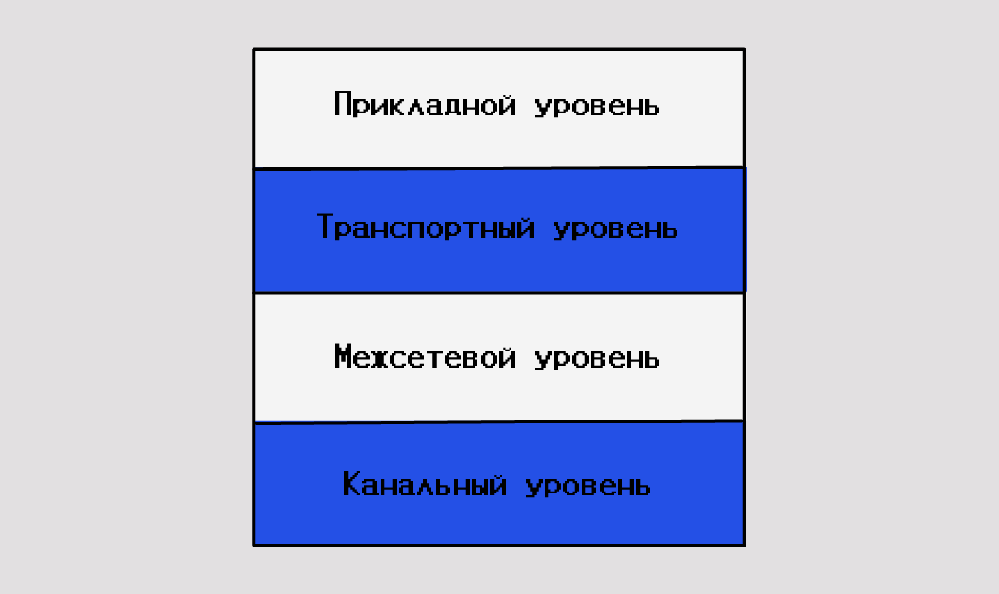
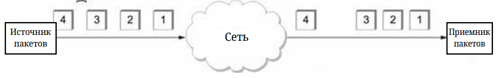

# Архитектура

Мы сформулировали внушительный набор требований к проектированию сетей. Сеть должна быть:
- универсальной;
- экономически эффективной;
- создающей справедливое и надёжное соединение между большим количеством компьютеров;
- адаптивной к изменениям;
- управляемой.

Сеть может быть сложной (устройства, подключенные через Интернет) или простой (два компьютера, подключенные напрямую с помощью одного кабеля). Возможно и что-то среднее. Сети могут различаться по размеру, форме и функциям. Тем не менее для связи недостаточно иметь только физическое соединение между оконечными устройствами. Для успешного обмена данными эти устройства должны «знать», как обмениваться информацией.

## Иерархия протоколов 

Для упрощения структуры и проектирования большинство сетей организуются в наборы уровней или слоёв, каждый последующий возводится над предыдущим. Количество уровней, их названия, содержание и назначение разнятся от сети к сети. Однако во всех сетях целью каждого уровня является предоставление неких сервисов для вышестоящих уровней. При этом от них скрываются детали реализации предоставляемого сервиса.

Таким образом применяются две концепции: 
- «Разделяй и властвуй». Одна сложная задача разбивается на несколько простых задач, каждая из которых решается по отдельности. 
- Абстракция — это сокрытие деталей реализации за чётко определённым интерфейсом. 

> Другими словами, мы прячем внутреннее устройство какого-то объекта за простым и понятным интерфейсом, через который с этим объектом можно взаимодействовать. Мы можем менять внутреннее устройство объекта удобным нам способом, оставляя неизменным внешний интерфейс. Отдельным задачам, которые мы получили, применив принцип «разделяй и властвуй», вовсе не обязательно знать, каким именно способом были решены их соседи. 

Уровень $n$ одной машины поддерживает связь с уровнем $n$ другой машины. Правила и соглашения, используемые в данном общении, называются протоколом уровня $n$. 
По сути, протокол является договорённостью общающихся сторон о том, как должно происходить общение. По аналогии: когда женщину представляют мужчине, она может протянуть ему свою руку. Он, в свою очередь, может принять решение либо пожать, либо поцеловать эту руку в зависимости от того, является ли эта женщина американским адвокатом на деловой встрече или же европейской принцессой на официальном балу. Нарушение протокола создаст затруднения в общении, а может и вовсе сделает общение невозможным.

В действительности данные не пересылаются с уровня $n$ одной машины на уровень $n$ другой машины. Вместо этого каждый уровень передаёт данные и управление уровню, лежащему ниже, пока не достигается самый нижний уровень. Ниже первого уровня располагается физическая среда, по которой и производится обмен информацией. На рисунке виртуальное общение показано пунктиром, тогда как физическое — сплошными линиями.

Между каждой парой смежных уровней находится интерфейс, определяющий набор примитивных операций, предоставляемых нижним уровнем верхнему. Ясно и чётко определённые интерфейсы позволяют минимизировать количество информации между уровнями, а также позволяют изменять или даже полностью заменять содержимое уровня и реализацию его протоколов, не затрагивая другие уровни. 

> Список протоколов, используемых системой (по одному протоколу на уровень), называется стеком протоколов.

Рассмотрим технический пример на примере 5-уровневой модели. Сообщение $M$ производится приложением, работающим на уровне 5, и передаётся уровню 4 для передачи. Уровень 4 добавляет к сообщению заголовок для идентификации сообщения и передаёт результат уровню 3. Заголовок включает управляющую информацию, например адреса, позволяющие уровню 4 принимающей машины доставить сообщения. Другими примерами управляющей информации, используемой в некоторых уровнях, являются порядковые номера (на случай, если нижний уровень не сохраняет порядок сообщений), размеры и время. 

Во многих сетях сообщения, передаваемые на уровне 4, не ограничиваются по размеру, однако такие ограничения почти всегда накладываются протоколом следующего уровня. Следовательно, уровень 3 должен разбить входящие сообщения на более мелкие единицы — пакеты, добавляя к каждому пакету заголовок уровня 3. В данном примере сообщение $M$ вместе с заголовком уровня 4 разбивается на две части: $H_4M_1$ и $M_2$.

Уровень 3 решает, какую из выходных линий использовать, и передаёт пакеты уровню 2. Уровень 2 добавляет в примере к каждому пакету не только заголовок, но также и концевик (трейлер), после чего передаёт сообщение уровню 1 для физической передачи. 

На узле-получателе сообщение двигается по уровням вверх, при этом заголовки убираются на каждом уровне по мере продвижения сообщения. То есть заголовки нижних уровней более высоким уровням не передаются. 

> Сетевой протокол — набор правил и действий (очерёдности действий), позволяющий осуществлять соединение и обмен данными между двумя и более включёнными в сеть устройствами.
> 
> Сетевая модель — теоретическое описание принципов работы набора сетевых протоколов, взаимодействующих друг с другом.
> 
> Инкапсуляция — это процесс передачи данных с верхнего уровня вниз (по стеку протоколов) к нижнему уровню, чтобы быть переданными по сетевой физической среде. Причём на каждом уровне различные протоколы добавляют к передающимся данным свою информацию.
>
> Декапсуляция — это процесс извлечения управляющей информации на каждом уровне модели начиная с нижнего и передачи данных на уровень выше. 

Важно различать модель и стек протоколов. В то время как модель является концептуальной схемой взаимодействия открытых систем, стек представляет собой набор спецификаций конкретных протоколов.

## Службы с установлением и без установления соединений

Уровни могут предлагать своим вышестоящим соседям услуги двух типов: с наличием или отсутствием соединения. 

Типичным примером сервиса с установлением соединения является телефонная связь. Чтобы поговорить с кем-нибудь, необходимо поднять трубку, набрать номер, а после окончания разговора положить трубку. Нечто подобное происходит и в компьютерных сетях: при использовании сервиса с установлением соединения абонент сначала устанавливает соединение, а после окончания сеанса разрывает его. Перед началом передачи отправляющий и принимающий узлы обмениваются приветствиями, отсылая друг другу приемлемые параметры соединения: максимальный размер сообщения, необходимое качество сервиса и т. д. 

Противоположный пример — сервисы без установления соединения; типичный пример — почтовые системы. Каждое письмо содержит полный адрес назначения и проходит по некому маршруту, который совершенно не зависит от других писем.

# Эталонные модели

Обсудив многоуровневые модели в общих чертах, можно рассмотреть несколько примеров таких моделей. 

## 7-уровневая модель OSI

ISO (Международная организация по стандартизации) была одной из первых организаций, которая формально определила модель сети. Их архитектура называется OSI (взаимодействие открытых систем). 
Несмотря на то что протоколы, которые создавались для эталонной модели OSI, сейчас не используются, сама модель до сих пор актуальна. 

Модель OSI определяет разделение сети на семь уровней, где один или несколько протоколов реализуют функциональность, назначенную данному уровню.

Рассмотрим уровни, начиная с самого нижнего:
- Физический уровень обрабатывает передачу сырых битов по физическому каналу.
- Канальный уровень затем собирает поток битов в более крупную сущность, называемую кадром. Сетевые адаптеры вместе с драйверами устройств, работающими в ОС узла, обычно реализуют уровень канала. 
- Сетевой уровень обрабатывает маршрутизацию между узлами в сети с коммутацией пакетов. На этом уровне единица данных, которой обмениваются узлы, обычно называется пакетом, а не кадром. 
> Нижние три уровня реализуются на всех сетевых узлах, включая коммутаторы в сети и хосты.
- Транспортный уровень реализует гарантированную доставку (если она необходима). В модели OSI транспортный уровень обеспечивает сквозную доставку между пользовательскими приложениями на узлах. Единица данных, которая передаётся на транспортном уровне, называется сегментом или сообщением. Транспортный уровень обычно работает только на оконечных узлах. 
- Перепрыгнув к верхнему (седьмому) уровню, мы находим прикладной уровень. Протоколы прикладного уровня включают, например, HTTP. Тут по сути реализуются конечные приложения, которыми мы пользуемся.
- Ниже прикладного уровня находится уровень представления, который занимается форматом данных. Например, определяет длину целого числа, передаётся ли старший байт первым или последним. 
- И наконец, сеансовый уровень, который позволяет пользователям различных компьютеров устанавливать сеансы связи друг с другом. 

## Эталонная модель TCP/IP 

Посмотрим теперь на эталонную модель Интернета, или модель TCP/IP. В отличие от модели OSI, которая в первую очередь интересна своим разбиением на уровни, модель TCP/IP важна своими протоколами, потому что они реально используются в компьютерных сетях и составляют основу современного Интернета. 

- Нижний, канальный уровень, или в другой терминологии уровень доступа. Тут находится множество протоколов и технологий, реализующих прямое подключение между узлами в сети, такие как Ethernet или Wi-Fi.
- Следующий уровень состоит из одного протокола — Интернет-протокола (Internet Protocol, IP). Этот протокол поддерживает взаимосвязь множества сетевых технологий в одну логическую интерсеть.
- Уровень выше IP содержит два основных протокола — протокол управления передачей (Transmission Control Protocol, TCP) и протокол пользовательских дейтаграмм (User Datagram Protocol, UDP). TCP и UDP предоставляют альтернативные логические каналы для приложений: TCP обеспечивает надёжный канал передачи байтового потока, а UDP предоставляет ненадёжный канал доставки дейтаграмм (дейтаграмму можно рассматривать как синоним сообщения).
- Над транспортным уровнем работает ряд прикладных протоколов, таких как HTTP, FTP, Telnet (удалённый вход) и протокол простой передачи почты (Simple Mail Transfer Protocol, SMTP), которые обеспечивают взаимодействие популярных приложений. 

# Производительность

Производительность сети измеряется двумя основными способами:
- пропускной способностью (Bandwidth и Throughput);
- задержкой.

Под пропускной способностью в компьютерных сетях обычно понимается количество бит, которые могут быть переданы по сети за определённый период времени. Например, если сеть имеет пропускную способность в 10 Мбит/с, то это значит, что она способна передавать 10 миллионов бит в секунду:
- 1000 бит в секунду — 1 Кбит/с;
- 1 000 000 бит в секунду — 1000 Кбит/с — 1 Мбит/с;
- 1 000 000 000 бит/с — 1 000 000 Кбит/с — 1000 Мбит/с — 1 Гбит/с.

Есть тонкая грань между терминами Bandwidth и Throughput. На русский наиболее точно их можно перевести как «пропускная способность» (Bandwidth) и «реальная пропускная способность» (Throughput).
Пропускная способность — она же ширина канала — это максимальная скорость, которую мы можем получить по каналу связи. Например, 1000Base Ethernet позволяет получить пропускную способность в 1 Гбит/с.
Но поскольку в силу различных обстоятельств не всегда получается полностью реализовать возможности пропускной способности, реальная пропускная способность может быть ниже. 

Второй показатель производительности, задержка (Latency или Delay), соответствует времени, необходимому для передачи сообщения от одного конца сети до другого. Задержка измеряется исключительно во времени. В большинстве ситуаций нам важнее знать, сколько времени требуется, чтобы отправить сообщение от одного конца сети до другого и обратно, а не только в одну сторону. Это называется временем кругового путешествия (round trip time) или просто RTT.

Задержка состоит из четырёх основных слагаемых:
- Задержка передачи (Transmission Delay): время, нужное узлу, чтобы «вытолкнуть» все биты пакета в кабель (зависит от пропускной способности).
- Задержка распространения (Propagation Delay): время пути сигнала по физической среде со скоростью света (~200 000 км/с в оптоволокне) (зависит только от расстояния).
- Задержка обработки (Processing Delay): время на чтение заголовков и проверку контрольной суммы маршрутизатором.
- Задержка в очереди (Queuing Delay): время ожидания в буфере маршрутизатора.

Ещё одним важным элементом измерения производительности сети является Jitter (на русский дословно переводится как «дрожание», но обычно так и говорится — джиттер). 

> Джиттер (Jitter) — это изменение во времени доставки пакетов данных, характеризующееся колебаниями задержек между последовательно передаваемыми пакетами.

Чтобы лучше понять, что такое джиттер, представьте себе приложение, которое отправляет пакет каждые 30 мс, например видеоприложение, передающее кадры. Если пакеты прибывают на место назначения с интервалом в 30 мс, то можно сделать вывод, что все пакеты испытали одинаковую задержку при передаче по сети. Однако если интервал между прибытием пакетов на место назначения (inter packet gap) изменяется, то задержка, испытываемая последовательностью пакетов, была разной. Вот эта разность между задержками для разных пакетов одного потока называется джиттером.

---

### Задание 1. Хронология: «Путь конверта» (Инкапсуляция)
*Формат: расставьте шаги в правильном порядке от отправки до получения.*

Приложение отправляет сообщение $M$. Расставьте события в порядке их выполнения:

* **А)** Канальный уровень добавляет заголовок и концевик (трейлер), формируя *кадр*.
* **Б)** Физический уровень передаёт *сырые биты* по кабелю / радиоканалу.
* **В)** Сетевой уровень разбивает данные на *пакеты* и добавляет заголовок маршрутизации.
* **Г)** Прикладной уровень генерирует исходное сообщение $M$.
* **Д)** Транспортный уровень добавляет свой заголовок (управляющую информацию и адреса портов).

👉 <b>Показать правильный порядок</b>

**Правильная последовательность (сверху вниз):**  
**Г $\rightarrow$ Д $\rightarrow$ В $\rightarrow$ А $\rightarrow$ Б**  
*(При получении на узле назначения процесс пойдёт строго в обратном порядке — декапсуляция).*

---

### Задание 2. Терминологический пазл (Уровень $\leftrightarrow$ Название блока данных)
*Формат: устный блиц — назвать правильный термин для каждого уровня.*

Как официально называется «порция данных» на каждом из уровней? Соедините пары:

1. **Транспортный уровень (Layer 4)** $\rightarrow$ ???
2. **Сетевой уровень (Layer 3)** $\rightarrow$ ???
3. **Канальный уровень (Layer 2)** $\rightarrow$ ???
4. **Физический уровень (Layer 1)** $\rightarrow$ ???

*(Варианты: Бит, Сегмент, Кадр/Фрейм, Пакет)*

👉 <b>Показать ответ</b>

* **1. Транспортный** $\rightarrow$ **Сегмент** (или дейтаграмма в UDP)
* **2. Сетевой** $\rightarrow$ **Пакет**
* **3. Канальный** $\rightarrow$ **Кадр (Frame)**
* **4. Физический** $\rightarrow$ **Биты**

---

### Задание 3. Сортировка по аналогии: «Почта против Телефона»
*Формат: распределите протоколы и примеры по двум корзинам.*

Разделите сущности на **«С установлением соединения»** и **«Без установления соединения»**:
1. Телефонный звонок другу.
2. Бумажное письмо в почтовом конверте.
3. Протокол **TCP**.
4. Протокол **UDP**.

👉 <b>Показать ответ</b>

* 📞 **С установлением соединения:**  
  * Телефонный звонок *(нужно набрать номер, дождаться ответа и только потом говорить)*.  
  * Протокол **TCP** *(выполняет предварительное согласование сеанса)*.
* ✉️ **Без установления соединения:**  
  * Бумажное письмо *(отправил с адресом получателя, не зная, готов ли тот его принять)*.  
  * Протокол **UDP** *(шлет дейтаграммы независимо друг от друга без предварительного «рукопожатия»)*.

---

### Задание 4. Задача из жизни: Bandwidth vs Throughput
*Формат: микро-кейс для проверки понимания разницы терминов.*

> *«Тариф вашего домашнего интернета — **500 Мбит/с**. Однако при скачивании игры реальная средняя скорость загрузки составила **320 Мбит/с**».*

**Вопрос:** Какое из этих двух чисел является **Bandwidth** (пропускной способностью канала), а какое — **Throughput** (реальной пропускной способностью)?

👉 <b>Показать ответ</b>

* **500 Мбит/с — это Bandwidth** (теоретический максимум / ширина канала, заявленная провайдером).
* **320 Мбит/с — это Throughput** (фактическая полезная скорость, достигнутая на практике с учётом накладных расходов, загрузки сети и серверов).

---

### Задание 5. Диагностика по симптомам: «Что сломалось?»
*Формат: загадка на знание сетевых метрик.*

Во время видеозвонка собеседник слышит ваш голос то с ускорением, то с паузами («заикание»), хотя средняя задержка не превышает 40 мс. Пакеты отправлялись стабильно каждые 30 мс, но доходили с интервалами: **30 мс $\rightarrow$ 95 мс $\rightarrow$ 15 мс $\rightarrow$ 120 мс**.

**Какая сетевая характеристика вызывает эту проблему?**
* **А)** Слишком низкий RTT
* **Б)** Высокий джиттер (Jitter)
* **В)** Неправильная декапсуляция
* **Г)** Переход с модели OSI на TCP/IP

👉 <b>Показать ответ</b>

**Правильный ответ: Б (Высокий джиттер / Jitter).**  
*Пояснение:* Джиттер — это колебание задержки между пакетами в одном потоке. Для видео- и голосовой связи неравномерность прибытия пакетов фатальна, так как человеческое ухо сразу замечает «рваный» звук.

Вот два слайда с заданиями на сопоставление пар в удобном для презентации формате.

---

### Задание 6. Из чего складывается сетевая задержка?
*Соберите пары: соотнесите название компонента задержки с его физическим смыслом.*

| Название компонента | Описание процесса |
| :--- | :--- |
| **1. Задержка распространения** *(Propagation Delay)* | **А)** Время ожидания пакета в буфере памяти маршрутизатора из-за занятости исходящей линии. |
| **2. Задержка передачи** *(Transmission Delay)* | **Б)** Время, которое процессор маршрутизатора тратит на проверку заголовков, контрольной суммы и поиск маршрута. |
| **3. Задержка в очереди** *(Queuing Delay)* | **В)** Время физического движения сигнала (электромагнитной волны) по кабелю от точки А до точки Б со скоростью света. |
| **4. Задержка обработки** *(Processing Delay)* | **Г)** Время, необходимое передатчику, чтобы «вытолкнуть» все биты пакета в кабель (зависит от размера пакета и ширины канала). |

👉 <b>Показать ответ и шпаргалку для спикера</b>

**Правильные пары:**
* **1 $\rightarrow$ В** (Зависит от длины провода и скорости света: $D / s$)
* **2 $\rightarrow$ Г** (Зависит от размера пакета и пропускной способности: $L / R$)
* **3 $\rightarrow$ А** (Зависит от загруженности сети; при переполнении очереди пакеты теряются)
* **4 $\rightarrow$ Б** (Зависит от быстродействия процессора коммутатора/маршрутизатора)

💡 *Главный вывод для зала:* покупка более дорогого тарифа (например, 1 Гбит/с вместо 100 Мбит/с) уменьшает **задержку передачи (2)**, но вообще не меняет **задержку распространения (1)**, так как скорость света в кабеле остаётся прежней.

---

### Задание 7. Уровни стека TCP/IP и единицы данных (PDU)
*Соберите пары: как официально называется блок данных на каждом уровне модели?*

| Уровень модели TCP/IP | Единица данных (PDU) |
| :--- | :--- |
| **1. Прикладной уровень** *(Application)* | **А)** Пакет *(Packet)* / IP-дейтаграмма |
| **2. Транспортный уровень** *(Transport)* | **Б)** Кадр / Фрейм *(Frame)* |
| **3. Межсетевой / Сетевой уровень** *(Internet / Network)* | **В)** Сообщение / Данные *(Data / Message)* |
| **4. Канальный уровень / Доступа к сети** *(Data Link)* | **Г)** Сегмент *(Segment)* / Дейтаграмма *(UDP)* |

*(Дополнительно для 5-уровневой модели: на 5-м, **Физическом уровне**, данные передаются в виде отдельных **Битов**).*

👉 <b>Показать ответ</b>

**Правильные пары:**
* **1 $\rightarrow$ В** (Прикладной $\rightarrow$ Данные / Сообщение, например HTTP-запрос)
* **2 $\rightarrow$ Г** (Транспортный $\rightarrow$ Сегмент в TCP или Дейтаграмма в UDP)
* **3 $\rightarrow$ А** (Сетевой $\rightarrow$ Пакет)
* **4 $\rightarrow$ Б** (Канальный $\rightarrow$ Кадр / Frame)

