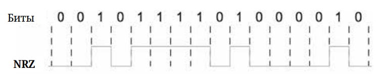
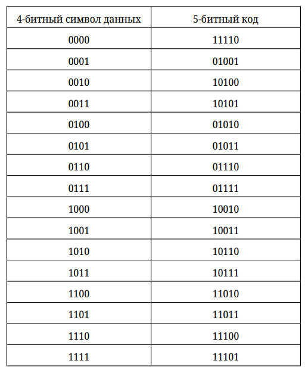
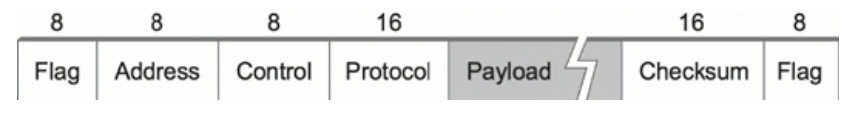
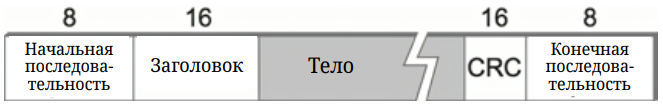

# Direct Links

Независимо от того, хотим мы создать простейшую сеть из двух хостов или подключить миллиардный хост к Интернету, нам нужно решить общий набор задач. Во-первых, нам нужна физическая среда передачи. Это может быть провод, оптическое волокно, электромагнитное излучение. Она может охватывать небольшую площадь (например, офис) или тянуться на гигантские расстояния (между материками).

Однако это только первый шаг. Пять дополнительных проблем должны быть решены, прежде чем узлы смогут успешно обменяться данными:
- Первое — это кодирование битов в носителе таким образом, чтобы они могли быть поняты принимающим узлом. 
- Вторая — разделение последовательности передаваемых битов на отдельные сообщения, которые могут быть доставлены конечному узлу. Это проблема кадрирования, а сообщения, доставляемые конечным узлам, часто называются фреймами (кадрами).
- Третье — так как фреймы иногда повреждаются во время передачи, необходимо обнаружить эти ошибки и предпринять соответствующие меры. То есть произвести обнаружение ошибок.
- Четвертое — сделать канал надежным, несмотря на то, что кадры периодически повреждаются. 
- Пятое — в тех случаях, когда канал разделяется несколькими узлами, необходимо регулировать доступ к этому каналу. Это проблема управления доступом к среде. 

## Кодирование

После того как мы соединили узлы физически, нужно определиться с тем, как двоичные данные, которые узел-источник хочет отправить, превратить в сигналы, которые способна передавать физическая среда. А затем на принимающем узле превратить эти сигналы обратно в данные. 

Большинство функций по кодированию выполняются сетевым адаптером — специальным устройством в составе узла, которое соединяет узел с каналом связи. Не будем рассматривать детали модуляции сигнала, предположим, что мы работаем всего с двумя дискретными сигналами: высоким и низким (на практике эти сигналы могут соответствовать двум напряжениям в медном канале, двум разным уровням мощности на оптике или двум разным амплитудам в радио).

### NRZ

Очевидным решением в кодировании является отображение 1 на высокий уровень и 0 на низкий. Такой метод кодирования называется NRZ (Non-return to zero, без возврата к нулю). 

Преимуществом такого подхода является простота его реализации. Но он несет в себе две фундаментальные проблемы в случае, если мы передаём длинные последовательности 1 и 0. Первая называется блужданием базовой линии. Приемник хранит среднее значение сигнала, который он принимал до сих пор, и затем использует его для различения низких и высоких сигналов. Если сигнал сильно ниже среднего, значит, это 0, если выше, то 1. Если мы передаём длинные последовательности 0 и 1, то среднее значение изменяется, и это затрудняет обнаружение изменений в сигнале. 

И вторая проблема заключается в том, что теряется синхронизация между передатчиком и приёмником. Сигнал каждого бита данных передаётся определенный промежуток времени, называемый квантом. Для того чтобы приёмник мог отличить, где заканчивается один квант данных и начинается другой, часы передатчика и приёмника должны быть точно синхронизованы. Можно передавать синхронизирующий сигнал по отдельному проводу, но это экономически невыгодно, так как удваивает цену кабельной линии. Вместо этого приёмник извлекает тактовую частоту из принятого сигнала. Каждый раз, когда сигнал меняется, например, с 0 на 1 или с 1 на 0, приёмник понимает, что это граница тактового цикла, и может восстановить синхронизацию с передатчиком. Если передаётся длинная последовательность 0 или 1, то приёмник начинает терять синхронизацию. 

### NRZI 

Одним из подходов к решению этой проблемы является метод кодирования, который называется NRZI (non-return to zero inversed, инверсия без возврата к нулю). Его суть заключается в том, что передатчик совершает переход от текущего сигнала к противоположному, чтобы закодировать 1, и остается на текущем сигнале для кодирования 0. Это решает проблему последовательных 1, но, очевидно, ничего не делает с последовательностью 0. 

### Манчестерское кодирование

Ещё один альтернативный метод называется *манчестерским кодированием*. Манчестерский код более явно объединяет тактовый сигнал с передаваемыми данными, передавая по сети результат операции «исключающее ИЛИ» между данными, закодированными по схеме NRZ, и тактовым сигналом. Манчестерский код приводит к тому, что 0 кодируется как переход от низкого уровня к высокому, а 1 — как переход от высокого к низкому. Поскольку и 0, и 1 приводят к переходу сигнала, тактовый сигнал может эффективно восстанавливаться. 

Проблема манчестерского кодирования заключается в том, что для его использования необходимо удвоить частоту переходов сигнала в канале. Скорость, с которой сигнал изменяется, называется скоростью передачи (baud rate) сигналов. В случае манчестерского кодирования скорость передачи битов (то есть bandwidth) составляет только половину от скорости передачи сигналов (baud rate), значит, манчестерский код эффективен только на 50%.

Обратите внимание, что скорость передачи битов не обязательно меньше или равна скорости передачи сигналов, как это происходит в манчестерском коде. Сейчас мы используем схему модуляции, которая распознаёт только два дифференциальных значения: высокое и низкое. Если мы будем использовать схему модуляции, которая может распознавать, например, 4 или 5 значений (+1В, +0.5В, 0В, -0.5В, -1В), то мы за один интервал передачи сможем закодировать уже 2 бита. А значит, скорость передачи битов будет в два раза выше скорости передачи сигналов. 

### 4B/5B

Ещё одно кодирование, которое следует рассмотреть, называется 4B/5B. Оно пытается решить проблему неэффективности манчестерского кодирования, параллельно не сталкиваясь с проблемой длительных периодов высоких и низких сигналов. Идея 4B/5B состоит в том, чтобы вставлять в поток полезных битов избыточные биты, которые будут разрывать последовательности из 0 и 1. 

Если говорить конкретно, то каждые 4 бита реальных данных кодируются в 5-битный код, который затем передаётся приёмнику, отсюда и название 4B/5B. 5-битные коды выбираются таким образом, что каждый из них имеет не более одного начального 0 и не более двух конечных 0. Таким образом, при передаче ни одна пара 5-битных кодов не приведет к передаче более чем трёх подряд идущих 0. Полученные 5 бит затем передаются с использованием кодирования NRZI, что объясняет, почему код заботится только о последовательности 0: NRZI уже решает проблему последовательных 1. Таким образом, кодирование 4B/5B обеспечивает эффективность 80%, что на 30% выше, чем у манчестерского кода. 

Таблица выше показывает, как подбираются коды. 4 бита полезных данных дают 16 возможных комбинаций. Если мы добавим ещё один избыточный бит, то получим уже 32 комбинации. Среди этих 32 комбинаций выбираются такие, которые соответствуют указанным выше условиям (не более одного начального 0 и не более двух конечных 0). Всего таких комбинаций будет 25. Из 25 подходящих комбинаций выбираются 16, в которые отображается пространство 4-битных реальных данных. Соответствие 4- и 5-битных кодов как раз показано в таблице. Оставшиеся 9 кодов можно использовать для служебных сообщений. Так, например:
- 11111 соответствует состоянию, когда линия простаивает;
- 00000 означает, что линия в нерабочем состоянии;
- 00100 интерпретируется как сигнал остановки (в случае если приёмник перегружен и не может принять больше данных).

Манчестерский код применяется в технологии Ethernet 10 Mbit/s. Код 4B/5B применяется в медном Fast Ethernet (100 Mbit/s).

## Кадрирование

Теперь, когда мы обсудили, как передать последовательность битов по каналу «точка-точка» (от адаптера к адаптеру), давайте вспомним, что мы рассматриваем работу пакетно-коммутируемых сетей. Это означает, что узлы обмениваются блоками данных, которые на данном уровне мы называем *кадрами*, а не потоками битов. 

Когда узел А хочет отправить кадр узлу Б, он сообщает своему адаптеру о необходимости передать кадр из памяти узла. Это приводит к отправке последовательности битов по каналу. Адаптер на узле Б затем собирает последовательность битов из канала и размещает полученный кадр в памяти. 

Определение того, какая именно часть последовательности битов составляет кадр, то есть определение того, где кадр начинается и где заканчивается, — одна из центральных задач адаптера. 

Существует несколько подходов к определению границ кадра, рассмотрим некоторые из них.

### Байт-ориентированные протоколы

Один из самых старых подходов, корнями уходящий к подключению терминалов к мэйнфреймам, является байт-ориентированный подход. Он заключается в том, чтобы рассматривать каждый кадр как набор байтов (символов), а не набор битов. 

Есть два основных способа байт-ориентированного кадрирования:
- Использование специальных символов для указания начала и конца кадра. Идея состоит в том, чтобы обозначить начало кадра, отправляя специальный символ синхронизации. Дополнительно сами данные внутри кадра обрамляются символами, которые обозначают начало и конец данных. 
- Альтернативно, вместо символа конца кадра заголовок включает длину кадра.

Протокол PPP (точка-точка, Point-to-Point Protocol) — наглядный представитель байт-ориентированного кадрирования. Ниже изображен формат кадра PPP.

Похожие схематические изображения часто используются для иллюстрации формата кадра или пакета, поэтому дадим небольшие пояснения к рисунку. Мы показываем пакеты или кадры как последовательность подписанных полей, над каждым полем указывается число, обозначающее длину этого поля в битах (иногда байтах). Обратите внимание, что пакеты передаются начиная с крайнего левого поля. 

Теперь перейдем к кадру PPP. Специальный символ Flag обозначает начало кадра, Flag всегда равен 01111110. Поля Address и Control наследуются PPP из другого протокола и не несут никакой нагрузки, так что они нам не интересны. Далее идёт поле Protocol, которое используется для демультиплексирования, оно идентифицирует протокол вышестоящего уровня, например IP. 

> Мультиплексирование — технология разделения средств передачи данных между группой использующих их объектов. В данном случае подразумевается, что над канальным уровнем может находиться сразу несколько получателей (протоколов), каждый из которых может быть получателем кадра. 

Размер поля Payload (полезные данные) может быть согласован, но по умолчанию он составляет 1500 байт. Поле Checksum имеет длину 2 или 4 байта и служит для обнаружения ошибок. 

### Бит-ориентированные протоколы

В отличие от протоколов, ориентированных на байты, бит-ориентированные протоколы представляют передаваемый кадр как последовательность бит. Рассмотрим, как это может выглядеть на примере протокола HDLC (был разработан для канального уровня модели OSI, сейчас встретить сложно).

HDLC обозначает начало и конец кадра при помощи специальной битовой последовательности 01111110. Эта последовательность передаётся в том числе в моменты, когда канал бездействует, чтобы приёмник и передатчик не теряли синхронизацию.

Поскольку данная последовательность может появиться в любом месте в теле кадра, бит-ориентированные протоколы используют специальную технику, которая называется bit-stuffing или вставка битов. 
Вставка битов работает следующим образом. На стороне отправителя каждый раз, когда передаются 5 последовательных 1 (за исключением случаев, когда передаётся специальная последовательность), отправитель вставляет 0 перед передачей последующего бита. Например:

001111100 -> 0011111**0**00

11111110 -> 11111**0**110

Когда получатель принимает последовательность из пяти 1, то он принимает решение на основе следующего бита. Если следующий бит — 0, значит, он был вставлен, и приёмник его удаляет. Если следующий бит 1, то возможно одно из двух: или это конец кадра, или произошла ошибка. Если следующий бит равен 0, то есть последние 8 бит, которые он получил, равны 01111110, то приёмник считает, что это конец кадра. Если 1, то последние 8 бит равны 01111111, значит, точно была ошибка, и весь кадр отбрасывается.

## Обнаружение ошибок

При передаче данных по сети в кадры иногда вводятся битовые ошибки. Хотя ошибки — явление довольно редкое, необходим механизм их обнаружения. Но обнаружение ошибки — это только часть проблемы. Другая часть — это её исправление. Существует два основных подхода к исправлению ошибок. Первый — запросить повторную передачу. Так как ошибки — явление редкое, велик шанс, что повторная передача пройдёт без проблем. Альтернативно можно использовать алгоритмы обнаружения ошибок, которые позволяют получателю восстановить исходное сообщение после повреждения. 

Основная идея обнаружения ошибок заключается в добавлении в передаваемый кадр избыточной информации. В крайнем случае можно представить себе передачу двух полных копий данных. Если копии идентичны, значит, передача прошла без ошибок, если различаются — значит, произошла ошибка. 

Менее радикальным способом является добавление к кадру некой контрольной суммы, которая будет представлять собой результат некой функции от передаваемых данных. То есть мы производим с передаваемыми данными некие примитивные операции, а результат этих операций добавляем к передаваемому кадру. Получатель, приняв кадр из сети, производит над данными те же операции и сравнивает свой результат с тем, что получил по сети. Если они не сходятся, значит, в данные была внесена ошибка. Причём неважно, куда именно была внесена ошибка: в сами данные или в результат вычислений, кадр в любом случае будет считаться ошибочным. Такой подход позволяет с достаточно высокой вероятностью обнаруживать ошибки, передавая незначительное количество избыточной информации. Например, в Ethernet-кадр, несущий 12 000 бит (или 1500 байт) данных, требуется добавить всего 32 бита избыточных данных. 

Не будем вдаваться в подробности конкретных «кодов обнаружения ошибок». Достаточно знать, что в сети Интернет в основном используется циклический избыточный код длиной 32 бита (или просто CRC-32).

## Надежная передача

Как мы обсудили выше, кадры иногда повреждаются во время передачи, и коды ошибок, такие как CRC-32, используются для их обнаружения. И хотя некоторые коды ошибок настолько сильные, что позволяют восстановить поврежденные данные, некоторые ошибки будут слишком серьёзными для исправления, и кадр в любом случае будет отброшен. Протоколы, которые хотят надежно передавать кадры, должны каким-то образом восстанавливать эти утерянные кадры. 

Сразу стоит отметить, что архитектура модели сети TCP/IP делегирует функции надежной передачи (Reliable Transmission) транспортному уровню, так что большинство современных канальных технологий эту функцию не включают. Поэтому сейчас мы не будем подробно рассматривать механизмы, которые используются для обеспечения надежной доставки, и оставим это до рассмотрения работы транспортного уровня и протокола TCP.

Отметим только, что надежная доставка обычно достигается с помощью комбинации двух фундаментальных механизмов — подтверждений и тайм-аутов. *Подтверждение* (Acknowledgement, ACK) — это небольшой управляющий кадр, который протокол отправляет своему партнеру, сообщая о получении ранее отправленного кадра. Если отправитель не получает подтверждение за некий разумный промежуток времени, то он повторяет передачу снова, это называется *тайм-аутом*. 

## Сети с множественным доступом, Ethernet

Сети с множественным доступом — это тип сетей, позволяющий к одной физической среде подключить несколько узлов. Разработанная в середине 1970-х технология Ethernet на сегодняшний день является доминирующей технологией для локальных сетей, вытеснив всех своих конкурентов. Сегодня если Ethernet и приходится с кем-то конкурировать, так это с беспроводными стандартами в локальных сетях 802.11 для подключения конечных абонентов. 

Общее название технологии, которая лежит в основе Ethernet, — это CSMA/CD (Carrier Sense, Multiple Access with Collision Detect):
- Carrier Sense — обнаружение несущей;
- Multiple Access — множественный доступ;
- Collision Detect — обнаружение коллизий. 

Исходя из названия, Ethernet является технологией с множественным доступом, что означает, что набор узлов отправляет и принимает кадры по общей линии. Таким образом, Ethernet можно представить как общую шину, к которой подключено несколько узлов. Обнаружение несущей означает, что все узлы могут отличить свободную линию от занятой, а обнаружение коллизий означает, что узел слушает линию в момент передачи и тем самым может обнаружить, когда кадр, который он передаёт, столкнулся с кадром, который передавал другой узел. 

Стоит отметить, что современные сети Ethernet в основном построены по принципу «точка-точка»: то есть они соединяют хост с промежуточным узлом, называемым Ethernet-коммутатором, или соединяют такие коммутаторы между собой. В результате алгоритм множественного доступа в современных сетях не используется, но его варианты применяются в беспроводных сетях, таких как Wi-Fi.

### Историческая справка и физические ограничения

Первые наработки технологии Ethernet появились ещё в начале 70-х (дата рождения Ethernet — 22 мая 1973 года) в компании Xerox. Эта технология позволяла передавать данные со скоростью 2,94 Мбит/с по толстому коаксиальному кабелю (шине).

В 1982 году компании DEC, Intel и Xerox выпустили спецификацию Ethernet II, а в 1983 году IEEE утвердил стандарт 802.3 10BASE5 thicknet («толстая сеть»). 10BASE5 подразумевал использование толстого (9 мм) коаксиального кабеля, длина которого была ограничена 500 метрами. Стандарт позволял подключить до 100 узлов, а пропускная способность в 10 Мбит/с делилась на всех. 

Вариант thicknet был не очень удобен в практическом отношении, а также дорог. Поэтому в 1985 году в рамках документа IEEE 802.3a вышел стандарт 10BASE2 thinnet («тонкая сеть»). Стандарт предполагал использование более дешевого и удобного тонкого коаксиального кабеля, но взамен длина сегмента ограничилась 185 метрами, а количество узлов — до 30. 10BASE2 сделал две важные вещи для развития Ethernet. Во-первых, он популяризовал Ethernet за счёт простоты развёртывания, невысокой стоимости решения и хорошей скорости. Во-вторых, он вызвал проблему в виде сокращения размера сегмента. Для её решения в том же 1985 году вышел документ IEEE 802.3c, где было описано устройство-репитер (повторитель). Повторители позволяли связать несколько сегментов сети в один. Для 10BASE2 разрешалось использовать до четырёх репитеров, и это позволяло разнести сеть на целых 925 метров.

Опустим несколько промежуточных, зависящих от конкретного производителя стандартов и сразу перейдём в 1990 год. В США исторически для прокладки телефонных линий использовалась витая пара (так же, как в СССР для этого использовалась двужильная «лапша»). Желание использовать уже существующие линии вместо прокладки дополнительной сети из коаксиального кабеля привело к появлению стандарта Ethernet для работы по витой паре. В 1990 году IEEE выпускает документ 802.3i, в котором описывает стандарт 10BASE-T. 10BASE-T определяет использование неэкранированной витой пары Cat. 3, прописывает топологию «звезда» с использованием концентраторов/хабов (внутри это всё ещё общая шина). Максимальная длина одного сегмента (по сути, расстояние между узлом и хабом) — 100 метров, количество узлов — 1024. Между двумя узлами может находиться не более 4 хабов, так что максимальное расстояние между узлами — 500 метров. Узлы подключались к общей шине внутри хаба при помощи двух витых пар: одна для передачи и другая для приема.

Любой сигнал, передаваемый в линию Ethernet, транслируется по всей сети во всех направлениях. Хорошая новость в том, что это позволяет обеспечить прямое соединение между множеством узлов. Плохая новость заключается в том, что все узлы конкурируют за доступ к линии, разделяя между собой её пропускную способность (для классического Ethernet это 10 Mbit/s), более того, в ситуации, когда два узла начинают одновременно передавать кадры, эти кадры сталкиваются и происходит коллизия.

> Когда несколько узлов подключены к одной физической среде передачи данных и при их одновременной работе может произойти коллизия, говорят, что эти узлы находятся в одном домене коллизий. 

### Протокол доступа к среде, MAC

Для предотвращения и разрешения коллизий в Ethernet используется алгоритм управления доступом к общей среде. Этот алгоритм обычно называется MAC (Media Access Control, контроль доступа к среде). 
Как правило, алгоритм MAC реализуется в аппаратном обеспечении сетевого адаптера.

### Формат кадра

Каждый кадр Ethernet определяется следующим форматом:

- Начинается кадр с 64-битной преамбулы, которая позволяет приемнику синхронизироваться с передатчиком. Преамбула состоит из чередующихся 0 и 1. 
- Так как в сегменте может быть больше двух узлов, требуется однозначно идентифицировать отправителя и получателя. Для этого служат 48-битные поля адреса отправителя и получателя.
- 16-битное поле типа указывает, какому протоколу верхнего уровня должен быть доставлен кадр. 
- Каждый кадр содержит до 1500 байт данных. Минимально поле данных должно содержать не менее 46 байт, даже если это означает, что узлу придется дополнить кадр перед передачей. Наличие минимального размера вызвано необходимостью эффективно обнаруживать коллизии. 
- Заканчивается кадр 32-битным CRC. 

Ethernet является бит-ориентированным протоколом кадрирования. Обратите внимание, что с точки зрения узла кадр Ethernet имеет 14-байтный заголовок: два 6-байтных адреса и 2-байтное поле типа. Преамбула и CRC добавляются и удаляются сетевыми адаптерами передатчика и приёмника. 

### Адреса

Каждый хост в сегменте Ethernet — а на самом деле каждый хост Ethernet в мире — имеет уникальный Ethernet-адрес. Это является обязательным условием для нормального функционирования технологии Ethernet. Технически адрес принадлежит адаптеру, а не хосту. У хоста может быть несколько Ethernet-адаптеров, и у каждого адаптера будет свой уникальный Ethernet-адрес. 

Ethernet-адреса обычно записываются в форме, удобной для чтения человеком. 48 бит разбиваются на кусочки по 4 бита, каждый кусочек переводится в шестнадцатеричную форму. Обычно запись выглядит как последовательность из 6 шестнадцатеричных чисел, разделенных:
- Дефисом: AA-BB-CC-DD-EE-FF, например в ОС Windows;
- Двоеточием: AA:BB:CC:DD:EE:FF, например в ОС Linux. 

Но бывают исключения, так, например, компания Cisco на своих продуктах записывает адреса в виде 3 групп цифр, разделенных точками (AABB.CCDD.EEFF), в очень старом оборудовании можно встретить запись без разделителей вообще. 

Чтобы обеспечить уникальность адреса каждого адаптера, каждому производителю Ethernet-устройств выделяется уникальный префикс (выделяется IEEE) длиной 24 бита, который называется OUI (уникальный идентификатор организации). Этот префикс записывается в первые 3 октета Ethernet-адреса. Следующие 3 октета выбираются изготовителем для каждого произведенного устройства. 

Всего может существовать $2^{48}$ уникальных Ethernet-адресов, из них только $2^{46}$ могут быть глобально уникальными, то есть назначены производителями на адаптеры. Дело в том, что два младших бита в старшем байте Ethernet-адреса зарезервированы.

Каждый кадр, передаваемый по сегменту Ethernet, принимается каждым адаптером, подключенным к сегменту. Каждый адаптер распознаёт только те кадры, которые адресованы лично ему, то есть содержат его уникальный адрес. Существуют ситуации, когда необходимо один и тот же кадр доставить сразу нескольким получателям. Для таких случаев используются специальные мультикастовые, или по-другому групповые, Ethernet-адреса. Так вот, самый младший бит самого старшего байта Ethernet-адреса определяет, является адрес юникастовым или групповым. Если бит установлен в 1 — такой адрес является групповым. Обычно с групповым Ethernet-адресом связано какое-то конкретное программное обеспечение. Когда оно запускается на узле, то Ethernet-адаптер начинает слушать и обрабатывать кадры для соответствующего группового адреса. Существует также специальный групповой адрес, называемый широковещательным, — в этом адресе все 48 бит выставлены в 1. Такие кадры прослушиваются и обрабатываются всеми узлами в Ethernet-сегменте.

Следующий бит после самого младшего указывает, является ли адрес глобально или локально уникальным. Глобально уникальные адреса — это те самые адреса, которые назначаются производителем на устройства. Они должны быть уникальными в пределах всего земного шара. Локально уникальные адреса могут назначаться администраторами сети на устройства при необходимости и не обязаны быть уникальными в пределах всего земного шара (при этом они всё ещё должны быть уникальными в пределах одной Ethernet-сети). В основном LLA используются при взаимодействии виртуальных машин, а также для подмены реального адреса, например с целью тестирования настроек безопасности.

> Разряд — «рабочее место» цифры в числе. Порядковому номеру разряда соответствует его **вес** — множитель, на который надо умножить цифру в данной позиции. Старший разряд имеет самый большой множитель, младший — самый маленький.
> 
> Big-Endian — старший байт числа записывается в память по самому младшему адресу.
>
> Little-Endian — младший байт записывается в память по самому младшему адресу.
>
> Сетевой порядок — самый старший байт передаётся в сеть первым, но биты внутри байта передаются от младшего к старшему.

Подведем итог. Ethernet-адаптер принимает и обрабатывает кадры, которые:
- Адресованы его собственному юникастовому адресу;
- Адресованы широковещательному адресу;
- Адресованы групповому адресу, если адаптер настроен на приём этих адресов (на узле запущено соответствующее программное обеспечение);
- Все кадры, если адаптер настроен в режим перехвата.

### Алгоритм передатчика

Кратко обсудим, как реализуется алгоритм доступа к общей среде. Основная работа происходит на стороне отправляющего.

Когда адаптер имеет кадр для отправки и линия простаивает, он немедленно передаёт кадр. Если адаптер имеет кадр для отправки и линия занята, он ждёт, пока линия освободится, и затем немедленно передаёт кадр. 

Если случается так, что два адаптера начали передавать кадры одновременно, то они сталкиваются и происходит коллизия. Адаптер узнаёт о коллизии, потому что одновременно с передачей слушает линию. Алгоритм обнаружения коллизий в стандартах по коаксиальному кабелю и витой паре немного отличается. 

В стандартах на основе коаксиального кабеля адаптер слушает линию и ожидает получить из неё те же сигналы, которые он передал. Если из линии приходит сигнал, отличающийся от того, который он передал сам, значит, произошла коллизия.

В стандартах на основе витой пары все узлы подключены к концентратору/хабу, который умеет обнаруживать коллизии и оповещать о них сеть. Что важно, узел, подключенный к хабу, не слышит сам себя во время передачи. Таким образом, в сетях с хабами возможно два вида коллизий. Первый — локальная коллизия: если во время передачи узел слышит сигнал на паре для приёма — значит, произошла коллизия. Второй вариант — удалённая коллизия: хаб обнаружил коллизию на другом своём интерфейсе и оповещает об этом узел. 

Механизм оповещения о коллизиях одинаковый во всех случаях. Адаптер, заметивший коллизию, будь то узел или хаб, останавливает передачу и генерирует в сеть специальный Jam-сигнал, который оповещает все адаптеры о коллизии. Адаптер, узнавший о коллизии, выдерживает случайную паузу перед повторной попыткой передачи. Если повторная попытка также провалилась, то адаптер увеличивает интервал возможных значений для случайной паузы. Так повторяется до 16 раз. Если передача не удалась 16 раз подряд, то кадр отбрасывается, и вышестоящему уровню передаётся сообщение об ошибке.