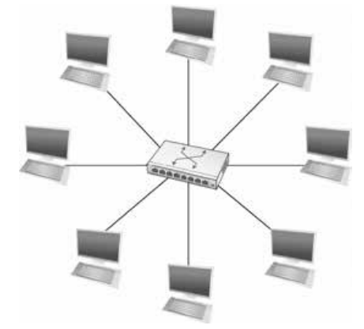

# Межсетевое взаимодействие

Как мы уже обсудили, существует множество технологий, которые можно использоваться для создания прямых каналов между устройствами. Но эти технологии имеют свои ограничения, которые не дают построить на их основе глобальные сети. Соединения типа точка-точка объединяют только два узла, один Ethernet сегмент (10Base-T) не позволит объединить более 1024 хостов, беспроводные сети ограничены радиусом действия своих передатчиков.

Чтобы построить действительно большую сеть, нам нужно нечто, что позволит нам объединять сети на основе одной канальной технологии в сеть большего масштаба, а также соединять сети построенные на основе разных технологий. Концепция объединения различных типов сетей для создания большой глобальной сети является основной идеей Интернета и часто называется *межсетевым взаимодействием*.

# Основы коммутации

Мы можем разделить проблему межсетевого взаимодействия на несколько подпроблем. Прежде всего нам нужен способ объединения каналов одного типа в более крупные сети. Устройства, которые объединяют каналы одного типа, обычно называют коммутаторами (свитчами, switches) или иногда L2 коммутаторами. 

> Сетевой коммутатор (жарг. свитч, свич от англ. switch «переключатель») — устройство, предназначенное для соединения нескольких узлов компьютерной сети в пределах одного или нескольких сегментов сети. Коммутатор работает на канальном (втором) уровне сетевой модели OSI.

Основная задача коммутатора - принимать кадры, которые поступают на вход, и перенаправлять (или коммутировать) их на правильный выход, чтобы они достигли своего места назначения. Говоря простым языком, коммутатор — это механизм, который позволяет нам соединять каналы для формирования более крупной сети. Коммутатор — это многовходовое, многовыходное устройство, которое передает пакеты от входа к одному или нескольким выходам. Таким образом, коммутатор создаёт топологию типа "звезда".

Топология звезда обладает несколькими привлекательными свойствами:
- Несмотря на то, что у коммутатора ограничено количество входов и выходов (будем их называть портами или интерфейсами), что ограничивает количество хостов, которые можно подключить к одному коммутатору, мы можем построить крупные сети объединяя несколько коммутаторов. 
- Мы можем подключать коммутаторы к хостам и друг к другу, используя соединения "точка-точка", что обычно даёт возможность охватить большую географию.
- Добавление нового хоста к сети не всегда снижает производительность уже подключенных хостов. 

Последние особенно важно для сетей на основе множественного доступа. Если мы подключим в один сегмент Ethernet с пропускной способностью 10 мбит/с несколько хостов, ни один из них не сможет непрерывно передавать данные на этой скорости, так как они будут конкурировать между собой. Каждый хост в коммутируемой сети имеет своё собственное соединение с коммутатором, поэтому вполне возможно, что все узлы смогут передавать данные на полной скорости канала, если коммутатор спроектирован с достаточной совокупной пропускной способностью. 

Как уже было сказано, основная задача коммутатора принимать кадры на одном из своих интерфейсом и передавать их дальше. Вопрос заключается в том, как коммутатор решает, на какой выходной канал направить пакет. Общий ответ состоит в том, что он смотрит в заголовок кадра, чтобы найти там информацию, на основе которой он примет решение. 

То, как именно будет использоваться информация из заголовка различается, но существует два основных подхода. 
- Первый - коммутация на основе датаграмм. 
- Второй - коммутация на основе виртуальных каналов.

Общая черта для обоих подходов заключается в наличии способа однозначно идентифицировать конечные узлы. Такие идентификаторы обычно называются адресами. Мы уже видели пример такого идентификатора, это был 48-битный адрес Ethernet. Главное требование к адресам Ethernet было в том, что они должны быть уникальными, так что в дальнейшем мы будем предполагать, что у каждого узла есть свой уникальный адрес. 

## Датаграммный подход

Основная идея, лежащая в основе датаграммного подхода очень простая: в каждый кадр включено достаточно информации, чтобы любой коммутатор мог решить, как доставить его до места назначения. То есть каждый кадр содержит полный адрес назначения. Рассмотрим пример сети, в который узлы имеют адреса A, B, C, D и так далее. Чтобы решить, куда переслать кадр, коммутатор обращается к таблице коммутации (иногда называемой таблицей пересылки), пример которой приведен в таблице. Достаточно легко создать такую таблицу имея полную карту простой сети, можно представить, что администратор вручную настраивает таблицы статически. Сложнее создать подобные таблицы в больших, динамически меняющихся сетях. Пример того, как это делается, рассмотрим позже, когда будем говорить про конкретную технологию коммутации. 

|Пункт назначения|Порт|
|----------------|----|
|A|2|
|B|0|
|C|3|
|D|1|
|E|1|
|F|1|
|G|1|
|H|1|

Датаграммные сети имеют следующие характеристики:
- Узел может отправить кадр в любое время и в любое место, так как любой кадр, пришедший на коммутатор, может быть немедленно им переслан (при условии корректно заполненной таблицы). По этой причине датаграммые сети можно назвать сетями без установления соединения.
- Когда узел отправляет кадр, он не знает, сможет ли сеть его доставить или работает ли узел назначения. Это делает датаграммные сети сетями без гарантии доставки.
- Каждый кадр пересылается независимо от предыдущих, которые могли быть отправлены в тот же пункт назначения. Таким образом два последовательных кадра от узла А к узлу В могут следовать совершенно разными путями. 
- Сбой коммутатора или канала может не иметь серьёзных последствий для связи, если есть возможность найти альтернативный путь и обновить таблицу коммутации. 

Этот последний факт особенно важен для истории датаграммных сетей. Одной из важных целей проектирования Интернета, или даже точнее ARPANETA, была устойчивость к сбоям. 

## Коммутация виртуальных каналов

Вторая подход к коммутации использует концепцию виртуальных каналов (VC, Virtual Circuit). Этот подход требует предварительной настройки виртуального соединения от узла источника до узла назначения перед отправкой данных. Чтобы разобраться, как это работает, рассмотрим пример сети, где узел А хочет отправить данные узлу В.

Это можно представить как двухэтапный процесс:
- Первый этап - установление соединения.
- Второй - передача данных.

На этапе установки соединения необходимо сформировать виртуальное соединение по всей цепочке коммутаторов между узлами A и В. Для формирования виртуальных соединений служит таблица виртуальных соединений. Одна запись в такой таблице содержит:
- Идентификатор виртуальной цепи (virtual circuit identifier, VCI), который уникально идентифицирует соединение в этом коммутаторе и который будет включен в заголовок пакетов, принадлежащих этому соединению.
- Входящий интерфейс, на котором пакеты для этого VC прибывают на коммутатор.
- Исходящий интерфейс, через который пакеты для этого VC покидают коммутатор.
- Потенциально другой исходящий VCI, который будет использоваться для исходящих пакетов.

Принцип работы такой записи достаточно простой: если кадр поступает на указанный входной интерфейс и содержит указанное значение VCI в своем заголовке, то этот пакет должен быть отправлен через указанный исходящий интерфейс с указанным исходящим VCI.

Обратите внимание, что комбинация VCI из кадра и интерфейса, на который кадр пришёл, уникально идентифицирует виртуальное соединение. Естественно, в коммутаторе может быть установлено множество виртуальных соединений одновременно. Также мы указали, что входящий и исходящий VCI обычно не совпадают. Таким образом VCI не является глобально уникальным идентификатором. Он имеет значение только для данного канала, и чаще всего, только для данного коммутатора. 

Также, как и с датаграммным подходом, существует два способа заполнения таблиц виртуальных соединений на коммутаторах. Первый предполагает ручную настройку администратором, второй - динамическую установку при помощи служебных сообщений. 

Для примера рассмотрим ручную настройку виртуальных соединений для связи между узлами А и В. Начнём с коммутатора 1:
- сначала администратору необходимо определить путь от А до В через сеть. В нашем примере такой путь только один. 
- Затем администратор неким произвольным (или не очень) способом выбирает значение VCI, которое в данный момент не используется. В нашем примере предположим, что это VCI 5 для канала от хоста А к коммутатору 1, а значение 11 для канала между коммутатором 1 и коммутатором 2.

Таким образом, для коммутатора 1, мы получаем запись в таблице виртуальных каналов следующего вида:

|Входящий интерфейс|Входящий VCI|Исходящий интерфейс|Исходящий VCI|
|------------------|------------|-------------------|-------------|
|2|5|1|11|

Аналогично предположим, что VCI 7 был выбран для идентификации канала между коммутаторами 2 и 3, а значение VCI 4 для канала между коммутатором 3 и узлом В. В таком случае мы должны получить следующие таблицы. На коммутаторе 2:

|Входящий интерфейс|Входящий VCI|Исходящий интерфейс|Исходящий VCI|
|------------------|------------|-------------------|-------------|
|3|11|2|7|

И на коммутаторе 3:

|Входящий интерфейс|Входящий VCI|Исходящий интерфейс|Исходящий VCI|
|------------------|------------|-------------------|-------------|
|0|7|1|4|

