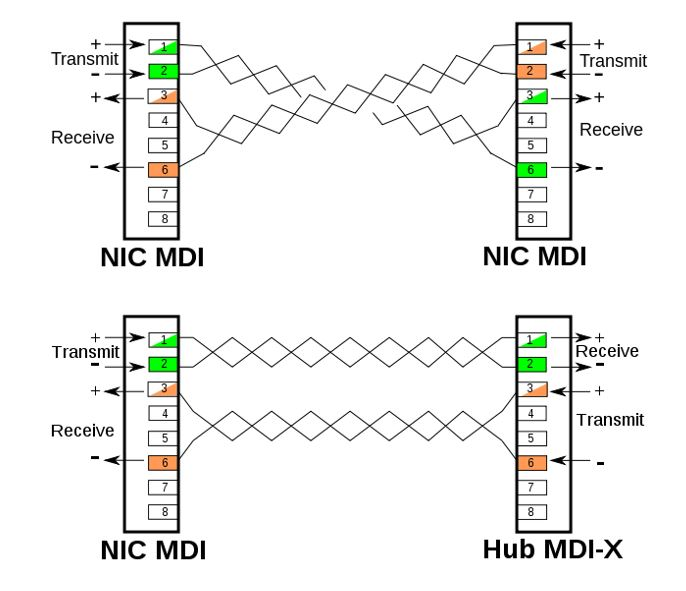
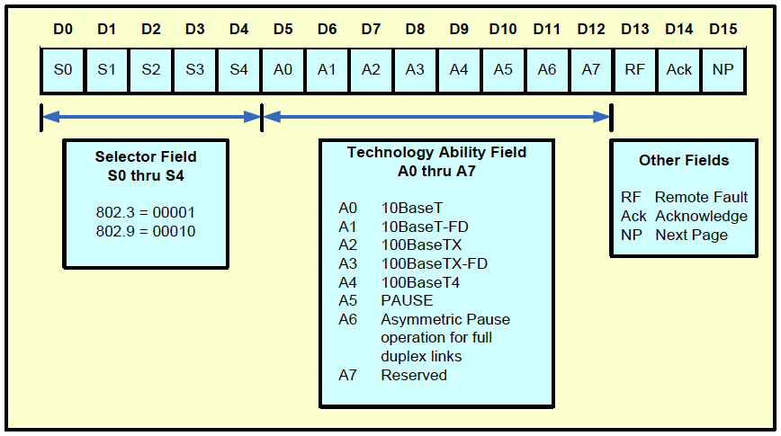

# Коммутируемый Ethernet 

Конкретная технология коммутации, которую мы будем рассматривать подробно, называется коммутируемым Ethernet. Коммутаторы, используемые для построения таких сетей, часто называются *коммутаторами уровня 2 (L2)*. Первых предков современных Ethernet-коммутаторов называли мостами (или bridge, бриджами), поскольку они использовались для создания «мостового соединения» между сегментами Ethernet. Это название до сих пор можно встретить в описании некоторых технологий и протоколов, связанных с Ethernet-коммутацией; если встретите — помните, что бридж — это коммутатор.

Для начала предположим, что у нас есть два сегмента Ethernet, которые необходимо соединить. Самый первый из подходов, который мы можем попробовать, — соединить их через ретранслятор (или многопортовый ретранслятор — он же хаб). Однако это решение не будет работать, если при этом будут превышены физические ограничения Ethernet (помним, что длина одного сегмента не более 500 метров и не более 4 повторителей между узлами, т. е. максимальное расстояние между двумя узлами — 2500 метров, и что в одном сегменте не может находиться более 1024 узлов).

Альтернативным решением было бы поставить узел с двумя Ethernet-адаптерами и заставить этот узел пересылать кадры из одной сети в другую. Этот узел будет сильно отличаться от повторителя, который просто копирует сигналы с одного интерфейса на другой. Такой узел будет работать с кадрами, принимая все кадры на одном интерфейсе и передавая их на другой. То есть оба его интерфейса будут полностью реализовывать алгоритмы обнаружения коллизий и доступа к среде, а значит, физические ограничения на длину сегмента и количество узлов, которые вызваны необходимостью эффективно управлять коллизиями, к данной паре соединённых сетей применяться не будут. Таким образом, мы разрываем один единый домен коллизий на два поменьше. 

## Обучающийся мост

Первое улучшение, которое можно придумать для такого моста, заключается в том, что ему не обязательно пересылать все кадры, которые он получает. 
Посмотрим на изображение. Всякий раз, когда узел A отправляет кадр узлу B, этот кадр поступает на порт 1 моста, и мост пересылает его на порт 2. Очевидно, что в этом нет никакой необходимости. Вопрос в том, как мосту узнать, на каком порту находятся различные узлы. 

Первый из вариантов — это вручную загрузить в мост таблицу, аналогичную таблице ниже. Тогда всякий раз, когда мост получает кадр на порту 1, адресованный узлу A, он не будет пересылать его на порт 2; в этом нет необходимости, так как хост A уже получил этот кадр. Следовательно, всякий раз, когда мост получает кадр для узла A на порту 2, он пересылает его на порт 1. 

|Узел|Порт|
|----|----|
|A|1|
|B|1|
|C|1|
|X|2|
|Y|2|
|Z|2|

Проблема в том, что поддерживать такую таблицу вручную слишком трудно, особенно для больших сетей. Но существует простой трюк, благодаря которому мост может самостоятельно обучаться. Идея состоит в том, чтобы мост проверял адрес источника во всех получаемых кадрах. Таким образом, когда узел A отправляет кадр любому другому узлу, мост получает этот кадр и фиксирует тот факт, что кадр от узла A был только что получен на порту 1. После этого мост вносит соответствующую запись в таблицу. 

Когда мост только включается, эта таблица пуста, записи добавляются со временем. Если мост получает кадр, адресованный узлу, чьё местоположение пока неизвестно, он пересылает кадр во все порты (кроме того, на котором он его получил). Также с каждой записью в таблице связан таймер, и мост удаляет запись, когда таймер истекает. Это делается для защиты от ситуаций, когда узел, а следовательно, и его Ethernet-адрес, перемещается из одной сети в другую.

Постепенно мосты совершенствовались, увеличивалось количество интерфейсов, росли объёмы памяти и размеры таблиц. Если изначально мосты использовались для объединения сегментов Ethernet, которые нельзя было соединить из-за физических ограничений, то с появлением многопортовых мостов администраторы сетей начали использовать мосты, чтобы дробить большие сегменты на сегменты меньшего размера, так как это повышало производительность каждого отдельного сегмента. Помним, что чем больше узлов в сегменте, тем больше они конкурируют за пропускную способность и тем чаще случаются коллизии, что ещё больше уменьшает общую пропускную способность. 

Тенденция к дроблению сегментов и дальнейшая эволюция мостов, их трансформация в устройства, которые называются Ethernet-коммутаторами, привели к тому, что в конечном итоге каждое отдельное устройство подключается к коммутатору своим каналом «точка — точка».

## Широковещательный домен

Сети Ethernet поддерживают широковещательную рассылку. Когда узел хочет отправить кадр, который должны получить и обработать все узлы, он указывает в Dst. Address специальный широковещательный адрес. Когда коммутатор получает кадр с широковещательным адресом, он рассылает его во все свои интерфейсы, кроме интерфейса, на котором он его получил. По аналогии с доменом коллизий (участок сети, в котором может произойти коллизия) существует термин «широковещательный домен». Широковещательный домен — это область сети, в которой устройства могут обмениваться широковещательными кадрами. 
Ранее, до появления коммутаторов, домен коллизий совпадал с широковещательным доменом. Сейчас домен коллизий ограничивается кабелем, соединяющим узел и коммутатор, таким образом, можно сказать, что широковещательный домен — это группа доменов коллизий, соединённых при помощи коммутатора.

## Half и Full Duplex

Дуплексность связи — это наличие или отсутствие возможности одновременно принимать и передавать данные. 

В режиме Half-Duplex узел может делать только что-то одно: или слушать, или передавать данные. 

Full-Duplex означает, что адаптер может принимать и передавать данные одновременно. 

Для сетей Ethernet на основе разделяемой среды Half-Duplex был стандартным режимом работы. Адаптер не мог передавать данные, если слышал чужую передачу, потому что иначе это вызовет коллизию. И если во время своей передачи адаптер принимал что-то из сети, то трактовал это как коллизию.

Теперь посмотрите, в какую мы попадаем ситуацию, если подключаем два полноценных Ethernet-адаптера каналом «точка — точка», например, подключаем узел к коммутатору. Мы передатчик одного адаптера подключаем напрямую к приёмнику другого и наоборот. В таком канале даже теоретически не может произойти коллизия. Но при этом, если оба адаптера попытаются передавать данные одновременно, то сработает алгоритм CSMA/CD и адаптеры обнаружат коллизию. Что ещё хуже, оба адаптера всё ещё продолжают конкурировать за пропускную способность. 

Всё, что нужно сделать, чтобы получить в Ethernet-канале типа «точка — точка» режим Full-Duplex, — это выключить алгоритм CSMA/CD.

> Теперь если во время передачи на приёмник приходят данные — устройство считает, что всё ок. На деле коллизии никуда не делись, но теперь за их отсутствие отвечает администратор сети — то есть мы. Если подключить устройства в концентратор и вручную включить им режим Full Duplex, то сеть утонет в коллизиях, но устройства не будут это фиксировать и пытаться исправлять.

> Передатчик — transmitter, Tx.
>
> Приёмник — receiver, Rx.
>
> Приёмопередатчик - transceiver

Все современные устройства поддерживают работу в режиме Full Duplex. Режим Half Duplex был определён в стандарте Gigabit Ethernet, однако на практике почти нигде не реализовывался. А начиная со стандарта 10GBASE поддерживается работа только Full Duplex. Сегодня работа интерфейса в режиме Half Duplex — это признак проблем, например с автосогласованием, физической линией и настройками. 
Что такое автосогласование и как оно работает — обсудим позже.

## MDI/MDIX, Auto MDI-X

Чтобы соединить Ethernet-адаптеры двумя витыми парами, нужно подключить передачу одного адаптера на приём другого и наоборот. Возможны два варианта:
- Оба узла имеют одинаковое расположение контактов. Тогда витые пары в коннекторе должны быть обжаты перекрёстно; кабель, обжатый таким образом, называется кроссовым.
- Передатчик заранее расположен напротив приёмника. Тогда витые пары обжимаются с обеих сторон одинаково. Такой кабель называется прямым.

Получается, что назначение контактов интерфейса зависит от того, как подключена среда передачи. Такой интерфейс называется MDI — Medium Dependent Interface. А его аналог с перевёрнутыми контактами — MDIX (Medium Dependent Interface with Crossover). MDI — это конечные узлы, маршрутизаторы. MDIX — коммутаторы и хабы. 

Если нужно соединить конечный узел с коммутатором, то надо использовать прямой кабель, а два одинаковых типа узлов (например, коммутатор к коммутатору) — кроссовый. 

Довольно часто в процессе подключения происходила путаница. Поэтому в 90-х годах в компании HP была создана технология Auto MDI-X, которая позволяет оборудованию автоматически определять тип подключённого кабеля и программно переворачивать пары при необходимости. При этом достаточно, чтобы Auto MDI-X поддерживался хотя бы одной стороной. Начиная с 1000BASE-T функционал Auto MDI-X стал частью стандарта; кроме того, технология поддерживается многими 100-мегабитными коммутаторами и маршрутизаторами и даже некоторыми сетевыми картами. 

## Стандарты Ethernet

За свою более чем полувековую историю технология Ethernet дошла с 2,94 Мбит/с по коаксиальному кабелю до 400 Гбит/с по оптическим линиям, которые реально используются в дата-центрах; более того, уже существует стандарт 800 Гбит/с.

[История Ethernet по витой паре](https://habr.com/ru/companies/netologyru/articles/819229/)

Стандартов Ethernet много, не все обрели коммерческий успех, но те, что это сделали, следует обсудить. 

### 10BASE-T

Буква «T» означает «twisted pair» (витая пара). Первый независимый от производителя стандарт Ethernet с использованием витой пары. Сейчас его уже, естественно, нигде не встретить. Но именно с него началось внедрение хабов, а затем и свичей. В данной реализации Ethernet использовалось манчестерское кодирование и частота несущей 10 МГц. 10BASE-T добавил механизм тестирования канала: в перерывах между передачей данных адаптеры посылают специальные короткие импульсы (NLP — Normal Link Pulse); один пульс длится 100 наносекунд и передаётся каждые 16 миллисекунд. Если адаптер регулярно получает эти пульсы — значит, канал в норме. 

### 100BASE-TX

В октябре 1995 года был принят документ 802.3u. В нём определено несколько стандартов 100-мегабитного Ethernet (Fast Ethernet), но на текущий день встретить можно только 100BASE-TX. 
100BASE-TX использует две витые пары (одну на приём и одну на передачу) длиной до 100 метров, может работать в режиме общей среды передачи (CSMA/CD, Half-Duplex, конкуренция за пропускную способность). Место манчестерского кодирования заняло сочетание импульсного кодирования MLT-3 и избыточного кода 4B/5B, а частота передачи — 31,25 МГц. Кабель Cat. 3 не подходил по своим физическим свойствам, поэтому для 100BASE-TX следовало использовать кабель категории 5 или 5е.

100BASE-TX сохраняет обратную совместимость со стандартом 10BASE-T. Поскольку теперь устройства теоретически могут не совпадать по поддерживаемым режимам работы (раньше был только 10BASE-T, теперь есть 100BASE, разные режимы дуплекса), понадобился режим автоматического согласования параметров. В Fast Ethernet под него адаптировали NLP из 10BASE-T.

### 1000BASE

Уже в 1998 году появился первый документ, описывающий гигабитный Ethernet. 802.3z предполагал использование только оптоволоконного кабеля. Два главных стандарта оттуда:
- 1000BASE-SX — дешёвое многомодовое волокно и коротковолновые лазеры (850 нм). Основное применение — соединения внутри одного здания или кампуса. Расстояние от 220 до 550 м в зависимости от толщины и качества кабеля. 
- 1000BASE-LX — этот стандарт использует длинноволновые лазеры (длина волны ~1310 нм) и может работать как с многомодовым, так и с одномодовым волокном. Главное его преимущество — дальность. На одномодовом волокне он обеспечивает связь на расстоянии до 5 километров.

Оба варианта двуглазые, то есть требуют отдельных волокон для приёма и передачи. 

В 1999 году выходит документ 802.3ab, который определяет абсолютного короля медного Ethernet — 1000BASE-T. 1000BASE-T позволяет передавать 1 Гбит/с по неэкранированной витой паре (UTP) категорий 5, 5е и 6, максимальное расстояние передачи составляет 100 метров. 1000BASE-T использует все 4 пары для передачи данных на скорости 1000 Мбит/с, причём каждая пара передаёт поток данных со скоростью 250 Мбит/с. 1000BASE-T использует кодирование 4D-PAM5 (5 символов, один символ позволяет передать сразу 2 бита информации) и частоту в 125 МГц. 

В 2004 году вышел документ 802.3ah, описавший ещё два гигабитных стандарта: 1000BASE-LX10 (позволяет передавать данные по одномоду на 10 км) и 1000BASE-BX10 (до 10 км по одному синглмоду на разных частотах).

### 10GBASE

Основные используемые на практике стандарты 10 Gigabit Ethernet определяются семейством документов IEEE 802.3. Большинство из них были выпущены в период с 2002 по 2007 год. Стандарты 10G полностью отказались от CSMA/CD и режима Half-Duplex.

| **Название** | **Год утверждения** | **Основной документ** | **Тип среды / Назначение** |
| :--- | :--- | :--- | :--- |
| **10GBASE-SR, -LR, -ER** | 2002 | IEEE 802.3ae-2002 | Оптические: многомодовое (SR) и одномодовое (LR, ER) волокно |
| **10GBASE-CX4** | 2004 | IEEE 802.3ak-2004 | Медный кабель Twin-Ax (до 15 м) |
| **10GBASE-T** | 2006 | IEEE 802.3an-2006 | Медная витая пара Cat 6a/7 (до 100 м) |
| **10GBASE-LRM** | 2006 | IEEE 802.3aq-2006 | Многомодовое волокно на 1310 нм (улучшенная дальность) |
| **10GBASE-KR, -KX4** | 2007 | IEEE 802.3ap-2007 | Медные печатные платы (backplane) |

## Autonegotiation

10BASE-T обнаруживает, что канал активен, при помощи получения/отправки NLP (Link Integrity Test (LIT)), когда не передаются данные. Эти сигналы представляют собой положительные униполярные импульсы длиной 100 нс с интервалом 16 мс (окно ±8 мс).

Протокол автосогласования, представленный в 100BASE Ethernet, использует Fast Link Pulse (FLP) вместо NLP. FLP представляет собой серию из 33 пульсов. Каждая серия длится 2 мс и использует такой же интервал передачи, что и NLP (16 мс ± 8 мс).

Половина импульсов в последовательности является тактовыми (первый и все последующие нечётные), а вторая половина — информационными (чётные); наличие пульса — 1, отсутствие — 0. Таким образом, за один FLP можно передать 16 бит, или 2 байта данных. Эти два байта называются Link Code Word (LCW) и содержат информацию для автосогласования.

[FLP description](https://lostintransit.se/2024/04/03/1000base-t-part-3/)

---

### Задание 1. Ситуационная задача: «По следам кадра»
**Контекст:** Коммутатор с 4 портами только что включили (таблица MAC-адресов **пуста**). 
* К порту 1 подключен узел **A**
* К порту 2 подключен узел **B**
* К порту 3 подключен узел **C**
* Порт 4 свободен.

**События:**
1. Узел **A** отправляет кадр узлу **B**.
2. Узел **B** сразу отправляет ответный кадр узлу **A**.

**Вопросы:**
1. Куда коммутатор перешлет первый кадр (от A к B) и какую запись сделает в таблице?
2. Куда коммутатор перешлет второй кадр (от B к A) и какую запись добавит?

---

### Задание 2. Сопоставление: «Стандарты и особенности»
Сопоставьте технологию/стандарт (1–4) с её ключевой особенностью (А–Г):

| Технология / Стандарт | Особенность |
| :--- | :--- |
| **1. 10BASE-T** | **А.** Полный отказ от Half-Duplex и CSMA/CD на уровне стандарта |
| **2. 1000BASE-T** | **Б.** Оптика на длине волны ~1310 нм, дальность до 5 км по одномоду |
| **3. 1000BASE-LX** | **В.** Передача 1 Гбит/с по 4 витым парам (по 250 Мбит/с на пару) |
| **4. 10GBASE** | **Г.** Первое появление импульсов NLP для проверки линии |

---

### Задание 3. Блиц: «Правда или Ложь»
Определите, верны ли следующие утверждения (если нет — объясните, в чём ошибка):

1. **Коммутатор делит сеть на несколько широковещательных доменов (по одному на каждый порт).** *(Правда / Ложь)*
2. **Чтобы включить Full Duplex на линке «точка-точка», нужно отключить алгоритм CSMA/CD.** *(Правда / Ложь)*
3. **Для соединения двух коммутаторов без поддержки Auto MDI-X нужен прямой патч-корд.** *(Правда / Ложь)*
4. **Один пакет FLP (Fast Link Pulse) передает ровно 16 бит информации (Link Code Word).** *(Правда / Ложь)*

---

### Задание 4. Вставка пропущенных терминов и чисел
Заполните пропуски нужными словами или числами:

> 1. В автосогласовании серия FLP состоит из **[ ? ]** импульсов: нечётные импульсы являются тактовыми, а чётные — **[ ? ]**.
> 2. В режиме Full Duplex коллизии не возникают на физическом уровне, однако если перевести адаптеры в Full Duplex при подключении к **[ ? ]**, сеть начнет терять данные из-за неучтённых коллизий.
> 3. Технология, которая автоматически меняет местами Tx и Rx при неправильном типе кабеля, называется **[ ? ]**.

---

### Задание 5. Топология и подсчёт доменов
Посмотрите на схему сегмента сети:

`[ПК 1] --- (Хаб) --- [ПК 2]`  
&nbsp;&nbsp;&nbsp;&nbsp;&nbsp;&nbsp;&nbsp;&nbsp;&nbsp;&nbsp;&nbsp;&nbsp;&nbsp;&nbsp;&nbsp;&nbsp;&nbsp;&nbsp;`|`  
&nbsp;&nbsp;&nbsp;&nbsp;&nbsp;&nbsp;`[Порт 1 Коммутатора]`  
&nbsp;&nbsp;&nbsp;&nbsp;&nbsp;&nbsp;`[Порт 2 Коммутатора] --- [ПК 3]`  
&nbsp;&nbsp;&nbsp;&nbsp;&nbsp;&nbsp;`[Порт 3 Коммутатора] --- [ПК 4]`  

**Вопросы:**
1. Сколько **доменов коллизий** в этой сети?
2. Сколько **широковещательных доменов** в этой сети?

---

### Задание 6. Разбор структуры FLP (Fast Link Pulse)

Изучите утверждения об импульсах автосогласования и отметьте **верные**:

1. Серия FLP длится 2 мс и повторяется каждые 16 мс.
2. В серии FLP передается ровно 33 импульса.
3. Нечётные импульсы несут информационные биты (0 или 1), а чётные задают тактовую частоту.
4. Полезная нагрузка пакета FLP называется LCW (Link Code Word) и имеет размер 16 бит (2 байта).

---

👉 <b>Ключ с ответами (для ведущего / разбора)</b>

#### Ответ к Заданию 1:
1. **Первый кадр:** Коммутатор запишет в таблицу, что MAC-адрес **A находится на порту 1**. Так как адрес B ему ещё неизвестен, кадр будет разослан во все активные порты, кроме порта-источника — **на порты 2 и 3** (механизм *Flooding*).
2. **Второй кадр:** Коммутатор запишет, что MAC-адрес **B находится на порту 2**. Так как адрес A уже есть в таблице, кадр будет отправлен **только на порт 1** (*Unicast Forwarding*).

#### Ответ к Заданию 2:
* **1 — Г** (10BASE-T — внедрил NLP)
* **2 — В** (1000BASE-T — использует все 4 пары по 250 Мбит/с)
* **3 — Б** (1000BASE-LX — длинноволновый лазер 1310 нм, до 5 км)
* **4 — А** (10GBASE — полностью убран CSMA/CD и Half Duplex)

#### Ответ к Заданию 3:
1. **Ложь.** Коммутатор делит сеть на *домены коллизий*. Широковещательный домен по умолчанию остаётся *единым*.
2. **Правда.** На физическом канале «точка-точка» коллизий нет, поэтому отключение CSMA/CD даёт возможность передавать и принимать одновременно.
3. **Ложь.** Однотипные устройства (коммутатор-коммутатор) без Auto MDI-X соединяются *кроссовым* (crossover) кабелем.
4. **Правда.** FLP содержит 16 информационных импульсов (16 бит / 2 байта = LCW).

#### Ответ к Заданию 4:
1. **33** импульса; **информационными** (данными).
2. **Хабу / концентратору / повторителю**.
3. **Auto MDI-X**.

#### Ответ к Заданию 6:
  * **Верные утверждения: 1, 2, 4.**
  * *Ошибка в пункте 3:* наоборот — нечётные импульсы являются тактовыми (тактом), а чётные — информационными данными.

