# Сетевой уровень

Мы обсудили, как создавать прямые каналы между устройствами и как объединять сети, построенные на основе одной технологии, в сети большего размера при помощи коммутации. Однако такой подход имеет ряд серьёзных ограничений:

- Каналы на основе разных технологий. Коммутаторы служат для объединения сетей на основе одной технологии. Разные технологии создания прямых каналов реализуют разные методы передачи кадров, отличаются форматы кадров, отличаются заголовки и адресация (где-то её вообще нет). Мы подробно рассмотрели только Ethernet, но кроме него есть и другие протоколы, как минимум Wi-Fi и PPP. Ранее технологический ландшафт был куда разнообразнее (Token Ring, Frame Relay, ATM и т. д.), и эта проблема стояла куда острее.
- Адресация. Пока что мы обсуждали только один тип адресов — адреса Ethernet (MAC-адреса). Эти адреса уникальные, назначаются производителем на заводе и принадлежат не узлу, а его адаптеру. Если мы заменим адаптер на узле (старый вышел из строя или устарел), то адрес нового адаптера будет совершенно другим. Если на этом узле находится какой-то сервис, например почтовый, пользователи, которые знают старый адрес, но не в курсе нового, не смогут получить к нему доступ.
- Масштабируемость. Представьте себе, что вам нужно создать сеть масштабов Интернета. 
  - Первое. Ethernet-коммутаторы принимают решения о пересылке кадров на основе таблицы коммутации; таблица коммутации содержит уникальную запись для **каждого** адреса в сети. Каких размеров была бы эта таблица и сколько времени занимал бы поиск нужной записи? Мы могли бы попробовать оптимизировать размеры такой таблицы, объединяя адреса в логические блоки (например, создавая одну запись в таблице коммутации для всех адресов, у которых совпадают первые 24 бита), но Ethernet-адреса назначаются производителем на заводе, и два адаптера с соседними адресами, скорее всего, окажутся в разных концах мира.
  - Второе. Вспомните про широковещание. Ethernet-узлы имеют возможность отправлять широковещательные кадры, которые должны быть получены всеми узлами. Количество широковещательного трафика, отправляемого через такую сеть, просто не позволило бы ей нормально работать.

Таким образом, технологии канального уровня не позволяют нам построить по-настоящему глобальные сети, в которых устройства, подключаемые к сети по разным технологиям, смогут коммуницировать друг с другом. Для решения этих проблем существует следующий уровень сети, так называемый «сетевой». Сетевой уровень реализует следующие основные функции:
- Услуга связи «узел-узел». Протоколы канального уровня предоставляют услугу связи «адаптер-адаптер», сетевой уровень должен обеспечивать связь между узлами, не имеющими возможности связаться напрямую.
- Адресация узлов. Адреса, назначаемые сетевым уровнем, обладают определёнными свойствами:
  - Они уникальные.
  - Они назначаемые (не привязаны к узлу физически) и при необходимости могут переноситься между узлами.
  - Они не зависят от технологии канального уровня. 
  - Они позволяют объединять узлы в логические группы (сети, подсети). Дальше, чтобы избежать путаницы, логические группы будут называться сетями. По адресу узла можно определить, к какой сети он принадлежит. Сети должны организовываться иерархически (несколько сетей можно объединить в одну большую).
- Маршрутизация. Сетевой уровень предоставляет сервисы, с помощью которых данные направляются к узлу назначения в другой сети (логической группе). Для перемещения данных между разными сетями сетевой уровень вводит новый тип устройств — маршрутизаторы (иногда их называют L3-коммутаторами). 
  - Маршрутизаторы подключают к себе несколько разных сетей. Маршрутизаторы при этом являются полноценными участниками каждой отдельной сети. Они имеют свой адрес в каждой сети, и узлы каждой сети имеют связь с маршрутизатором (напрямую или через коммутатор).
  - Когда узел хочет отправить пакеты узлу в другой сети, он сначала передаёт их маршрутизатору. Маршрутизатор определяет дальнейший путь для пакета и передаёт его в следующую сеть. До того как достигнуть узла назначения, пакет может пройти через несколько маршрутизаторов.
  - Маршрутизаторы соединяют сети, построенные на основе разных канальных технологий.
  - Маршрутизатор ограничивает широковещательный домен. Широковещательные кадры, посылаемые узлами, не проходят через маршрутизатор. 

> Определимся с терминологией. Словом «сеть» мы будем называть коллекцию узлов, относящихся к одной логической группе. Обычно эта логическая группа будет совпадать с напрямую подключённой/коммутируемой физической сетью на основе одной технологии. 
> Второй термин, «интерсеть», — это произвольное объединение таких сетей через маршрутизаторы. 

# IP — Internet Protocol

Главный протокол сетевого уровня — это IP (Internet Protocol). Протокол Интернета (IP) — ключевой инструмент, используемый сегодня для создания масштабируемых интерсетей.

## Инкапсуляция IP

Протокол IP принимает данные от вышестоящего уровня, упаковывает их в единицу данных сетевого уровня (IP-пакет) и добавляет служебную информацию в виде IP-заголовка. После принятия решения о дальнейшей пересылке пакет передаётся канальному уровню. 

Маршрутизаторы — промежуточные устройства, работающие на сетевом уровне. Они соединяют отдельные «сети» в «интерсети», даже если те работают на основе разных технологий. На рисунке мы видим сети Ethernet, беспроводную сеть и канал связи «точка-точка». Каждая из них представляет собой сеть, использующую одну технологию. 

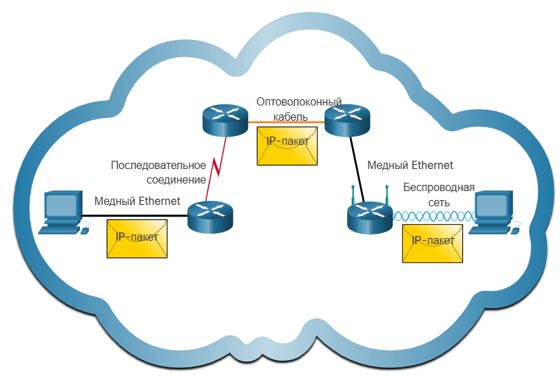

## Модель обслуживания

Философия, использованная при создании протокола IP, заключалась в том, чтобы сделать его максимально непритязательным, чтобы почти любая технология, которую можно встретить по пути между двумя узлами, могла предоставить необходимые услуги. 

Модель обслуживания протокола IP состоит из двух частей: схемы адресации, которая предоставляет способ идентификации всех узлов в сети, и способа доставки данных без установления соединения.

Принцип, на котором строится способ доставки в IP, называется «максимальным усилием» (best effort). IP делает всё возможное для доставки датаграмм, но не даёт никаких гарантий. «Максимальные усилия» означают, что если что-то пойдёт не так и пакет будет утерян, повреждён, доставлен не по назначению или каким-либо другим образом не достигнет места назначения, то IP-сеть ничего не сделает — она уже сделала всё возможное. Она не попытается исправить ошибку, в лучшем случае уведомит узел-источник о неудаче. Такой подход иногда называют ненадёжной услугой. 

Услуга, оказываемая таким образом, — это самая простая услуга, которую можно реализовать в «интерсети», и именно это является её главным преимуществом. Если бы IP предоставлял услуги «максимальных усилий», то это отлично работало бы в «интерсети», которая всегда надёжна и стабильна. Но реальные «интерсети» не такие, они ненадёжные (обрывы связи, перегрузка устройств, ошибки в каналах и прочее) — это означает, что в устройства, на основе которых строится «интерсеть», то есть в маршрутизаторы, пришлось бы добавлять множество дополнительных функций, чтобы эту ненадёжность исправлять. Одной из первоначальных целей проектирования IP было сделать маршрутизаторы как можно проще. Способность IP «работать на чём угодно» часто называют одной из его самых важных характеристик. Примечательно, что многие технологии, по которым работает IP сегодня, не существовали, когда IP был изобретён.

## Формат IP-пакета

IP-пакет состоит из заголовка, за которым следует некоторое количество байтов данных. 

Заголовок IP-пакета состоит из следующих полей:
- Version — по умолчанию, обсуждая протокол IP, мы будем подразумевать версию 4. Другая используемая версия IP — 6. Расположение этого поля самым первым облегчает внедрение новых версий.
- Header Length — длина заголовка в 32-битных словах. Заголовок IP содержит поля переменной длины (опции). Когда опций нет (что бывает в большинстве случаев), заголовок имеет длину в 5 слов (20 байт).
- TOS (Type of Service) — это поле имело несколько различных определений на протяжении многих лет, но его основная функция — позволить обрабатывать пакеты по-разному в зависимости от потребностей приложения. 
- Length — длина всего пакета, включая заголовок. В отличие от HLen, это поле указывает длину в байтах. Таким образом, максимальная длина IP-пакета — 65535 байт. 
- TTL — задача этого поля — бороться с пакетами, застрявшими в петле маршрутизации. Значение этого поля уменьшается каждым маршрутизатором на пути пакета. Пакет уничтожается, когда значение TTL достигает 0.
- Protocol — идентифицирует протокол вышестоящего уровня. 
- Checksum — высчитывается только от заголовка. Метод вычисления менее устойчив к ошибкам, чем CRC, но его намного проще реализовать в ПО.
- Source Address — адрес отправителя. Содержит 32-битное двоичное значение, которое представляет IPv4-адрес источника пакета. IPv4-адрес источника всегда индивидуальный. 
- Destination Address — адрес получателя. Содержит 32-битное двоичное значение, которое представляет IPv4-адрес назначения. IPv4-адрес назначения может быть одноадресным, многоадресным или широковещательным. 

На основе двух последних полей принимаются решения о дальнейшей пересылке IP-пакета.

## Адресация

IPv4-адрес — это уникальный 32-битный числовой идентификатор, присваиваемый каждому устройству в сети для его идентификации и маршрутизации трафика.

**01010000010011111011000010100001**

Для человека управлять адресами в такой записи крайне сложно, поэтому используется следующий формат записи. Последовательность из 32 бит разбивается на 4 октета, отдельные октеты переводятся в десятичную систему счисления:

|01010000|01001111|10110000|10100001|
|-|-|-|-|
|80|79|176|161|

> [!TIP]
> Мы можем перевести число $n_{10}$ из десятичной СС в двоичную по следующему алгоритму:
>
> 1. Делим $n_{10}$ на 2 и записываем остаток от деления.
> 2. Результат деления вновь делим на 2 и опять записываем остаток.
> 3. Повторяем операцию до тех пор, пока результат деления не будет равен нулю.
> 4. Записываем полученные остатки в обратном порядке. Полученное число и будет искомым $n_{2}$.
>
> Перевод числа из двоичной СС в десятичную осуществляется путём умножения каждого разряда числа на $2^k$, где $k$ — номер разряда, начиная с 0.

### Классовая адресация

Мы говорили, что одно из требований к адресации — это возможность объединять IP-адреса в иерархические группы. Это значит, что адреса должны состоять из нескольких частей, соответствующих определённой иерархии.

Если говорить конкретно, IP-адреса состоят из двух частей, обычно называемых сетевой и хостовой (узловой) частями. Сетевая часть IP-адреса идентифицирует сеть, к которой подключён хост; все хосты, подключённые к одной сети, имеют одну и ту же сетевую часть в своём IP-адресе. Хостовая часть затем уникально идентифицирует каждый хост в этой сети. 

Изначально IP-адреса были разделены на три разных класса, каждый из которых определяет разные размеры сетевой и хостовой частей. Класс IP-адреса определялся по нескольким старшим битам. Если первый бит равен 0, это адрес класса А. Если первый бит равен 1, а второй — 0, это класс B. Если первые два бита равны 1, а третий — 0, это адрес класса С. Таким образом, из примерно 4 миллиардов возможных IP-адресов половина относится к классу А, четверть — к классу B и одна восьмая — к классу C. Каждый класс выделяет своё количество бит для сетевой части адреса, а остальное — для узловой.
- Сети класса А имеют 7 бит для сетевой части и 24 бита для хостовой. Это означает, что может существовать только 126 сетей класса А (0 и 127 зарезервированы), но каждая из них может вмещать до $2^{24}-2$ (примерно 16 миллионов) хостов (два значения тоже зарезервированы). 
- Сети класса B выделяют 14 бит для сети и 16 бит для хоста, значит, каждая сеть класса B имеет место для 65534 узлов. 
- Сеть класса C выделяет 21 бит для сети и всего 8 бит для хоста, значит, в сети класса C может находиться всего 254 узла (тоже два зарезервированы), но зато таких сетей может быть более 2 миллионов. 

### Бесклассовая адресация, маска сети

На первый взгляд эта схема адресации обладает большой гибкостью, позволяя достаточно эффективно обслуживать сети различных размеров. Первоначальное назначение IP-адресов заключалось в том, чтобы сетевая часть уникально идентифицировала ровно одну физическую сеть. Оказалось, что у этого подхода есть несколько недостатков.

Со стремительным ростом Интернета стало очевидно, что такое распределение адресов слишком неэффективно. Представьте себе большой университетский кампус, который имеет множество внутренних сетей (своя на каждую лабораторию) и решает подключиться к Интернету. Для каждой сети, независимо от её размера, нужна как минимум адресация класса С. Для сетей, в которых находится всего два узла (например, соединение между двумя маршрутизаторами: в такой сети нет оконечных узлов, но это всё равно полноценная физическая сеть, где требуются свои адреса), выделяется сеть класса C. 252 адреса из 254 остаются незадействованными. Если сеть включает в себя чуть больше узлов, чем 254, то выделение сети класса B выглядит крайне расточительным. 

Второй недостаток становится очевидным, когда мы начинаем задумываться о размере таблиц пересылки. Как было в коммутации? Размер таблицы коммутации пропорционален количеству узлов в сети. В случае с классовой адресацией размер таблиц, по которым будет происходить пересылка IP-пакетов, будет пропорционален количеству выделенных сетей.

Предположим, что нашему университетскому кампусу для подключения к Интернету будет выделено 10 сетей класса C: сети с номерами с 3 по 7 и с 15 по 19. Тогда в точке подключения будет создано 10 записей вида:

|Номер сети|Куда|
|---|---|
|3|Кампус университета|
|4|Кампус университета|
|...|Кампус университета|
|7|Кампус университета|
|15|Кампус университета|
|...|Кампус университета|
|19|Кампус университета|

Отличным шагом к оптимизации такой таблицы стало бы объединение строк для идущих подряд номеров сетей. Тогда мы могли бы получить таблицу вида:

|Номер сети|Куда|
|---|---|
|3-7|Кампус университета|
|15-19|Кампус университета|

В примере таблица стала бы в 5 раз меньше. Но классовая адресация не предоставляет такого инструмента. 

По этим причинам в 1993 году в документе RFC 1517 была представлена схема CIDR (Classless Inter-Domain Routing). Маршрутизация CIDR вытеснила систему назначений классовых сетевых адресов, и классы адресов (А, В и С) устарели и перестали использоваться. При использовании маршрутизации CIDR сетевой адрес больше не определяется значением первого октета. Вместо этого сетевая часть адреса определяется маской подсети, также называемой сетевым префиксом или длиной префикса (т. е. /8, /19 и т. д.).

Маска — это число, применяемое в паре с IP-адресом, причём двоичная запись маски содержит непрерывную последовательность единиц в тех разрядах, которые должны в IP-адресе интерпретироваться как номер сети. Граница между последовательностями единиц и нулей в маске соответствует границе между номером сети и номером узла в IP-адресе.

Маску сети записывают двумя способами:
- либо как IP-адрес (разбивают на октеты, каждый октет переводят в десятичную систему);
- либо числом от 0 до 32, обозначающим количество единиц в маске. 

Чтобы отделить сетевую часть адреса от узловой, нужно записать маску под адресом. Часть адреса над единицами будет адресом сети, часть адреса над нулями — адресом узла. 

0101000001001111101100 **|** 0010100001

1111111111111111111111 **|** 0000000000

- Сетевая: 0101000001001111101100
- Узловая: 0010100001

Для перехода в десятичный формат номер сети и узла дополняют до 32 бит. 

Правильно это действие называется логическим умножением, или операцией логического «И», между адресом и маской.

Маска сети допускает произвольное разделение IP-адреса на поля для нумерации сети и узлов. При такой системе адресации клиенту может быть выдан пул адресов, более точно соответствующий его запросу, чем это происходит при адресации, основанной на классах адресов.

Например, если в кампусе есть четыре лаборатории, в каждой своя сеть, в которых 25, 20, 15 и 28 узлов соответственно, то с классовой системой адресов на каждую сеть пришлось бы выделить сеть класса C. 
При использовании бесклассовой адресации хватит пула адресов с маской /24.

Допустим, кампус при подключении к Интернету получил сеть 192.168.20.0/24. Чтобы лучше разобраться в механизме работы бесклассовой адресации, воспользуемся двоичными представлениями:

11000000.10101000.00010100 .00000000

11111111.11111111.11111111 .00000000

Эта запись интерпретируется следующим образом: «сеть, не принадлежащая ни к одному из стандартных классов, номер которой содержится в 24 старших разрядах, и имеющая 8-битовое поле для нумерации 254 узлов».

Пока что это не соответствует заявленным требованиям. Чтобы получить четыре отдельные сети для каждой лаборатории, необходимо заимствовать три бита из узловой части, увеличив длину префикса с /24 до /27. 

|11111111111111111111111|.111|000000|
|-|-|-|
|11000000.10101000.00010100|.000|00000|
|11000000.10101000.00010100|.001|00000|
|11000000.10101000.00010100|.010|00000|
|11000000.10101000.00010100|.011|00000|
|11000000.10101000.00010100|.100|00000|
|11000000.10101000.00010100|.101|00000|
|11000000.10101000.00010100|.110|00000|
|11000000.10101000.00010100|.111|00000|

Посмотрите на таблицу. Три заимствованных бита образуют поле номера подсети. Поскольку возможно восемь комбинаций, сеть /24 разбивается на восемь подсетей с префиксом /27. Изменяя значения трёх битов номера подсети, получаем восемь различных подсетей, каждая из которых является частью исходной сети 192.168.20.0/24. Каждая из 8 подсетей будет составной частью выделенной кампусу сети. Это легко видно по таблице.

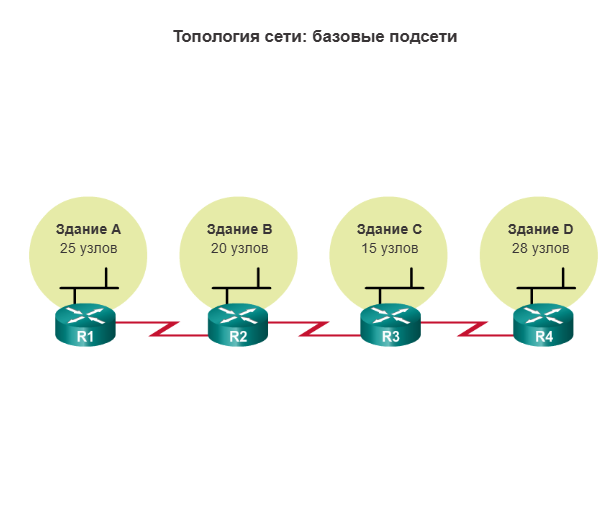

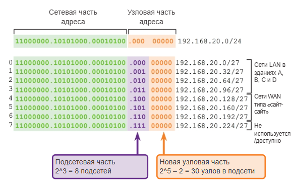

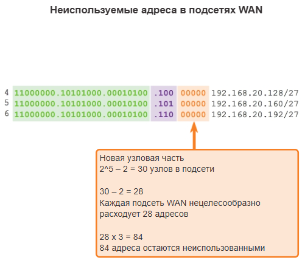

При использовании масок подсети фиксированной длины (FLSM) для каждой подсети выделяется одинаковое число адресов. Если все подсети предъявляют одинаковые требования к количеству узлов, выделенных блоков адресов фиксированного размера будет достаточно. Тем не менее чаще всего это не так.

Например, в каждой подсети для трёх каналов WAN требуется только два адреса. Поскольку каждая из подсетей содержит 30 доступных для использования адресов, в каждой из подсетей оказывается 28 неиспользуемых адресов. Как показано на рисунке 3, это приводит к тому, что в подсетях в итоге оказывается 84 неиспользованных адреса ($28 \times 3$). Кроме того, это также ограничивает расширение сети в будущем, уменьшая общее число доступных подсетей. Такое неэффективное использование адресов характерно для стандартного разделения классовых сетей на подсети.

При традиционном разделении на подсети ко всем подсетям применяется одна и та же маска подсети. Это означает, что все подсети содержат одинаковое число доступных адресов узлов. Разделение на подсети с помощью VLSM схоже с традиционным разделением на подсети в том, что для создания подсетей заимствуются биты. По-прежнему применяются формулы расчёта числа узлов в каждой подсети и числа создаваемых подсетей. Разница заключается в том, что разделение на подсети не является одноэтапным действием. При использовании VLSM сеть сначала разделяется на подсети, а затем подсети, в свою очередь, также разбиваются на подсети. Этот процесс можно повторять многократно для создания подсетей различных размеров.

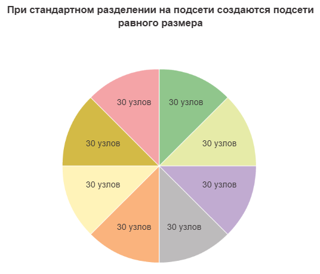

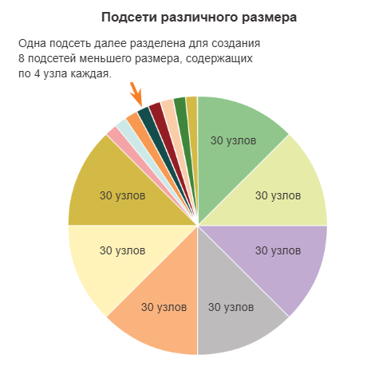

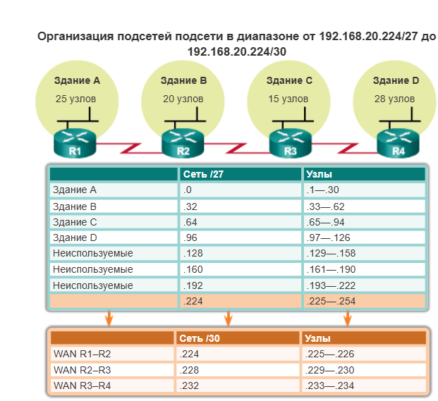

Маска сети настраивается на узле вместе с IP-адресом и служит для того, чтобы узел мог определить, какие IP-адреса находятся с ним в одной сети (живут с ним на одной улице), а какие — нет. Маска не передаётся по сети, а существует только локально на узле.

## Концепция маршрутизации

Разобрав адресацию, мы готовы рассмотреть основной механизм, с помощью которого IP-узлы пересылают пакеты в интерсетях, — маршрутизацию.

Вспомним основные моменты, которые следует учитывать при обсуждении пересылки IP-пакетов:
- Каждый IP-пакет содержит IP-адрес целевого узла.
- Сетевая часть IP-адреса уникально идентифицирует одну физическую сеть в интерсети.
- Все узлы и маршрутизаторы, которые имеют одинаковую сетевую часть адреса, подключены к одной и той же физической сети и, следовательно, могут обмениваться данными напрямую (передавая друг другу кадры).
- Каждая физическая сеть, которая является частью интерсети, имеет по крайней мере один маршрутизатор, который также подключён как минимум ещё к одной физической сети; этот маршрутизатор может обмениваться пакетами с узлами в обеих сетях.

Доставка пакета до конечной точки назначения осуществляется двумя различными способами: прямым и косвенным, как показано на рисунке.

При прямой доставке, конечная точка пакета и отправитель находятся в одной физической сети. Отправитель может легко определить, будет ли доставка прямой. Для этого он определяет адрес сети назначения (используя маску) и сравнивает его с адресами сетей, к которым подключен. Если совпадение найдено, то доставка прямая. 

Когда отправитель и конечная точка в разных физических сетях, доставка считается косвенной. Пакет переходит от роутера к роутеру, пока не достигнет роутера, который подключен к одной физической сети к конечной точке. Заметье, что таким образом, IP-пакет отправляется от исходного узла к целевому узлу, возможно, проходя через несколько маршрутизаторов по пути.

Для того чтобы принимать решения о пересылке, все узлы IP-сети имеют специальную таблицу, называемую таблицей маршрутизации. 

В простейшем виде записи (маршруты) в таблице маршрутизации содержат адрес сети с маской (prefix) и адрес следующего перехода (next-hop). Есть три основных способа создания новых записей в таблице маршрутизации:
- Прямо подключённые сети (connected). Когда на узле настраивается IP-адрес, в таблице маршрутизации создаётся соответствующая запись.
- Статические маршруты. Записи можно создавать вручную. В таком случае администратор вручную указывает prefix и next-hop. 
- Динамические маршруты. В таком случае узлы обмениваются служебными сообщениями, которые содержат информацию о доступных маршрутах. 

Оконечные узлы обычно используют первые два типа. В большинстве случаев на оконечных узлах есть маршрут только до connected-сетей и маршрут через шлюз по умолчанию.
Шлюз по умолчанию — это маршрутизатор, которому узел будет отправлять все пакеты, для которых не нашёл более оптимального пути. 

Когда узлу (оконечному или маршрутизатору) нужно принять решение о пересылке IP-пакета, он запускает поиск по таблице маршрутизации для IP-адреса назначения. Узел последовательно проверяет, попадает ли IP-адрес назначения под prefix из таблицы маршрутизации. Для этого он прикладывает к IP-адресу назначения маску сети и получившийся результат сравнивает с адресом сети. Среди подошедших записей выбирается самая оптимальная, затем пакет передаётся на next-hop.

### Рекурсивный поиск по таблице маршрутизации

Есть два варианта для next-hop:
- Получатель IP-пакета находится в локальной сети. Тогда вместо next-hop будет указан интерфейс, через который к получателю можно получить прямой доступ. 
- Получатель IP-пакета находится в удалённой сети. В таком случае в таблице будет записан IP-адрес узла следующего перехода.

Во втором случае есть небольшая тонкость. После того как узел определился с next-hop, ему нужно снова запустить процесс поиска по таблице маршрутизации, на этот раз уже для самого next-hop. Так может повторяться несколько раз — до тех пор, пока не будет найден маршрут через напрямую подключённый узел. 

Пример таблицы маршрутизации для узла, на котором настроен адрес 192.168.10.110/24:

|Network|Mask|Next-hop|
|---|---|---|
|192.168.10.110|255.255.255.255|Self|
|192.168.10.0|255.255.255.0|Eth0|
|172.16.12.0|255.255.255.128|192.168.10.2|
|0.0.0.0|0.0.0.0|192.168.10.1|

Разберём записи в таблице по отдельности:

1. Первая запись содержит адрес узла и необычную маску 255.255.255.255. Если перевести эту маску в двоичный вид, то она будет состоять из 32 единиц. Под такой маршрут могут попасть только пакеты, предназначенные самому узлу. Обратите внимание, что в графе Next-Hop записано Self, то есть таблица маршрутизации сообщает, что такие пакеты надо оставить у себя.
2. Во второй строке записаны адрес сети и маска, соответствующие адресу, настроенному на узле. Запись Eth0 в графе Next-Hop указывает, что узлы из этой сети доступны напрямую через интерфейс Eth0.
3. Третья строка содержит статический маршрут до сети 172.16.12.0/25, в строке Next-Hop указан адрес следующего перехода. Это адрес маршрутизатора, которому нужно отправить пакет, чтобы он переслал его дальше.
4. Четвёртый маршрут — самый необычный. Это так называемый маршрут по умолчанию. Под него попадают ВСЕ IP-адреса. Он используется в последнюю очередь, если не нашлось лучшего маршрута. 

### Выбор лучшего маршрута

В таблице маршрутизации может находиться сразу несколько маршрутов до одной и той же сети. Устройства ориентируются на следующие параметры при выборе лучшего маршрута:

1. **Longest Prefix Match** — среди всех записей в таблице маршрутизации, совпадающих с целевым IP-адресом, роутер выбирает маршрут с самой длинной маской подсети (наибольшим числом совпадающих бит).
2. Если маски сети совпадают, оценивается **Administrative Distance (AD)** — приоритет источника маршрута. Чем ниже AD, тем более предпочтителен маршрут. Самые предпочтительные — маршруты до прямо подключённых сетей. Затем идут статические маршруты. В конце — динамические маршруты (для разных протоколов динамической маршрутизации свой AD).
3. Если источники маршрутов совпали, сравниваются метрики — стоимость маршрута внутри самого источника маршрута. Она высчитывается внутри динамического протокола маршрутизации.

Если по итогу два маршрута оказываются равнозначными, устройство использует оба сразу, балансируя пакеты между ними.

### Агрегация маршрутов

Когда мы обсуждали классовую адресацию, то в качестве одного из минусов приводили большой размер таблиц маршрутизации. Используя сетевые маски мы можем уменьшить объём маршрутов в таблице. На рисунке роутер R1 подключен к 4 сетям, в каждой из которых по 64 адреса. Роутер R2 находится где-то вдалеке от R1. У роутера R1 более длинная таблица маршрутизации, потому что он должен корректно доставлять пакеты в каждую из подключенных сетей. С другой стороны таблица на R2 сильно меньше. Для R2 что пакет до 140.24.7.0, что пакет 140.24.7.255 отправляется через один и тот же интерфейс, независимо от конкретной подсети. Поэтому в таблице R2 все четыре подсети записаны в виде одного маршрута. Это называется агрегацией маршрутов. Заметьте, что как и в случае с подсетями, мы можем использовать несколько уровней агрегации. 

### Динамическая и статическая маршрутизация

Статические маршруты — это записи маршрутов, которые настраиваются вручную. Статический маршрут включает в себя адрес удалённой сети и IP-адрес маршрутизатора следующего перехода. В случае изменения топологии сети статический маршрут не обновляется автоматически и должен быть перенастроен вручную. 

Динамические маршруты — это записи маршрутов, полученные в результате обмена сообщениями специальных протоколов. Протокол динамической маршрутизации позволяет маршрутизаторам автоматически получать информацию об удалённых сетях, включая маршрут по умолчанию, от других маршрутизаторов. Маршрутизаторы, использующие протоколы динамической маршрутизации, автоматически обмениваются информацией о маршрутизации с другими маршрутизаторами и выполняют обновления в случае каких-либо изменений в топологии без участия сетевого администратора. При изменении топологии сети маршрутизаторы совместно используют эту информацию с помощью протокола динамической маршрутизации и автоматически обновляют свои таблицы маршрутизации.

## Протокол ARP, MAC и IP

Процесс маршрутизации всегда завершается тем, что узлу необходимо переслать пакет дальше через один из своих интерфейсов — неважно, конечному узлу или следующему по пути маршрутизатору. 
В обоих случаях IP-пакет передаётся вниз на канальный уровень. Если на канальном уровне работает протокол PPP, то всё просто: один отправитель, один получатель; узел инкапсулирует IP-пакет в PPP-кадр и отправляет через адаптер. 

Если на канальном уровне работает протокол Ethernet, то узел перед отправкой кадра должен заполнить поля SRC MAC и DST MAC. В поле SRC MAC узел записывает адрес своего Ethernet-адаптера. Если конечный узел находится в локальной сети, то в поле DST MAC записывается его MAC-адрес. Когда адаптер узла назначения получает этот кадр, он считывает DST MAC, видит там себя, декапсулирует из кадра пакет и передаёт пакет сетевому уровню. Сетевой уровень считывает DST IP из заголовка пакета, видит там себя и продолжает обработку.

В случае если узел назначения находится в удалённой сети, пакет надо сначала отправить маршрутизатору. В такой ситуации в поле MAC-адреса назначения записывается MAC-адрес маршрутизатора, который выбран в качестве адреса следующего перехода. Когда маршрутизатор получает такой кадр, он считывает DST MAC, видит там себя, декапсулирует из кадра пакет и поднимает его на сетевой уровень. На сетевом уровне маршрутизатор считывает DST IP, понимает, что пакет предназначен не ему, и запускает процесс маршрутизации.

Возникает логичный вопрос: как отправляющему узлу узнать MAC-адрес узла или шлюза, чтобы вписать его в Ethernet-кадр? 

Для этих целей существует ещё одна таблица. Она содержит IP-адреса и соответствующие им MAC-адреса. Каждой записи соответствует таймер, который определяет время её жизни на случай, если узел отключён от сети. 

|IP-address|MAC-address|Timer|
|---|---|---|
|IP1|A|100|
|IP2|B|599|
|IP3|C|33|

Как и в случае с таблицами коммутации, существует два способа заполнения такой таблицы:
1. Заполнять таблицу вручную. Как и в случае с коммутацией, это трудозатратный и немасштабируемый вариант. 
2. Заполнять таблицу динамически. Для этих целей используется специальный протокол — ARP (Address Resolution Protocol). По названию этого протокола именуется описанная выше таблица — ARP-таблица.

Функции протокола ARP:
- Если IPv4-адрес назначения пакета находится в той же сети, что и IPv4-адрес источника, устройство ищет в таблице ARP IPv4-адрес назначения.
- Если IPv4-адрес назначения пакета находится не в той же сети, что и IPv4-адрес источника, устройство ищет в таблице ARP IPv4-адрес следующего перехода.

Если устройство находит IPv4-адрес, то в качестве MAC-адреса в кадре используется соответствующий MAC-адрес. Если запись не найдена, устройство отправляет ARP-запрос.

ARP-запрос отправляется в том случае, когда устройству требуется MAC-адрес, связанный с IPv4-адресом, но в его таблице ARP нет данных об этом IPv4-адресе.

Сообщения ARP-запроса инкапсулируются непосредственно в кадре Ethernet. Заголовок IPv4 отсутствует. ARP-запрос инкапсулируется в кадре Ethernet со следующей информацией в заголовке:

- MAC-адрес назначения. Широковещательный адрес FF-FF-FF-FF-FF-FF, требующий принятия и обработки ARP-запроса всеми сетевыми интерфейсными платами Ethernet в локальной сети (LAN).
- MAC-адрес источника. Это MAC-адрес отправителя ARP-запроса.
- Тип. В сообщении ARP-запроса есть поле «Тип» со значением 0x806. Оно информирует принимающую сетевую плату о том, что для части кадра, выделенной для данных, необходимо использовать процесс ARP.

Поскольку ARP-запросы являются широковещательной рассылкой, они рассылаются через все порты коммутатора, кроме принимающего порта. Все сетевые адаптеры Ethernet в локальной сети транслируют и должны доставить запрос ARP в свою операционную систему для обработки. Каждое устройство обрабатывает ARP-запрос на предмет совпадения целевого IPv4-адреса с собственным адресом. Маршрутизатор не пересылает широковещательные рассылки другим интерфейсам.

Только у одного устройства в локальной сети (LAN) будет IPv4-адрес, совпадающий с целевым IPv4-адресом в ARP-запросе.

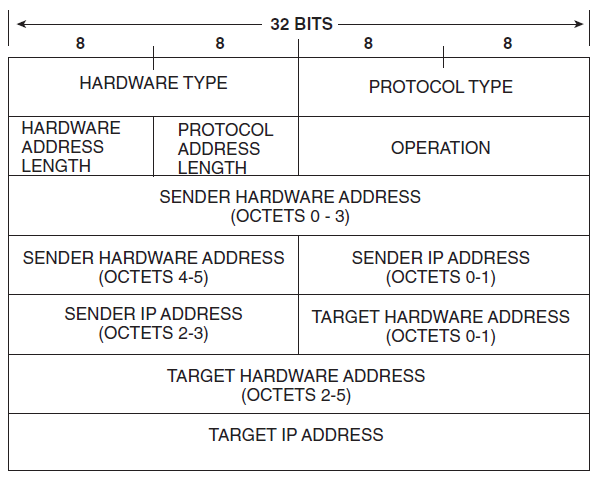

ARP-кадр состоит из следующих полей:
- Hardware Type — 16-битное поле, определяющее «тип канальной среды»: 1 — Ethernet (также Wi-Fi), 15 — Frame Relay, 18 — Fiber Channel и т. д.
- Protocol Type — 16-битное поле, определяющее протокол сетевого уровня, который отправитель связывает с идентификатором канала передачи данных. Для протокола IP версии 4 значение данного поля равно 0x0800.
- Hardware Address Length — 8-битное поле, определяющее длину идентификатора канальной среды в байтах. MAC-адрес имеет длину 48 бит, или 6 байт.
- Protocol Address Length — 8-битное поле, определяющее длину адреса сетевого уровня в байтах. IP-адрес имеет длину 32 бита, или 4 байта.
- Operation — 16-битное поле, которое определяет, какой тип пакета ARP используется:
  - ARP Request — 1
  - ARP Reply — 2
  - Reverse ARP Request — 3
  - Reverse ARP Reply — 4
  - Inverse ARP Request — 8
  - Inverse ARP Reply — 9
- Sender Hardware Address (SHA) — MAC-адрес отправителя.
- Sender Protocol Address (SPA) — IP-адрес отправителя.
- Target Hardware Address (THA) — MAC-адрес получателя (не заполняется при запросе, поле заполнено нулями).
- Target Protocol Address (TPA) — IP-адрес получателя.

### Gratuitous ARP

Устройство иногда может создавать запрос ARP со своим собственным IP-адресом в качестве адреса назначения. Такой запрос ARP называется Gratuitous ARP и может использоваться в следующих случаях:

1. Первый случай — использование для проверки дублирования адресов в сети. Устройство, которое отправило ARP Request со своим собственным адресом в качестве адреса назначения в запросе и в ответ получило ARP Reply от другого устройства, сможет узнать, что данный адрес является дубликатом в сети.
2. Второй случай — использование для того, чтобы объявить свой новый идентификатор канальной среды. Если устройство получает ARP Request для IPv4-адреса, который уже есть в кэше ARP, то кэш будет обновлён с использованием нового идентификатора канального уровня отправителя.
3. Третий случай — использование маршрутизаторами протокола Hot Standby Router Protocol (HSRP).

## ICMP

Несмотря на то что протокол IP спокойно отбрасывает пакеты, когда что-то идёт не так, он не обязательно делает это «молча». Протокол IP всегда работает в паре с протоколом-компаньоном, известным как ICMP (Internet Control Message Protocol), который определяет набор сообщений об ошибках, отправляемых обратно на исходный узел, когда маршрутизатор или узел не могут успешно обработать IP-пакет. 

Например, ICMP определяет сообщения об ошибках, указывающие на то, что узел назначения недоступен (возможно, из-за сбоя соединения), что процесс сборки не удался, что TTL достиг нуля, что контрольная сумма заголовка IP не прошла проверку и так далее.

- тип (1 байт) — числовой идентификатор типа сообщения;
- код (1 байт) — числовой идентификатор, более тонко дифференцирующий тип ошибки;
- контрольная сумма (2 байта) — подсчитывается для всего ICMP-сообщения.

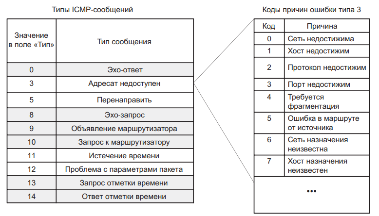

ICMP можно использовать для проверки доступности узла в IP-сети. Локальный узел отправляет узлу эхо-запрос ICMP. Если узел доступен, узел назначения отправляет эхо-ответ. Такое использование ping-запросов по протоколу ICMP легло в основу утилиты ping.

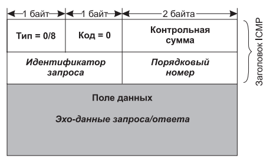

Формат эхо-запроса и эхо-ответа показан на рисунке. Поле типа для эхо-ответа равно 0, для эхо-запроса — 8; поле кода всегда равно 0 и для запроса, и для ответа. В байтах 5 и 6 заголовка содержится идентификатор запроса, в байтах 7 и 8 — порядковый номер. В поле данных эхо-запроса может быть помещена произвольная информация, которая в соответствии с данным протоколом должна быть скопирована в поле данных эхо-ответа.

## Конфигурация IP-адресов

Большинство операционных систем предоставляют системному администратору или даже пользователям возможность вручную и динамически настраивать IP-информацию (адрес, маску, шлюз по умолчанию) на узле.

Выбор между статическим IP (ручная настройка) и DHCP (автоматическая выдача) определяется одним главным критерием: должен ли этот компьютер/устройство быть всегда доступен по одному и тому же адресу для других устройств в сети.

Обязательно нужен статический IP (ручная настройка):
- Серверное оборудование: файловые серверы (NAS), серверы печати, 1С-серверы, веб-серверы внутри сети. Если IP изменится — клиенты не найдут сервер.
- Сетевое оборудование: маршрутизаторы (роутеры), коммутаторы (свитчи), точки доступа Wi-Fi. К ним нужно подключаться для управления по строго известному адресу.
- Принтеры и МФУ (сетевые). Чтобы отправить документ на печать, ваш компьютер должен «знать», где находится принтер. Если DHCP сменит ему адрес, печать перестанет работать.
- IP-камеры и системы видеонаблюдения. Для записи видео с камеры видеорегистратор должен постоянно видеть её на одном месте.

Когда можно и нужно использовать DHCP (автоматическая выдача). DHCP — это стандарт для клиентских устройств, которым не нужно, чтобы их находили другие:
- Ноутбуки и смартфоны сотрудников. Они постоянно перемещаются (из офиса в переговорную, с Wi-Fi на проводную сеть). DHCP сам скорректирует настройки под новый сегмент сети.
- Домашние компьютеры и планшеты. Если вы не держите на ПК домашний веб-сервер, ему не нужен фиксированный адрес.
- Гостевые сети. Для безопасности и изоляции трафика.
- Временные подключения. Подключение к публичному Wi-Fi в кафе, аэропорту или на конференции — только DHCP (вам даже не нужно знать настройки подсети).

### DHCP

[DHCP Habr Article](https://habr.com/ru/articles/825016/)

Для динамической конфигурации узла используется протокол динамической конфигурации узла v4 (DHCPv4). 
Протокол DHCP работает в соответствии с моделью «клиент-сервер». Во время старта ОС компьютер, являющийся DHCP-клиентом, посылает в сеть широковещательный запрос на получение IP-адреса. DHCP-сервер откликается и посылает сообщение-ответ, содержащее IP-адрес и ряд других конфигурационных параметров. При этом DHCP-сервер может работать в разных режимах, включая:

- Ручное распределение — администратор присваивает устройству-клиенту предварительно выделенный IPv4-адрес, в то время как DHCPv4 только передаёт IPv4-адрес устройству.
- Автоматическое распределение — DHCPv4 автоматически присваивает устройству постоянный статический IPv4-адрес, выбирая его из пула доступных адресов. При автоматическом распределении отсутствует понятие аренды, и устройству выделяется адрес в постоянное использование.
- Динамическое распределение — DHCPv4 динамически присваивает или выдаёт в аренду IPv4-адрес из пула адресов на ограниченный период времени — по выбору сервера или до тех пор, пока у клиента есть необходимость в адресе.

DHCPv4 работает по модели «клиент-сервер». Когда клиент подключается к серверу DHCPv4, сервер присваивает или сдаёт ему в аренду IPv4-адрес. Клиент с арендованным IP-адресом подключается к сети до истечения срока аренды. Периодически клиент должен связываться с DHCP-сервером для продления срока аренды. Благодаря подобному механизму «переехавшие» или отключившиеся клиенты не занимают адреса, в которых они больше не нуждаются. По истечении срока аренды сервер DHCP возвращает адрес в пул, из которого адрес может быть повторно получен при необходимости.

При начальной загрузке клиента (или ином способе подключения к сети) начинается 4-шаговый процесс получения адреса в аренду:

1. Обнаружение DHCP (DHCPDISCOVER). Сообщение DHCPDISCOVER находит в сети DHCPv4-серверы. Поскольку во время загрузки у клиента нет верной IPv4-информации, для связи с сервером используются широковещательные адреса уровня 2 и уровня 3.
2. Предложение DHCP (DHCPOFFER). Когда сервер DHCPv4 получает сообщение DHCPDISCOVER, он резервирует доступные IPv4-адреса для выдачи в аренду клиенту. Сервер также создаёт запись ARP, состоящую из MAC-адреса запрашивающего клиента и выданного клиенту IPv4-адреса. DHCPv4-сервер посылает сообщение привязки DHCPOFFER запрашивающему клиенту. Адресом источника одноадресной рассылки сообщения DHCPOFFER является MAC-адрес уровня 2 сервера, адресом назначения — MAC-адрес уровня 2 клиента.
3. Запрос DHCP (DHCPREQUEST). Когда клиент получает от сервера сообщение DHCPOFFER, он отправляет в ответ сообщение DHCPREQUEST. Это сообщение используется как для первоначальной аренды адреса, так и для её продления. Когда сообщение используется при первоначальной аренде, DHCPREQUEST служит уведомлением о принятии предложения привязки к предложенным сервером параметрам и косвенным отклонением для всех других серверов, которые могли предоставить клиенту предложение привязки.
4. Подтверждение DHCP (DHCPACK). При получении сообщения DHCPREQUEST сервер проверяет, не используется ли выдаваемый в аренду IP-адрес, с помощью отправки эхо-запроса по протоколу ICMP на этот адрес. После этого сервер создаёт новую запись ARP для клиентской аренды и отвечает сообщением одноадресной рассылки DHCPACK. Сообщение DHCPACK является копией сообщения DHCPOFFER, за исключением изменения в поле типа сообщения. При получении сообщения DHCPACK клиент загружает информацию о конфигурации и выполняет ARP-проверку присвоенного адреса. Если ARP-ответа нет, значит, IPv4-адрес доступен и клиент начинает использовать его в качестве собственного адреса.

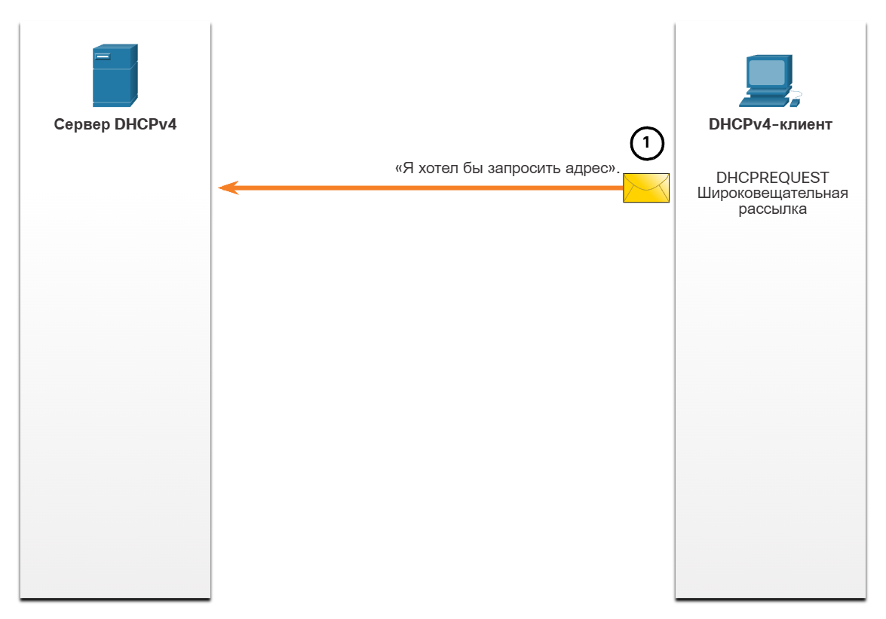

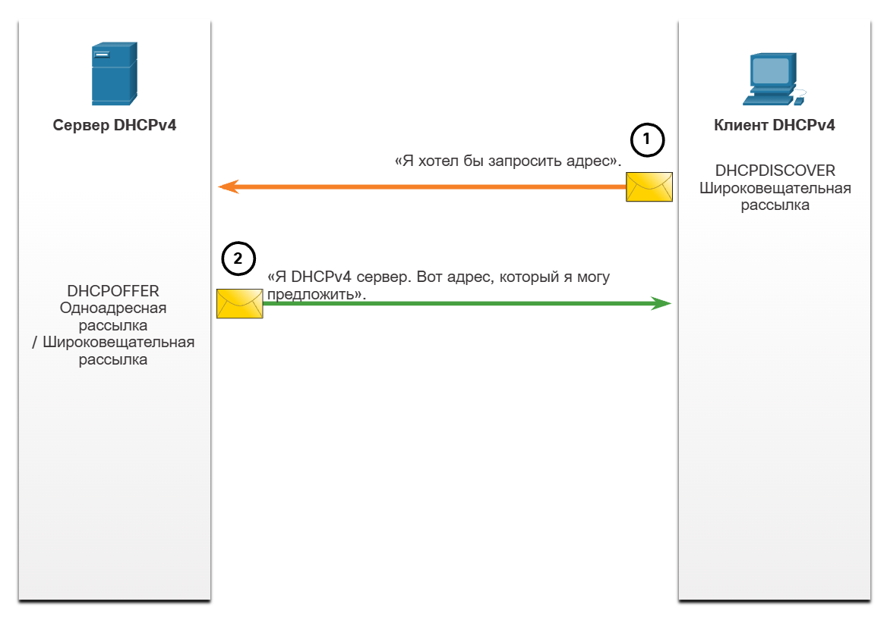

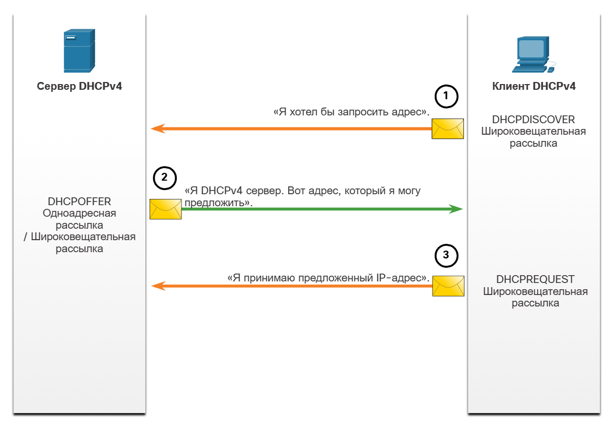

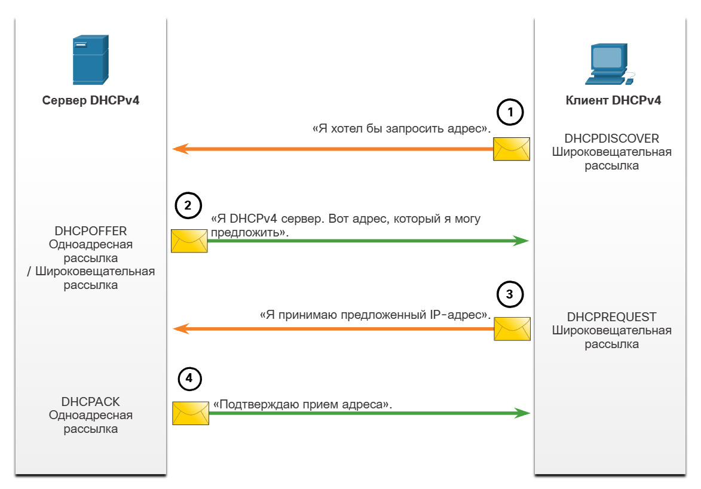

[CCNA DHCP](http://ssa.kbgtk07.ru/2/course/module10/index.html#10.0.1.1)

Сообщения DHCP упаковываются в UDP. UDP-порт 67 используется для отправки запросов и приёма данных со стороны DHCP-сервера. UDP-порт 68 используется для приёма ответов и подтверждений на стороне DHCP-клиента.

DHCP наследует более ранний протокол BOOTP и сохраняет с ним обратную совместимость, поэтому часть полей не относится к работе DHCP.

- **op** — тип сообщения:  
  - `1` = BOOTREQUEST  
  - `2` = BOOTREPLY  
- **htype** — тип аппаратного адреса (например, `1` для Ethernet).  
- **hlen** — размер аппаратного адреса в байтах (например, `6` для Ethernet).  
- **hops** — число ретрансляторов, переславших DHCP-сообщение.  
- **xid** — идентификатор транзакции:  
  - случайное число, уникально идентифицирующее диалог между клиентом и сервером.  
- **secs** — количество секунд с начала процесса получения или обновления адреса (указывается клиентом).  
- **flags** — флаги.  
- **ciaddr** — текущий IP-адрес клиента.  
- **yiaddr** — IP-адрес, предлагаемый DHCP-сервером клиенту.  
- **siaddr** — IP-адрес следующего сервера в процессе конфигурации (обычно для загрузки образа ОС).  
- **giaddr** — адрес ретранслятора, передавшего DHCP-сообщение.  
- **chaddr** — аппаратный адрес клиента.  
- **sname** — имя следующего сервера в процессе конфигурации.  
- **file** — имя файла, запрашиваемого клиентом с сервера (например, файла операционной системы).  
- **options** — список параметров (опций).

Поле options содержит список параметров (опций), которые клиент и сервер сообщают друг другу. Первые 4 байта поля options содержат 4 десятичных значения: 99, 130, 83 и 99. Данная последовательность называется magic cookie. Она нужна, чтобы отличать сообщения DHCP от сообщений BOOTP, которые имеют идентичный формат заголовка. Все параметры начинаются с кода параметра, который занимает один байт. С помощью данного значения можно однозначно определить параметр. Далее один байт занимает длина параметра, а после содержится непосредственное значение параметра.

Примеры опций:

| Код опции | Название                 | Описание                                                      | Пример значения    |
| --------- | ------------------------ | ------------------------------------------------------------- | ------------------ |
| **1**     | Subnet Mask              | Маска подсети клиента                                         | `255.255.255.0`    |
| **3**     | Router (Default Gateway) | IP-адрес шлюза по умолчанию                                   | `192.168.1.1`      |
| **6**     | DNS Servers              | Список DNS-серверов                                           | `8.8.8.8, 1.1.1.1` |
| **15**    | Domain Name              | DNS-домен клиента                                             | `company.local`    |
| **42**    | NTP Servers              | Серверы синхронизации времени                                 | `192.168.1.10`     |
| **51**    | IP Address Lease Time    | Время аренды IP-адреса                                        | `86400` (24 часа)  |
| **54**    | DHCP Server Identifier   | IP-адрес DHCP-сервера                                         | `192.168.1.2`      |
| **58**    | Renewal Time (T1)        | Время первой попытки продления аренды                         | `43200`            |
| **59**    | Rebinding Time (T2)      | Время повторной попытки продления аренды                      | `75600`            |
| **66**    | TFTP Server Name         | Имя или IP TFTP-сервера (часто используется при PXE-загрузке) | `192.168.1.20`     |
| **55**    | Requested Parameters     | Список запрашиваемых параметров (байт — параметр)             | `1,3,6,42`         |

| Код     | Название                    | Назначение                                                            |
| ------- | --------------------------- | --------------------------------------------------------------------- |
| **43**  | Vendor Specific Information | Передача вендор-специфичных параметров (Cisco, Aruba, Ubiquiti и др.) |
| **50**  | Requested IP Address        | Запрашиваемый клиентом IP-адрес                                       |
| **60**  | Vendor Class Identifier     | Идентификатор типа клиента                                            |
| **61**  | Client Identifier           | Уникальный идентификатор DHCP-клиента                                 |
| **67**  | Bootfile Name               | Имя загрузочного файла для PXE                                        |
| **119** | Domain Search List          | Список доменов для поиска DNS                                         |
| **121** | Classless Static Routes     | Передача статических маршрутов клиенту                                |
| **150** | TFTP Server Address (Cisco) | Адрес TFTP-сервера для IP-телефонов Cisco                             |

DHCP-адрес выдаётся сроком на Lease Time (время аренды). От этого значения рассчитываются два таймера: T1 и T2. T1 (Renewal) — 50% от времени аренды; по истечении T1 устройство отправляет DHCPREQUEST именно тому серверу, который выдал адрес. T2 (Rebinding) — 7/8 от времени аренды; если первый сервер не ответил, устройство рассылает широковещательный запрос, чтобы продлить аренду или получить новый адрес. Если Lease Time истёк и никто не продлил адрес, устройство отказывается от него и начинает процедуру получения нового с нуля. 

## Фрагментация IP

Каждая технология канального уровня имеет своё представление о том, каким должен быть максимальный размер передаваемого блока (MTU). 

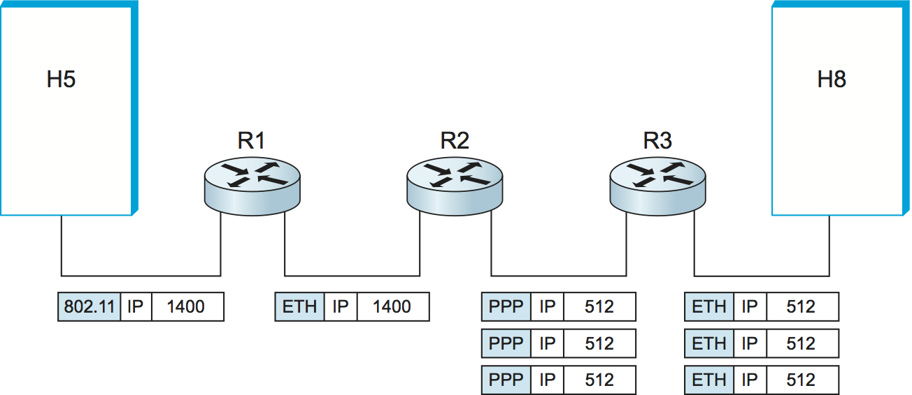

Таким образом, может сложиться ситуация, когда маршрутизатор получает IP-пакет, который требуется переслать в сеть с MTU меньше, чем размер полученного пакета. 

В такой ситуации маршрутизатор разбивает исходный пакет на фрагменты, снабжает каждый фрагмент IP-заголовком и передаёт их как отдельные пакеты.

Для последующей сборки фрагментов в исходное состояние используются следующие поля заголовка:
- Ident пакета используется для распознавания пакетов, образовавшихся путём деления на части (фрагментации) исходного пакета. Все части (фрагменты) одного пакета должны иметь одинаковое значение этого поля.
- TTL — сейчас это поле используется как счётчик транзитных узлов, но в случае с фрагментацией конечный узел использует TTL как крайний срок ожидания недостающих фрагментов.
- Смещение фрагмента (Offset) — содержит информацию о положении фрагмента относительно начала исходного пакета. 
- Bit MF (More Fragments) — если установлен, значит, этот фрагмент не последний. 

Флаг DF (Do not fragment) запрещает фрагментацию. Если узел получает такой пакет и не может переслать его без фрагментации, то пакет уничтожается. 

IP-фрагментация замедляет передачу данных и снижает надёжность сети. При разбиении пакета на части возрастает нагрузка на процессоры маршрутизаторов, увеличивается расход пропускной способности из-за дублирования заголовков, а потеря хотя бы одного фрагмента приводит к отбрасыванию всего исходного пакета.

Вот расширенный интерактивный тест из **10 разноплановых заданий**. Он охватывает все ключевые темы конспекта (адресация, маршрутизация, L2/L3 инкапсуляция, ARP, DHCP, ICMP, фрагментация) и использует разные механики проверки: расчёты, поиск ошибок, кейсы, логические цепочки и сопоставления.

---

### Задание 1. «Битва маршрутов» (Longest Prefix Match)
Маршрутизатор получил пакет с IP-адресом назначения **`172.16.12.50`**.  
В таблице маршрутизации есть следующие записи:

1. `0.0.0.0/0` $\rightarrow$ Next-hop: `10.0.0.1` (Шлюз по умолчанию)
2. `172.16.0.0/16` $\rightarrow$ Next-hop: `10.0.0.2`
3. `172.16.12.0/24` $\rightarrow$ Next-hop: `10.0.0.3`
4. `172.16.12.0/25` $\rightarrow$ Next-hop: `10.0.0.4`

**Вопрос:** На какой Next-hop роутер отправит пакет и почему?

---

### Задание 2. «Математика подсетей» (CIDR и расчёт)
Администратор выделил для отдела сеть **`192.168.10.0/27`**.

Ответьте на 4 вопроса:
1. Какова маска подсети в десятичном формате (с точками)?
2. Сколько **всего** IP-адресов входит в этот блок?
3. Сколько адресов можно **фактически назначить** хостам?
4. Назовите **Broadcast-адрес** (широковещательный адрес) этой подсети.

---

### Задание 3. «Путешествие пакета» (L2 vs L3 адресация)
Компьютер `PC-1` отправляет HTTP-запрос на `Web-Server` через шлюз `Router-1`.

* **PC-1:** IP `192.168.1.10`, MAC `11:11:11:11:11:11`
* **Router-1 (внутренний интерфейс):** IP `192.168.1.1`, MAC `22:22:22:22:22:22`
* **Router-1 (внешний интерфейс):** IP `203.0.113.1`, MAC `33:33:33:33:33:33`
* **Web-Server:** IP `93.184.216.34`, MAC `44:44:44:44:44:44`

Заполните значения полей заголовков в кадре **на участке между PC-1 и Router-1**:
* **Source IP:** `_______________________`
* **Destination IP:** `_______________________`
* **Source MAC:** `_______________________`
* **Destination MAC:** `_______________________`

---

### Задание 4. «Кейс сисадмина: Авария на шлюзе» (Логика доставки)
В офисной сети `192.168.1.0/24` находятся:
* ПК сотрудника (`192.168.1.15`)
* Локальный файловый сервер (`192.168.1.200`)
* Основной шлюз / маршрутизатор (`192.168.1.1`)

Внезапно **шлюз `192.168.1.1` полностью вышел из строя** (отключилось питание).

**Вопрос:** Сможет ли сотрудник продолжить скачивать файлы с локального сервера `192.168.1.200`? Обоснуйте ответ, опираясь на концепцию *прямой/косвенной доставки*.

---

### Задание 5. «Конструктор аренды DHCP» (Хронология и таймеры)
Расставьте события жизненного цикла IP-адреса в хронологическом порядке (от 1 до 6):

* **[  ]** Клиент отправляет **DHCPDISCOVER** (широковещательно).
* **[  ]** Сервер отвечает подтверждением **DHCPACK**.
* **[  ]** Сервер отправляет предложение **DHCPOFFER**.
* **[  ]** Наступает таймер **T1 (50% времени)**: клиент отправляет одноадресный запрос продления.
* **[  ]** Клиент отправляет **DHCPREQUEST** (принимает предложение).
* **[  ]** Наступает таймер **T2 (87.5% времени)**: клиент рассылает широковещательный запрос на продление всем серверам.

---

### Задание 6. «Рекурсивный поиск» (Маршрутизация)
Узел анализирует свою таблицу маршрутизации для отправки пакета на адрес **`10.5.5.5`**:

| Сеть назначения | Маска | Next-hop |
| :--- | :--- | :--- |
| `192.168.1.0` | `255.255.255.0` | `Eth0` |
| `10.5.5.0` | `255.255.255.0` | `192.168.1.254` |
| `0.0.0.0` | `0.0.0.0` | `192.168.1.1` |

**Вопрос:** Через какой физический интерфейс (`Eth0` или другой) и на какой MAC-адрес (шлюза по умолчанию `192.168.1.1` или маршрутизатора `192.168.1.254`) в итоге будет отправлен кадр? Опишите логику двух шагов поиска.

---

### Задание 7. «Анатомия ARP» (Чек-лист сценариев)
Для каждой ситуации определите, какой тип ARP-сообщения будет сгенерирован (**Обычный ARP Request** или **Gratuitous ARP**):

1. Компьютер только что включился и хочет убедиться, что его статический IP не занят кем-то другим в сети. $\rightarrow$ `[ ____________ ]`
2. Компьютер хочет отправить пакет на IP `192.168.1.50`, но не знает его MAC-адрес. $\rightarrow$ `[ ____________ ]`
3. На сервере заменили сетевую карту (изменился MAC-адрес при сохранении прежнего IP), и нужно немедленно обновить кэш соседей. $\rightarrow$ `[ ____________ ]`

---

### Задание 8. «Задачка на фрагментацию» (MTU и флаги)
Маршрутизатор получил пакет общего размера **`3000 байт`** (заголовок IP = 20 байт, полезная нагрузка = 2980 байт).  
Следующий канал связи имеет **MTU = 1500 байт**.

Ответьте на вопросы:
1. На сколько фрагментов маршрутизатор разобьёт этот пакет?
2. Какое значение флага **MF (More Fragments)** будет у *первого* фрагмента (`0` или `1`)?
3. Какое значение флага **MF** будет у *последнего* фрагмента (`0` или `1`)?
4. Что произойдёт с пакетом, если в его заголовке изначально был установлен флаг **DF = 1 (Do not Fragment)**?

---

### Задание 9. «Агрегация маршрутов» (Супернетинг)
В филиале компании настроены четыре небольшие подсети:
* `10.20.0.0/24`
* `10.20.1.0/24`
* `10.20.2.0/24`
* `10.20.3.0/24`

**Вопрос:** Какой **одной** агрегированной записью (адрес сети и префикс маски) центральный маршрутизатор может описать все четыре подсети сразу, чтобы минимизировать размер таблицы маршрутизации?

---

### Задание 10. «Статика против DHCP» (Классификация)
Распределите устройства по двум группам (**Группа А: Только статический IP** / **Группа Б: Рекомендуется DHCP**):

1. Сетевое хранилище компании (NAS с базами данных)
2. Смартфон посетителя в гостевом Wi-Fi
3. Основной офисный сетевой принтер/МФУ
4. Ноутбук менеджера по продажам
5. Камера видеонаблюдения, пишущая поток на видеорегистратор

---

### Ответы и пояснения:

1. **Задание 1:**
   * **Ответ:** На **`10.0.0.4`**.
   * *Пояснение:* Диапазон сети `172.16.12.0/25` охватывает адреса с `.0` по `.127`. Адрес `.50` входит в этот диапазон. Поскольку маска `/25` самая длинная (наиболее специфичная) среди подошедших, срабатывает правило **Longest Prefix Match**.

2. **Задание 2:**
   * 1. Десятичная маска: **`255.255.255.224`** (27 единиц = $255.255.255.11100000_2$).
   * 2. Всего адресов: **$32$** ($2^{32-27} = 2^5 = 32$).
   * 3. Доступно для узлов: **$30$** ($32 - 2 = 30$, минус адрес сети и broadcast).
   * 4. Broadcast-адрес: **`192.168.10.31`**.

3. **Задание 3:**
   * **Src IP:** `192.168.1.10` (PC-1)
   * **Dst IP:** `93.184.216.34` (Web-Server — IP назначения не меняется при маршрутизации!)
   * **Src MAC:** `11:11:11:11:11:11` (PC-1)
   * **Dst MAC:** `22:22:22:22:22:22` (Внутренний интерфейс маршрутизатора R1).

4. **Задание 4:**
   * **Ответ:** **Да, сможет.**
   * *Пояснение:* Компьютер и сервер находятся в одной физической и логической сети (`192.168.1.0/24`). ПК определяет это с помощью своей маски подсети. Доставка является **прямой**: ПК отправляет ARP-запрос напрямую серверу и пересылает Ethernet-кадры через коммутатор без участия шлюза по умолчанию.

5. **Задание 5:**
   * **Порядок:** **1 $\rightarrow$ 4 $\rightarrow$ 2 $\rightarrow$ 5 $\rightarrow$ 3 $\rightarrow$ 6**  
     *(DHCPDISCOVER $\rightarrow$ DHCPOFFER $\rightarrow$ DHCPREQUEST $\rightarrow$ DHCPACK $\rightarrow$ T1 Renewal $\rightarrow$ T2 Rebind).*

6. **Задание 6:**
   * **Ответ:** Кадр уйдёт через интерфейс **`Eth0`** на MAC-адрес узла **`192.168.1.254`**.
   * *Логика:* Сначала узел находит лучший маршрут к `10.5.5.0/24`, где указан Next-hop `192.168.1.254`. Затем запускается рекурсивный поиск для самого адреса `192.168.1.254`, который совпадает с прямо подключённой сетью `192.168.1.0/24` (доступной через `Eth0`).

7. **Задание 7:**
   * 1. **Gratuitous ARP** (проверка дублирования адреса в сети / Duplicate Address Detection).
   * 2. **Обычный ARP Request** (стандартное разрешение IP в MAC).
   * 3. **Gratuitous ARP** (оповещение коммутаторов и соседей о смене связки IP-MAC).

8. **Задание 8:**
   * 1. На **$3$ фрагмента** (1-й: 20 байт заголовок + 1480 данных; 2-й: 20 байт заголовок + 1480 данных; 3-й: 20 байт заголовок + 20 данных = всего 2980 байт полезной нагрузки).
   * 2. Флаг MF у 1-го фрагмента: **`1`** (будут ещё фрагменты).
   * 3. Флаг MF у последнего фрагмента: **`0`** (фрагмент последний).
   * 4. Пакет будет **уничтожен/отброшен**, а отправителю вернётся ICMP-сообщение об ошибке (Fragmentation Needed and DF set).

9. **Задание 9:**
   * **Ответ:** **`10.20.0.0/22`** (или маска `255.255.252.0`).
   * *Пояснение:* В двоичном виде третий октет: $0 = 00000000_2$, $1 = 00000001_2$, $2 = 00000010_2$, $3 = 00000011_2$. Первые 6 бит третьего октета совпадают ($000000xx_2$), поэтому маска заимствует 22 бита ($16 + 6 = 22$).

10. **Задание 10:**
    * **Группа А (Статический IP):** 1 (NAS), 3 (Принтер/МФУ), 5 (IP-камера). *(Им необходим постоянный известный адрес).*
    * **Группа Б (DHCP):** 2 (Гостевой смартфон), 4 (Ноутбук менеджера). *(Клиентские мобильные устройства).*

