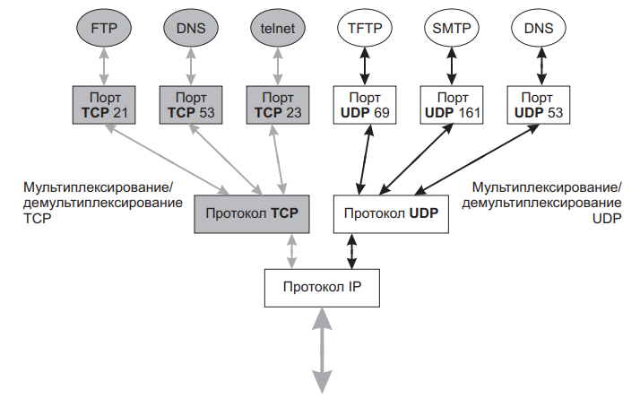
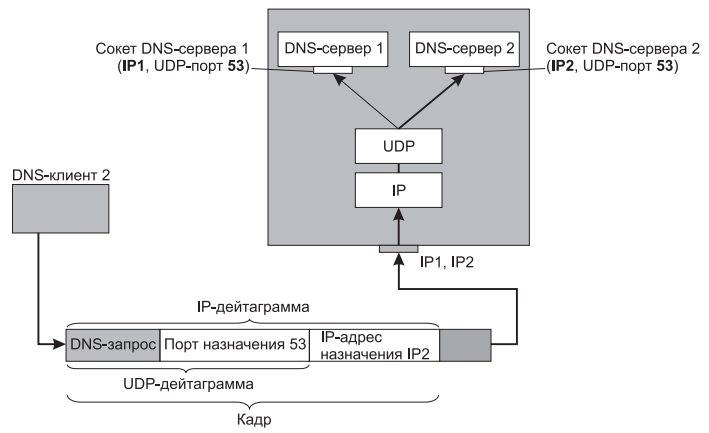
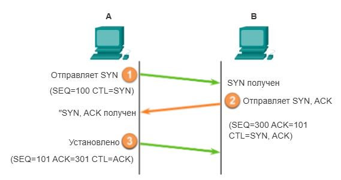
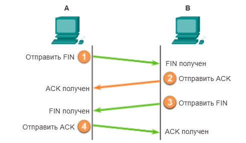
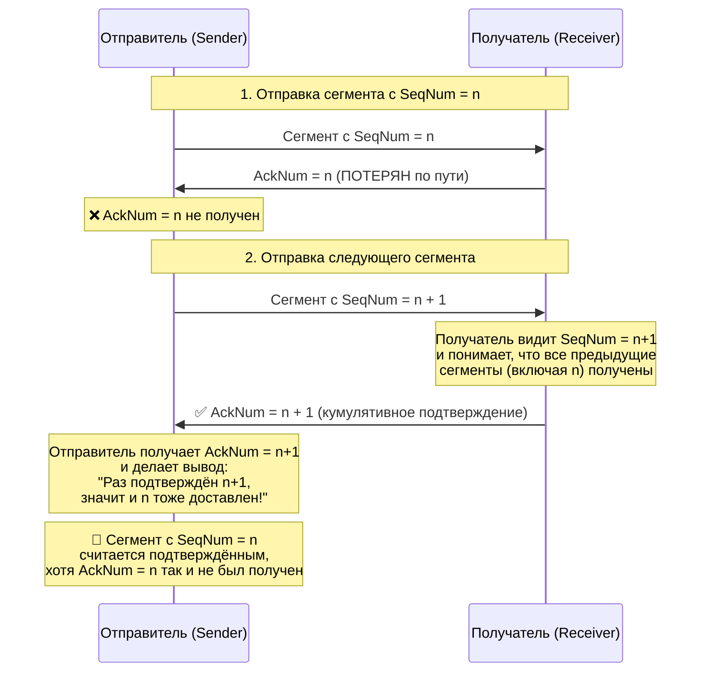
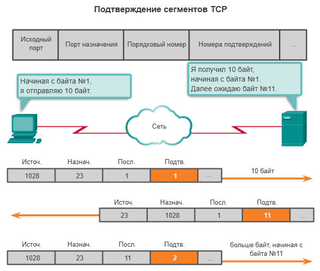
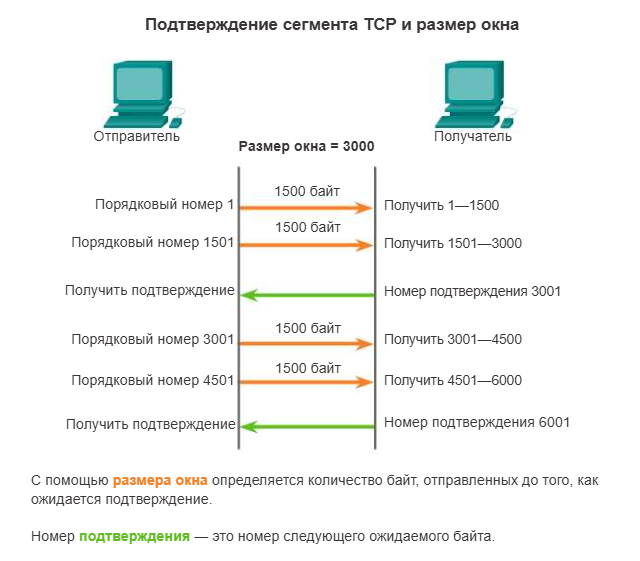
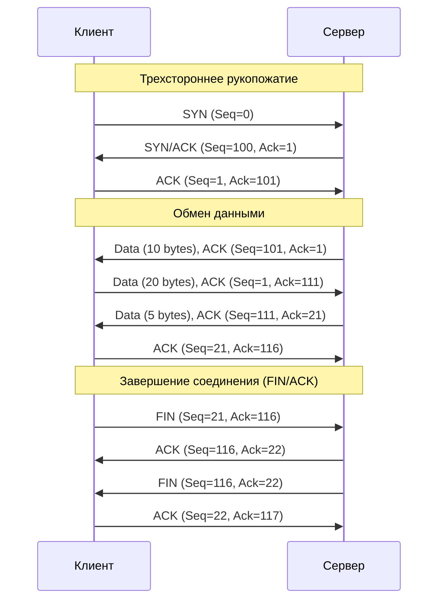

# Transport Layer

Мы обсудили как объединить узлы в физические сети, чтобы обеспечить прямую связность между узлами. Затем мы объединили отдельные физические сети в одну большую интерсеть, разобрались с логической адресацией и тем, как узлы пересылают данные через интерсеть. 

Теперь следует решить ещё две задачи:
- Каждый компьютер способен выполнять сразу несколько процессов (прикладных программ). Поэтому получение IP-пакета на сетевом интерфейсе - это ещё не конец пути, так как данные из пакета нужно отправить конкретному процессу. 
- Протокол IP намеренно отказывается от надежной доставки, чтобы максимально упростить работу маршрутизаторам. Но большинство приложений, работающих через компьютерную сеть, требуют надежной доставки.

Обе задачи решает транспортный уровень. Транспортный уровень обеспечивает такой способ передачи данных по сети, который гарантирует, что на принимающей стороне данные будут скомпонованы без ошибок (или наоборот не делает ничего, так же как и сетевой уровень). Транспортный уровень также использует разделение данных на сегменты и предлагает элементы управления, необходимые для повторной сборки этих сегментов в различные потоки обмена данными. В TCP/IP для выполнения процессов сегментации и повторной сборки можно использовать два абсолютно разных протокола транспортного уровня — TCP (протокол управления передачей) и UDP (протокол пользовательских датаграмм).

Основные функции протоколов транспортного уровня:
- Отслеживание отдельных сеансов передачи данных между приложениями на узле-источнике и узле-получателе
- Сегментирование данных для управления ими, а также для их повторной компоновки в потоки прикладных данных на узле-адресате
- Идентификация соответствующего приложения для каждого потока обмена данными

## Демультиплексирование

На каждом узле в сети может быть запущено множество приложений или сервисов. Чтобы переслать потоки данных соответствующим приложениям, транспортному уровню необходимо определить целевое приложение. Для выполнения этой задачи транспортный уровень присваивает каждому приложению отдельный идентификатор. Этот идентификатор называется номером порта. Каждому программному процессу, которому требуется доступ к сети, назначается номер порта, уникальный для этого узла. Под номера портов выделяется 16 бит, таким образом всего может быть 65536 портов, от 0 до 65535.

Пакеты, поступающие на транспортный уровень с сетевого, распределяются протоколами TCP и UDP между прикладными процессами. Это называется демультиплексированием.

Существует и обратная задача: данные, генерируемые разными приложениями, работающими на одном конечном узле, должны быть переданы общему для всех модулю IP для отправки в сеть. Эту работу, называемую мультиплексированием, тоже выполняют протоколы TCP и UDP.

## Протоколы транспортного уровня, общие сведения 

### TCP

Первоначально протокол TCP был описан в документе RFC 793. Помимо поддержки таких базовых функций, как сегментация данных и повторная компоновка, протокол TCP, также обеспечивает:

- каналы связи с установлением соединения посредством установления сеансов. TCP является протоколом с установлением соединения. Перед пересылкой любого трафика протокол с установлением соединения согласовывает и настраивает постоянное соединение (или сеанс) между устройством источника и устройством назначения.
- надёжность доставки. Протокол TCP может предоставить способ обеспечения надёжной доставки данных. В сетевой терминологии надёжность означает доставку на узел назначения каждой части данных, отправленной узлом источника. 
- восстановление последовательности данных. Поскольку в сетях могут использоваться несколько маршрутов с разными скоростями передачи информации, в процессе доставки данных их порядок может измениться. Используя нумерацию и упорядочивание сегментов, TCP может гарантировать, что они будут собраны в правильном порядке.
- управление потоком. Такие ресурсы сетевых узлов, как память или полоса пропускания, довольно ограничены. Когда протокол TCP получает информацию о том, что эти ресурсы используются слишком активно, он может потребовать от отправляющего приложения уменьшить скорость потока данных. 

При использовании этих функций протокол TCP создаёт дополнительную нагрузку. Как показано на рисунке, каждый сегмент TCP содержит как минимум 20 дополнительных байт в заголовке, инкапсулируя данные уровня приложений:

### UDP

UDP считается транспортным протоколом негарантированной доставки данных, который описан в документе RFC 768. UDP — это облегчённый транспортный протокол, который предлагает такую же сегментацию и повторную сборку данных, как и протокол TCP, но при этом не обеспечивает надёжность и управление потоком, присущие TCP. 

- Без установления соединения. UDP не устанавливает соединение между узлами до того, как станут возможными отправка и получение данных.
- Ненадёжная доставка. UDP не использует сервисы, обеспечивающие надёжную доставку данных. 
- Без восстановления последовательности данных. Периодически данные поступают не в том порядке, в котором они были отправлены. Протокол UDP не предусматривает средств для повторной сборки данных в их исходной последовательности.
- Без управления потоком. В UDP отсутствуют механизмы для управления объёмами данных, которые пересылаются источником, для предотвращения перегрузок на устройстве назначения. Источник отправляет данные. В случае чрезмерного использования ресурсов на узле назначения он, скорее всего, будет отклонять отправленные данные до тех пор, пока ресурсы не станут доступными.

Фрагменты данных в протоколе UDP называются датаграммами. 

### Адресация портов TCP и UDP

В заголовке каждого сегмента или датаграммы указываются порты источника и назначения. Порт — это числовой идентификатор внутри каждого сегмента, который используется для учёта отдельных сеансов связи и запрошенных сервисов назначения.

Клиент указывает номер порта назначения в сегменте, чтобы сообщить серверу назначения информацию о том, какой сервис запрашивается.

Номер порта источника случайно генерируется устройством-отправителем для идентификации сеанса связи между двумя устройствами.

Номера порта источника и порта назначения записываются в сегмент. Затем эти сегменты инкапсулируются в пакете IP. В пакет записывается IP-адрес источника и назначения. Пара значений IP-адрес + порт - называется сокетом. Четвёрка `{src_ip, src_port, dst_ip, dst_port}` в сетевой терминологии называется **socket pair** (сокетовая пара) или **4-tuple** (идентификатор TCP-соединения). Сокетная пара однозначно идентифицирует конкретное соединение. 

Сочетание номера порта транспортного уровня и IP-адреса узла сетевого уровня однозначно идентифицирует конкретный процесс приложения на конкретном физическом узле. Пусть, например, на одном хосте запущены две копии DNS-сервера — DNS-сервер 1, DNS-сервер 2 (рис. 15.2). Каждый из этих DNS-серверов имеет хорошо известный UDP-порт 53. Какому из этих серверов нужно направить запрос клиента, если в DNS-запросе в качестве идентификатора сервера был указан только номер порта?

Чтобы снять неоднозначность в идентификации приложений, разные копии связываются с разными IP-адресами. Для этого сетевой интерфейс компьютера, на котором выполняется несколько копий приложения, должен иметь соответствующее число IP-адресов — на рисунке это IP1 и IP2. Во всех IP-пакетах, направляемых DNS-серверу 1, в качестве IP-адреса указывается IP1, а DNS-серверу 2 — адрес IP2. Поэтому показанный на рисунке пакет, в поле данных которого содержится UDP-дейтаграмма с указанным номером порта 53, а в поле заголовка задан адрес IP2, однозначно будет направлен заданному адресату — DNS-серверу 2.

> Прикладной процесс однозначно определяется в пределах сети и в пределах отдельного компьютера парой (IP-адрес, номер порта), называемой сокетом (socket). Сокет, определенный IP-адресом и номером UDP-порта, называется UDP-сокетом, а IP-адресом и номером TCP порта — TCP-сокетом.

В результате создания сокетов становятся известны конечные точки соединения, и данные могут передаваться между приложениями на двух узлах. Сокеты позволяют различать несколько процессов, выполняющихся на клиенте, а также распознавать различные подключения к процессу сервера.

Существует несколько типов номеров портов.

| Группа портов | Диапазон номеров портов | Описание |
| :--- | :---: | :--- |
| **Общеизвестные порты** | 0 – 1023 | Эти номера портов зарезервированы для обычных или популярных служб и приложений, таких как веб-браузеры и почтовые клиенты, а также клиентами удаленного доступа. Определённые известные порты для общих серверных приложений позволяют легко определить требуемый сервис. |
| **Зарегистрированные порты** | 1024 – 49151 | Эти номера портов присваиваются IANA запрашивающему объекту для использования с конкретными процессами или приложениями. Эти процессы в основном представляют собой отдельные приложения, которые пользователь выбрал для установки, а не обычные приложения, которые получили бы известный номер порта. Например, Cisco зарегистрировала порт 1812 для своего процесса аутентификации RADIUS-сервера. |
| **Частные и/или динамические порты** | 49152 – 65535 | Эти порты также известны как временные порты. ОС клиента обычно присваивает номера портов динамически, когда инициируется подключение к сервису. После чего такой порт используется для определения клиентского приложения во время обмена данными. |

| Номер порта | Протокол | Уровень приложений |
| :---: | :---: | :--- |
| 20 | TCP | File Transfer Protocol (FTP) — Передача данных |
| 21 | TCP | File Transfer Protocol (FTP) — Управление передачей |
| 22 | TCP | Протокол Secure Shell (SSH) |
| 23 | TCP | Программа Telnet |
| 25 | TCP | Протокол SMTP |
| 53 | UDP, TCP | Служба доменных имён (DNS) |
| 67 | UDP | Сервер протокола динамической конфигурации узла (DHCP) |
| 68 | UDP | Dynamic Host Configuration Protocol (DHCP) — клиент |
| 69 | UDP | Простейший протокол передачи файлов (TFTP) |
| 80 | TCP | Протокол HTTP |
| 110 | TCP | Протокол почтового отделения (POP3) |
| 143 | TCP | Протокол IMAP |
| 161 | UDP | Протокол SNMP |
| 443 | TCP | Защищённый протокол передачи гипертекста (HTTPS) |

Нет никакой зависимости между назначением номеров портов для приложений, использующих протокол TCP, и приложений, работающих с протоколом UDP. Приложения, передающие данные на уровень IP по протоколу UDP, получают номера, называемые UDP-портами. Аналогично приложениям, обращающимся к протоколу TCP, выделяются TCP-порты. 

## TCP

Основным отличием протокола TCP от протокола UDP является надёжность. Надёжность обмена данными по протоколу TCP обеспечивается с помощью сеансов связи с установлением соединения. Перед тем как отправить данные, узел, использующий TCP, инициирует процесс для создания подключения к узлу назначения.

После того как сеанс настроен и началась передача данных, узел назначения отправляет подтверждения о полученных сегментах на узел источника. Эти подтверждения формируют основу надёжности в рамках сеанса TCP. Когда источник получает подтверждение, он знает, что данные успешно доставлены и наблюдение за ними можно прекратить. Если узел источника не получит подтверждение в течение установленного периода времени, он повторит передачу данных адресату.

### Установление TCP соединения

В некоторых странах при встрече двух человек принято обмениваться рукопожатиями. Рукопожатие рассматривается обеими сторонами как сигнал для дружеского приветствия. Подключения в сети осуществляются примерно так же. 

Для установления TCP узлы используют трёхэтапное рукопожатие. При первом рукопожатии (на компьютерном языке это называется рукопожатием) отправляется запрос синхронизации. При втором рукопожатии первоначальный запрос синхронизации подтверждается, после чего согласовываются параметры подключения в противоположном направлении. Третий этап рукопожатия — это подтверждение, которое используется для информирования узла назначения о том, что обе стороны согласны установить подключение. При трёхстороннем рукопожатии выполняются следующие процессы.

- Сначала устанавливается, присутствует ли устройство назначения в сети.
- Затем проверяется, имеется ли на устройстве назначения активный сервис и принимает ли он запросы на номер порта назначения, который инициирующий клиент планирует использовать для сеанса.
- Далее устройству назначения сообщается, что клиент источника планирует установить сеанс связи на этом номере порта.

Чтобы обозначить этап рукопожатия, используются биты Флагов в заголовках:
- SYN — синхронизировать порядковые номера.
- ACK — поле «Номер подтверждения» задействовано.

#### Шаг 1

Инициирующий клиент запрашивает сеанс связи клиент-сервер с сервером. Клиент TCP начинает трёхстороннее рукопожатие путём отправки сегмента с установленным управляющим флагом SYN (синхронизировать порядковые номера), который обозначает начальное значение в поле номера последовательности в заголовке. Это значение последовательности, которое называется начальным порядковым номером (ISN), выбирается случайно и используется, чтобы начать отслеживание потока данных, которые пересылаются от клиента к серверу в этом сеансе.

#### Шаг 2

Сервер подтверждает сеанс связи клиент-сервер и запрашивает сеанс связи сервер-клиент. Чтобы начать сеанс связи клиент-сервер, TCP-сервер должен подтвердить получение сегмента SYN от клиента. Для этого сервер возвращает сегмент клиенту с установленным флагом подтверждения (ACK), указывая на то, что номер подтверждения задействован. Если этот флаг в сегменте установлен, клиент считает это подтверждением того, что сервер получил SYN от клиента TCP.

Значение в поле номера подтверждения равно номеру ISN плюс 1. Это позволяет установить сеанс связи клиент-сервер. Для обеспечения сбалансированности сеанса флаг ACK остаётся установленным. Следует помнить, что сеанс связи между клиентом и сервером фактически представляет собой два односторонних сеанса: один клиент-сервер, другой — сервер-клиент. На втором шаге трёхстороннего рукопожатия сервер должен инициировать ответ клиенту. Чтобы начать этот сеанс, сервер использует флаг SYN точно так же, как это делал клиент. Он устанавливает управляющий флаг SYN в заголовке для установления сеанса типа сервер-клиент. Флаг SYN указывает на то, что начальное значение поля порядкового номера указано в заголовке. Это значение используется для отслеживания в этом сеансе потока данных от сервера к клиенту.

#### Шаг 3

Инициирующий клиент подтверждает сеанс связи сервер-клиент. Наконец, клиент TCP возвращает сегмент, содержащий ACK, — то есть ответ на TCP SYN, отправленный сервером. Пользовательские данные в этом сегменте отсутствуют. Значение в поле номера подтверждения на единицу больше, чем номер ISN, полученный от сервера. После того как между клиентом и сервером будут начаты оба сеанса, для всех дополнительных сегментов, которые пересылаются в этом процессе обмена данными, будут установлены флаги ACK. 

### Завершение TCP соединения

Для прекращения соединения в заголовке сегмента должен быть установлен управляющий флаг Finish (FIN). Для завершения каждого одностороннего TCP-сеанса используется двухстороннее рукопожатие, которое состоит из сегмента FIN и сегмента ACK. Следовательно, чтобы завершить один сеанс связи, поддерживаемый протоколом TCP, необходимы четыре обмена данными, которые завершат оба сеанса.

Шаг 1. Когда у клиента больше нет данных для отправки в потоке, он отправляет сегмент с установленным флагом FIN.
Шаг 2. Сервер отправляет ACK, чтобы подтвердить получение FIN для завершения сеанса клиент-сервер.
Шаг 3. Сервер отправляет FIN клиенту, чтобы завершить сеанс сервер-клиент.
Шаг 4. Клиент возвращает ACK для подтверждения получения FIN от сервера.

### Надежная передача, методы квитирования

Самый естественный приём, который только можно придумать для организации надежного обмена данными - это передача с квитированием. Отправитель отсылает данные, а получатель подтверждает их получение квитанциями. Если отправитель вовремя не получает квитанцию, то он передаёт данные повторно. 

За данной схемой закрепилось название - "запрос повторной передачи" или ARQ (Automatic Repeat reQuest).

#### Stop and Wait, Метод простоя источника

Простейшая схема квитирования называется stop and wait. Идея очень простая: после передачи одного сегмента, отправитель ждёт подтверждение перед тем, как передать следующий. Если подтверждение (acknowledgment, ACK) не приходит за определённый таймер, то отправитель снова посылает этот же сегмент.

Рисунок демонстрирует 4 сценария работы этого алгоритма. Отправитель слева, получатель справа, а время течет сверху вниз.

Рисунок (a) показывают ситуацию, когда ACK приходит раньше истечения таймера; (b) и (с) показывают ситуацию, когда оригинальный кадр и подтверждение потеряны; и (d) когда таймер истекает слишком рано. 

В алгоритме stop and wait есть один важный нюанс. Предположим, отправитель отправляет кадр, и получатель подтверждает его получение, но подтверждение либо теряется, либо приходит с задержкой. Эта ситуация проиллюстрирована на временных шкалах (c) и (d) рисунка. В обоих случаях отправитель по таймаут и он ​​повторно передает исходный кадр, но получатель будет считать, что это следующий кадр, поскольку он правильно получил и подтвердил первый кадр.

Это может привести к доставке дубликатов кадров. В течение этой паузы источник, не дождавшись квитанции, которая была утеряна, послал повторно пакет 2, в результате получатель теперь имеет и оригинальный пакет 2, и его дубликат. Для решения этой проблемы заголовок протокола Stop-and-Wait («простоя источника») обычно включает 1-битный порядковый номер — то есть, порядковый номер может принимать значения 0 и 1 — и порядковые номера, используемые для каждого кадра, чередуются, как показано на рисунке ниже. Таким образом, когда отправитель повторно передает кадр 0, получатель может определить, что он видит вторую копию кадра 0, а не первую копию кадра 1, и поэтому может игнорировать его (получатель все равно подтверждает его получение, если первое подтверждение было потеряно).

Главный недостаток алгоритма «простоя источника» заключается в том, что он позволяет отправителю иметь только один незавершенный кадр на канале связи одновременно, и это может быть значительно меньше пропускной способности канала.

Рассмотрим, например, канал связи со скоростью 1,5 Мбит/с и RTT 45 мс. Произведение круговой задержки на пропускную способность (BDP, Bandwidth-Delay Product - максимальный объем неподтвержденных данных в канале) составит 67.5 Кб, или приблизительно 8 КБ. Поскольку отправитель может передать только один сегмент за RTT (предположим длина сегмента 1 КБ), реальная скорость отправки будет равна:

Bits-Per-Frame / Timer-Per-Frame = 1024 * 8 / 0,045 = 182 kbps

Или одна восьмая пропускной способности канала. Для того чтобы использовать канал полностью отправитель должен отправить 8 сегментов, прежде чем начнёт ожидать подтверждения.

#### Sliding Window, скользящее окно

Рассмотрим ещё раз сценарий, в котором BDP равен 8 КБ, а размер сегмента - 1 КБ. Мы бы хотели, чтобы отправитель был готов отправить девятый сегмент практически в тот же момент, когда придет ACK для первого сегмента. Алгоритм, позволяющий это сделать, называется скользящим окном. 

Алгоритм скользящего окна работает следующим образом. Сначала отправитель присваивает каждому сегменту порядковый номер (sequence number). Пока что давайте думать, что номер сегментов могут увеличиваться бесконечно. 

Отправитель поддерживает три переменные:
- Размер окна отправки (SWS, Window Size) - задает верхнюю границу неподтвержденных сегментов, которые отправитель может передать.
- Номер последнего подтвержденного сегмента (LAR, last acknowledgment received). Также называемый базой окна. 
- Номер последнего отправленного сегмента (LSS, Last Segment Sent).

Отправитель поддерживает следующий инвариант:

`LSS - LAR <= SWS`

Это означает, что размер окна всегда больше или равен разнице последнего отправленного сегмента и последнего полученного подтверждения.

В момент, когда устанавливается соединение, отправитель передаёт все сегменты, которые находятся в окне и останавливается, ожидая подтверждений. Когда прибывает очередное подтверждение, отправитель сдвигает `LAR` вправо, что позволяет отправителю отослать ещё один сегмент. С каждым сегментом отправитель ассоциирует таймер, если этот таймер истекает до получения ACK для сегмента, то сегмент (точнее его копия), отправляется заново. Логично, что отправитель должен иметь возможность буферизировать до `SWS` кадров. 

Получатель поддерживает свои три переменные:
- Размер окна получения (`RWS`) - указывает верхнюю границу поступивших не по порядку кадров, которые получатель готов принять. 
- Наибольший допустимый сегмент (`LAS`, largest acceptable segment) - самый большой номер сегмента, который получатель готов принять. 
- Номер последнего полученного сегмента (`LSR`).

Получатель поддерживает следующий инвариант:

`LAS - LSR <= RWS` 

Что означает, что размер окна приёма всегда больше или равен разнице между номером наибольшего допустимого сегмента и номером последнего полученного сегмента. 

Когда сегмент с неким номером `SeqNum` прибывает получателю, тот производит следующие действия:
- Если `SeqNum <= LSR` или `SeqNum > LAS`, значит он находится за пределами окна получения и его надо отбросить. 
- Если `LSR < SeqNum <= LAS`, тогда сегмент попадает в окно и его надо принять. 

Теперь получателю нужно принять решение, посылать или не посылать подтверждение. Давайте `SeqNumToAck` будет обозначать наибольший ещё неподтвержденный порядковый номер, такой что все сегменты с номерами меньше или равными уже были получены. 

Тогда получатель отправит подтверждение для `SeqNumToAck`, даже если были получены сегменты с большими номерами. Такое подтверждение называется кумулятивным, потому что оно подтверждает все `SeqNum <= SeqNumToAck`. Например, возьмём `LSR = n`, и скажем, что `AckNum = n` потерялся по пути к отправителю, тогда, когда получатель примет сегмент с `SeqNum = n + 1` и отправит подтверждение с номером `AckNum = n + 1` - то отправитель, получив его поймёт, что сегмент с `SeqNum = n` тоже был успешно получен, хотя отправитель так никогда и не увидит `AckNum = n`.

Другой пример. Предположим, что `LSR = 5` (т.е. что последнее подтверждение, отправленное получателем, было для `SeqNum = 5`), и `RWS = 4`. Это означает, что `LAS = 9`. Если прибудут сегменты 7 и 8, они будут буферизованы, поскольку находятся в пределах окна получателя. Однако подтверждение отправляться не будет, потому что сегмент 6 ещё не прибыл. В таком случае мы говорим, что сегменты 7 и 8 прибыли не по порядку. Если затем прибывает кадр 6 - тогда получатель сразу отправит подтверждение для кадра 8. Теперь получатель выставил `LSR = 8`, а `LAS = 12`.

### Надёжная доставка TCP

TCP — это байто-ориентированный протокол, что означает, что отправитель записывает байты в TCP-соединение, а получатель считывает байты из TCP-соединения. Хотя термин «поток байтов» описывает услугу, которую TCP предоставляет прикладным процессам, сам TCP не передает отдельные байты через Интернет. Вместо этого TCP на хосте-источнике буферизует достаточное количество байтов от отправляющего процесса, чтобы заполнить пакет разумного размера, а затем отправляет этот пакет своему партнеру на хосте-получателе. TCP на хосте-получателе затем опустошает содержимое пакета в буфер приема, и принимающий процесс читает из этого буфера по своему усмотрению.

Хотя единицей передаваемых данных протокола TCP является сегмент, окно скользящее окно двигается на множестве нумерованных байтов потока данных, который передаёт протоколу TCP приложение. 

В ходе переговоров модули TCP обоих узлов договариваются между собой о параметрах обмена данными. Одним из таких параметров является *начальный номер байта* (Init Seq Num), с которого будет вестись отсчёт. Байты внутри сегмента нумеруются начиная с заголовка:

Когда отправитель посылает TCP-сегмент, он помещает в поле последовательного номера (`SeqNum`) номер первого байта данного сегмента, этот номер служит идентификатором сегмента. 

На рисунке показано четыре сегмента размером 1460 байт и один — размером 870 байт. Идентификаторами этих сегментов являются номера 32600, 34060, 35520 и т.д. На основании этих номеров получатель TCP-сегмента отличает сегмент от других и позиционирует его относительно общего потока байтов. 

В качестве ACK получатель сегмента отсылает ответное сообщение, в поле `AckNum` которого помещает число, на единицу больше максимального номера байта в полученном сегменте. То есть получатель берет `SeqNum` полученного сегмента, прибавляет к нему длину сегмента (без заголовка). 

Протокол TCP также обеспечивает механизмы для управления потоком данных. Управление потоком позволяет поддерживать надёжность передачи по протоколу TCP путём регулировки скорости потока данных между узлами источника и направления в течение определённого сеанса.

Для управления потоком TCP в первую очередь определяет количество сегментов данных, которое может принять устройство назначения. Заголовок TCP включает в себя 16-битное поле, которое называется размером окна. Это количество байтов, которое устройство назначения сеанса TCP способно принять и обработать единовременно. Исходный размер окна согласовывается во время запуска сеанса через трёхстороннее рукопожатие между устройствами источника и назначения. После согласования исходное устройство должно ограничить количество сегментов данных, отправленных устройству назначения, в соответствии с размером окна. Только после того как исходное устройство получит подтверждение того, что сегменты данных получены, оно может продолжить отправку остальных данных в этом сеансе.

Упрощённое представление размера окна и подтверждений представлены на рисунке. В этом примере первоначальный размер окна для представленного сеанса TCP установлен как 3000 байт. Когда отправитель передаст 3000 байт, он ожидает подтверждения их получения перед передачей оставшихся сегментов в этом сеансе. После того как отправитель получит подтверждение от получателя, отправитель сможет передать дополнительные 3000 байт.

Протокол TCP использует размер окна, чтобы попытаться управлять скоростью передачи данных в соответствии с максимальным значением потока, которое поддерживается сетью и устройством назначения, одновременно с этим уменьшая потери данных и количество их повторных пересылок.

Пример трехэтапного рукопожатия, обмена данными и завершения сессии. 

Есть клиент и сервер, у обоих есть поток байтов, которые они готовы друг другу передать. 

Клиент инициирует соединение, отправляя серверу сегмент. В заголовке этого сегмента клиент указывает ряд важных параметров:
- Клиент выставляет флаг SYN. Так он обозначает, что этот сегмент используется для согласования параметров, перед передачей данных. 
- ISN - Init Sequence Number - начальный номер байта, с которого будет вестись отсчёт переданных данных. В реальном TCP по ряду причин это число выбирается случайным образом, но для простоты скажем, что сейчас это 0.
- Window Size. Здесь клиент обозначает **своё** окно приема, сколько байт данных клиент готов принять от сервера без отправки подтверждений. В TCP максимальный размер окна определяет принимающая сторона, чтобы передающая случайно не затопила её слишком большим потоком данных.

Сервер получает сегмент, выделяет под соединение все необходимые ресурсы и отправляет клиенту свой сегмент:
- Этот сегмент также содержит флаг SYN, так как служит для согласования параметров, но на этот раз со стороны сервера.
- Сервер также указывает INS с которого он начнёт нумеровать байты. Укажем его равным 100.
- Сервер указывает свой Window Size.
- Теперь сегмент содержит флаг ACK, так как сервер подтверждает клиенту, что получил его сегмент. Что примечательно, все сегменты до конца сессии будут содержать флаг ACK.
- И теперь сервер указывает ACK Num (номер подтверждения) равный SeqNum клиента + 1. Тут кроется небольшая тонкость, выше мы говорили, что AckNum это SeqNum + длина принятого сегмента **без заголовка**, то есть длина принятой полезной нагрузки. Но в принятом сегменте нет полезных данных, только заголовок. Дело в том, что управляющие флаги SYN и FIN "съедают" один условный порядковый номер, хотя сами по себе данными не являются.

У двух начальных сегментов TCP сессии нет какого-то особого названия, поэтому обычно их называют по флагам, которые в них выставлены. Так и говорят SYN и SYN/ACK.
Клиент получает SYN/ACK от сервера и отправляет ему последний сегмент рукопожатия. 
- Выставлен флаг ACK.
- Ack Num выставлен 101. Так клиент подтверждает, что получил от сервера его SYN/ACK. 
- А SeqNum равен 1.

На этом этапе TCP соединение считается установленным и обе стороны готовы передавать друг другу данные. 

### TCP, дополнительные темы

Управление перегрузкой, алгоритмы управления CWND, расширения, выборочное подтверждение, MSS.

## UDP

Есть приложения, для которых скорость передачи и маленькие накладные расходы важнее надежной доставки. Такие приложения готовы мириться с потерей данных и не готовы задерживать передачу ради предварительной установки соединения, подтверждений и повторных отправок. Идеальные примеры таких приложений - это передача голоса, онлайн игры, DNS. 

При работе на хосте-отправителе данные от приложений поступают протоколу UDP через порт в виде сообщений. Протокол UDP добавляет к каждому отдельному сообщению свой 8-байтный заголовок, формируя из этих сообщений собственные протокольные единицы, называемые UDP-дейтаграммами, и передает их нижележащему протоколу IP. В этом и заключаются его функции по мультиплексированию данных.

Каждая дейтаграмма переносит отдельное пользовательское сообщение. Сообщения могут иметь разную длину, не превышающую, однако, длину поля данных протокола IP, которое, в свою очередь, ограничено размером кадра технологии нижнего уровня. Поэтому если буфер UDP переполняется, то сообщение приложения отбрасывается.

Заголовок UDP состоит из четырех двухбайтных полей:
- номер UDP-порта отправителя;
- номер UDP-порта получателя;
- контрольная сумма;
- длина дейтаграммы.

При контроле искажений протокол UDP только диагностирует, но не исправляет ошибку. Если контрольная сумма показывает, что в поле данных UDP-дейтаграммы произошла ошибка, то протокол UDP просто отбрасывает поврежденную дейтаграмму.