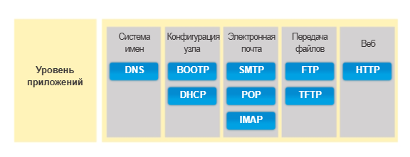
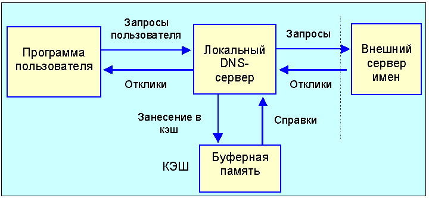
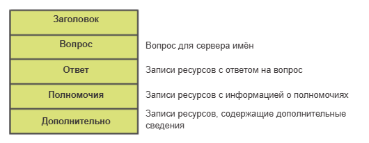
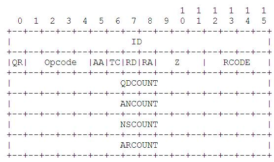
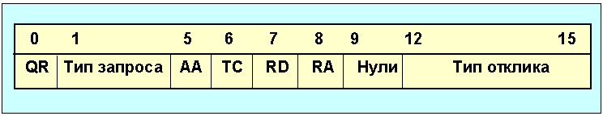
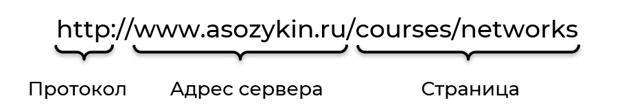
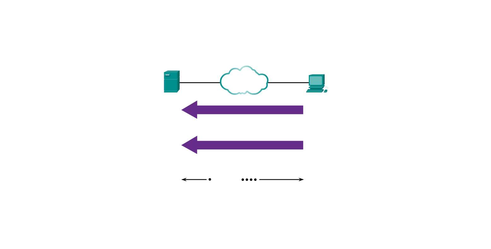
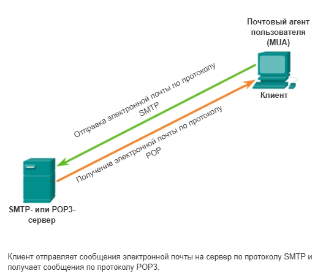

# Уровень приложений

В модели TCP/IP и в модели OSI самый верхний уровень носит название Application layer — то есть уровень приложений или прикладной уровень. Большая часть полезных данных, передаваемых по сети создаются на этом уровне и именно с этим уровнем взаимодействует человек посредством прикладного ПО. Все остальные уровни по сути выполняют задачу обслуживания передачи данных с уровня приложений на одном компьютере уровню приложений на другом компьютере.



## Модели взаимодействия

Для уровня приложений характерны три основные модели взаимодействия:

- Клиент-сервер (Client-Server). Самая распространенная модель, Клиент запрашивает данные или услугу. Сервер обрабатывает запрос и отдает ответ. HTTP, FTP, SSH и т.д.
- P2P (Peer-to-Peer). Децентрализация, все узлы обладают равными правами. В основно это файловые протоколы и сети-блокчейны.
- Гибридная. Узлы используют центральный сервер для поиска информации, а затем устанавливают одноранговые соединения с другими узлами. 

# DNS

В сетях передачи данных устройства идентифицируются по числовым IP-адресам для отправки и получения данных. Большинство пользователей не в состоянии запомнить эти числовые адреса. Доменные имена были созданы для того, чтобы преобразовать числовой адрес в простое и легко запоминаемое имя.

Служба доменных имён (DNS) была создана специально для преобразования доменных имён в адреса в таких сетях. 

Немного исторической справки. В 70-ых прародитель современного Интернета - ARPAnet - представляла собой тесное закрытое сообщество из нескольких сотен узлов. Всю информацию по узлам, в частности необходимую для преобразования имен и адресов узлов, содержал один единственный файл *HOSTS.TXT*. За файл *HOSTS.TXT* отвечал Сетевой информационный центр (NIC) Стенфордского исследовательского института. Администраторы ARPAnet просто посылали изменения электронной почты в NIC и периодически синхронизировали свои файлы *HOSTS.TXT* c копией в NIC. 

По мере роста сети эта схема стала неработоспособной и был начат поиск альтернативного решения. В 1984 году были опубликованы RFC 882 и 883, которые затем были обновлены документами RFC 1034 и 1035, они и по настоящий день остаются актуальными.

## Система DNS

DNS - это распределенная база данных. Структура базы данных DNS очень похожа на структуры файловой системы Unix. Вся база данных представлена в виде перевёрнутого дерева, корень которого в самом верху. Каждый узел дерева имеет текстовую метку, которая идентифицирует его относительно других узлов. Самый верхний корневой узел обозначается пустой меткой (обозначается " ") и тексте обычно записывается точкой **.**. 

Дерево DNS — это иерархическая база данных. Каждый узел (node) в этом дереве называется доменом. Каждый домен может содержать ресурсные записи (информацию об IP-адресах, почтовых серверах и т.д.) и иметь поддомены (потомков).


Иерархия системы DNS достигается за счёт разделения дерева на зоны. Зона — это не один узел, а административный срез дерева. Это совокупность данных (ресурсных записей), которая начинается с конкретного домена и распространяется вглубь на все его поддомены. Зона — это часть доменного дерева, за которую отвечает конкретный DNS-сервер. У каждой зоны есть первичный (primary, он же master) DNS-server, именно на нём хранится главная копия информации о зоне. Кроме этого, правила требуют, чтобы у каждой зоны был хотя бы один вторичный (secondary, slave) сервер, для надежности. Вместе эти сервера называются авторитетными (authoritative) серверами для данной зоны.

Разделение доменов на поддомены позволяет разделить административную ответственность за управление каждым доменом и его поддоменами между разными людьми и организациями.

Например, организация RogaAndCopita отвечает за зону example.com., эта зона содержит поддомены blog.example.com, shop.example.com, mail.example.com. Сам example.com и его поддомены содержат какие-то ресурсные записи. За весь этот кусок доменного дерева отвечает DNS-сервер компании RogaAndCopita, если вы захотите узнать, как попасть на web-сайт, http://blog.example.com, вы отправите запрос их DNS-серверу и он вернёт ресурсную запись. 

Теперь RogaAndCopita может взять и делегировать поддомен shop.example.com другой организации, ООО "Рожки да Ножки". DNS-сервер компании РогаИКопыта больше не отвечает за shop, не содержит информацию о поддоменах shop и о соответствующих ресурсных записях.

Что это означает на практике? Теперь, если вы попытаетесь получить доступ до shop.example.com и отправите запрос DNS-сервера РогаИКопыта, то он больше не вернёт вам IP-адрес сайта, вместо этого он скажет: "Иди спроси у DNS-сервера Рожки да Ножки, я не отвечаю за эту зону". Если точнее, он вернёт специальную запись, в которой будут указаны DNS сервера для shop.example.com. При делегировании, в родительскую зону добавляются ссылки на авторитетные сервера дочерней зоны.


Как это устроено в реальном Интернете. Корневой зоной (которая " " или просто **.**) заведует американская организация ICANN (Internet Corporation for Assigned Names and Numbers, https://www.icann.org/). Она же и устанавливает обязательные для всех правила в отношении использования DNS-имен. Следом за корневой зоной идут **зоны первого уровня** (top-level domain, TLD), это национальные домены `.ru`, `.eu`, `.kz`, etc и тематические домены `.com`, `.edu`, `.net`, .etc. Каждым TLD управляет какая-то организация. Например, зоной `.com` распоряжается VeriSing (а раньше Министерство Обороны США), доменом `.ru` - "Координационный центр доменов .RU/.РФ".

Обеспечивают работу корневой зоны DNS в сети Интернет 13 **Корневых серверов** (на деле это более 2000 серверов-зеркал). Корневые серверы DNS управляются двенадцатью различными организациями, действующими на основании соглашений с корпорацией ICANN. В их число входят университеты, организации Министерства обороны США, некоммерческие ассоциации.

Корневые сервера содержат список DNS-серверов для любого домена верхнего уровня, то есть делегирует им соответствующие зоны.

## Ресурсные записи

На DNS-серверах хранятся различные типы ресурсных записей, используемые для разрешения имен. Эти записи содержат имя, адрес и тип записи. 

Всего определено несколько десятков типов ресурсных записей. Самые часто используемые:
- A (address record) - адрес оконечного устройства. Самый часто используемые тип записей. Связывает домен с конкретным IPv4-адресом.
- AAAA - аналог А, но для IPv6 адресов.
- CNAME (Canonical Name) - создаёт псевдоним для домена. Перенаправляет с одного доменного имени на другое. Например, `www.example.com` на `example.com`. 
- MX (mail exchange) - отвечает за маршрутизацию электронной почты. Указывает почтовый сервер, который будет принимать письма для домена.
- TXT - простая текстовая информация. Часто используется для подтверждения владения доменом. 
- NS (name server) - Указывает, какие именно DNS-серверы отвечают (являются авторитетными) за домен. 

## Взаимодействие с DNS

Когда клиент выполняет запрос, процесс BIND сервера сначала ищет это имя в своих записях, чтобы разрешить его. Если имя не удалось разрешить по локальным записям, сервер обращается к другим серверам для разрешения имени.

При повторном запросе этого же имени первый сервер может вернуть адрес, используя значение, которое хранится в кэше имён. Кэширование снижает трафик DNS-данных в сети и нагрузку серверов на более высоком уровне в иерархии.



DNS стандартно работает по протоколу UDP, DNS сервера слушают порт 53. Сообщения DNS имеют следующий формат:



- Header — Заголовок DNS пакета, состоящий из 12 октет.
- Question section — в этой секции DNS-клиент передает запросы DNS-серверу сообщая о том, для какого имени необходимо разрешить (зарезолвить) запись DNS, а также какого типа (NS, A, TXT и т.д.). Сервер при ответе, копирует эту информацию и отдает клиенту обратно в этой же секции.
- Answer section — сервер сообщает клиенту ответ или несколько ответов на запрос, в котором сообщает вышеуказанные данные.
- Authoritative Section — содержит сведения о том, с помощью каких авторитетных серверов было получена информация включенная в секцию DNS-ответа.
- Additional Record Section — дополнительные записи, которые относятся к запросу, но не являются строго ответами на вопрос.

Записей в секциях может быть как несколько, так и не быть вообще. Всё определяется заголовком.



- ID (16 бит) — данное поле используется как уникальный идентификатор транзакции. Указывает на то, что пакет принадлежит одной и той же сессии “запросов-ответов” и занимает 16 бит.
- QR (1 бит) — данный бит служит для индентификации того, является ли пакет запросом (QR = 0) или ответом (QR = 1).
- Opcode (4 бита) — с помощью данного кода клиент может указать тип запроса, где обычное значение:
  - 0 — стандартный запрос,
  - 1 — инверсный запрос,
  - 2 — запрос статуса сервера,
  - 3-15 – зарезервированы на будущее.
- AA (1 бит) — данное поле имеет смысл только в DNS-ответах от сервера и сообщает о том, является ли ответ авторитетным либо нет.
- TC (1 бит) — данный флаг устанавливается в пакете ответе в том случае если сервер не смог поместить всю необходимую информацию в пакет из-за существующих ограничений.
- RD (1 бит) — этот однобитовый флаг устанавливается в запросе и копируется в ответ. Если он флаг устанавливается в запросе — это значит, что клиент просит сервер не сообщать ему промежуточных ответов, а вернуть только IP-адрес.
- RA (1 бит) — отправляется только в ответах, и сообщает о том, что сервер поддерживает рекурсию.
- Z (3 бита) — являются зарезервированными и всегда равны нулю.
- RCODE (4 бита) — это поле служит для уведомления клиентов о том, успешно ли выполнен запрос или с ошибкой.
  - 0 — значит запрос прошел без ошибок;
  - 1 — ошибка связана с тем, что сервер не смог понять форму запроса;
  - 2 — эта ошибка с некорректной работой сервера имен;
  - 3 — имя, которое разрешает клиент не существует в данном домене;
  - 4 — сервер не может выполнить запрос данного типа;
  - 5 — этот код означает, что сервер не может удовлетворить запроса клиента в силу административных ограничений безопасности.

- QDCOUNT(16 бит) – количество записей в секции запросов
- ANCOUNT(16 бит) – количество записей в секции ответы
- NSCOUNT(16 бит) – количество записей в Authority Section
- ARCOUNT(16 бит) – количество записей в Additional Record Section



| Бит(ы) | Поле | Длина | Описание | Значения |
|:---:|:---|:---:|---|:---|
| 0 | **QR**<br>(Query/Response) | 1 бит | Тип сообщения | **0** — запрос<br>**1** — отклик |
| 1–4 | **OPCODE**<br>(Operation Code) | 4 бита | Код операции | **0** — стандартный запрос (query)<br>**1** — инверсный запрос (inverse query)<br>**2** — запрос статуса сервера (status)<br>*3–15 — зарезервированы* |
| 5 | **AA**<br>(Authoritative Answer) | 1 бит | Авторитетный ответ.<br>Устанавливается в **1** в отклике, если сервер DNS имеет полномочия (является авторитетным) для домена, указанного в разделе вопросов. | **0** или **1** |
| 6 | **TC**<br>(Truncated) | 1 бит | Обрезано (truncated).<br>Для UDP означает, что полный размер отклика превысил 512 байт, но возвращены только первые 512 байт. | **0** или **1** |
| 7 | **RD**<br>(Recursion Desired) | 1 бит | Требуется рекурсия.<br>Устанавливается в запросе и возвращается в отклике.<br>• **1** — сервер должен сам обработать запрос и вернуть готовый ответ (рекурсивный запрос).<br>• **0** — если сервер не авторитетен, он возвращает список других DNS-серверов для повторного обращения (итеративный запрос). | **0** или **1** |
| 8 | **RA**<br>(Recursion Available) | 1 бит | Рекурсия возможна.<br>Устанавливается в **1** в отклике, если сервер поддерживает рекурсию. | **0** или **1** |
| 9–11 | **Зарезервировано** | 3 бита | Зарезервировано для будущего использования.<br>Должно быть равно **0**. | Всегда **000** |
| 12–15 | **RCODE**<br>(Response Code) | 4 бита | Код возврата (код ответа).<br>Указывает на результат обработки запроса. | **0** — нет ошибок (No Error)<br>**1** — ошибка в формате запроса (Format Error)<br>**2** — сбой на сервере (Server Failure)<br>**3** — имя не существует (Name Error — NXDOMAIN)<br>*4–15 — зарезервированы* |


# Протоколы удаленного управления

На каждодневной основе мы взаимодействуем с компьютерами посредством GUI. При помощи GUI пользователь операционной системы ПК может выполнять следующие задачи:

- Выбирать различные объекты и запускать программы, используя мышь.
- Вводить текст и текстовые команды.
- Просматривать выходные данные на экране монитора.

Но это не единственный и не всегда оптимальный способ, потому что GUI требует ресурсов. Выделять их на серверах и сетевом оборудовании расточительно. Более экономичной (а во многих сценариях и более эффективной) является CLI (интерфейс командной строки). Управляя операционной системы при помощи CLI специалист может выполнять следующие задачи:

- Запускать программы на базе CLI, используя клавиатуру.
- Вводить текст и текстовые команды с клавиатуры.
- Просматривать выходные данные на экране монитора.

Управлять устройством через CLI можно подключившись к нему физически монитором и клавиатурой (чаще всего так делают с серверами), или, если устройство вообще не имеет видеовыходов, то через последовательный порт, подключившись специальным консольным кабелем. 

Оба варианта подразумевают физическую близость к управляемому устройству, что требуется при начальной инициализации устройства (и когда что-то пошло не так). Администрировать устройства постоянно ходя к ним с монитором и клавиатурой не очень удобно, поэтому требуется вариант, при котором инженер сможет получать доступ к CLI через компьютерную сеть, не вставая из-за рабочего места. 

Для этого используются протоколы прикладного уровня, позволяющие удаленно начать сеанс CLI через виртуальный интерфейс по сети.

## Telnet (Teletype Network)

Протокол TELNET позволяет пользователю установить TCP-соединение с сервером и затем передавать коды нажатия клавиш так, как если бы работа проводилась на консоли сервера. Сервер TELNET традиционно слушает на 23 порту. Главный недостаток Telnet - все данные передаются в открытом виде. Данные для аутентификации пользователя, пароли и команды передаются по сети в виде простого текста. 

TELNET предлагает три услуги:
- Определяет сетевой виртуальный терминал (NVT - network virtual terminal), который обеспечивает стандартный интерфейс к удаленной системе.
- Включает механизм, который позволяет клиенту и серверу согласовать опции обмена
- Обеспечивает симметрию соединения, допуская любой программе (например FTP) выступать в качестве клиента

Формат NTV достаточно прост. Для данных используются 7-битовые ASCII коды. 8-битовые же октеты зарезервированы для командных последовательностей.

Протокол Telnet очень простой, но использовать Telnet стоит только когда нет других вариантов или когда отсутствуют требования к безопасности (например в лабораторных средах). 

## SSH 

На сегодня протокол Telnet практически полностью вытеснен протоколом SSH (Secure Shell). SSH позволяет установить защищённое зашифрованное соединение к узлу. 

### Основы криптографии

Защиту передаваемой информации можно грубо свести к трем основным задачам:

  - Аутентификация — стороны должны убедиться в легитимности друг друга.
  - Конфиденциальность (приватность) — информация должна быть изменена таким
    образом, чтобы прочитать её могли только легитимные стороны обмена.
  - Целостность — нужно убедиться, что в процессе передачи информация не была
    несанкционированно изменена.

Для выполнения этих задач используется несколько различных методов управления
данными:

  - Симметричное шифрование.
  - Асимметричная криптография.
  - Хеширование.

Симметричное шифрование

Симметричное шифрование – это способ шифрования, при котором для зашифровки и
расшифровки данных между сторонами используется один и тот же ключ. Алгоритмы
симметричного шифрования обеспечивают высокую криптостойкость при относительно
короткой длине ключа. Примеры симметричных алгоритмов:

  - Advanced Encryption Standard (AES) — абсолютный лидер среди симметричных
    алгоритмов шифрования. Использует разные варианты длин ключей: 128, 192
    и 256 бит, где AES-256 обеспечивает наивысший уровень безопасности.
  - ChaCha20 — может показывать более высокую производительность, особенно на
    устройствах с ограниченными ресурсами.
  - «Кузнечик» — отечественный стандарт (ГОСТ 34.12-2015). Используется там, где
    к этому есть регуляторные требования.

Главная проблема симметричного шифрования заключается в необходимости доставки
ключа всем участникам диалога. Требуется либо уже существующий безопасный канал
связи, либо алгоритм, который позволит выработать общий секретный ключ по
небезопасному каналу.

Классическим примером такого алгоритма служит алгоритм Диффи-Хеллмана (DH),
основанный на трудности вычисления дискретного логарифма в конечных полях. В
современных приложениях чаще используются:

  - Вариант DH на эллиптических кривых (ECDH).
  - ML-KEM (Module-Lattice-Based Key-Encapsulation Mechanism), обладающий
    постквантовой стойкостью.

Все эти технологии позволяют двум сторонам получить общий секретный ключ через
открытый канал, который может прослушиваться третьей стороной. Они защищают от
пассивного прослушивания. Однако, к сожалению, от атаки Man-in-the-Middle (когда
злоумышленник может активно изменять передаваемые данные или выдавать себя за
одну из сторон) они не защищают, так как не решают проблему начального доверия.

Чтобы защититься от активных атак, используются хеширование и методы
асимметричной криптографии.

Хеширование

Хеширование — это алгоритм, преобразующий произвольный массив данных в строку
фиксированной длины, состоящую из букв и цифр. Это похоже на контрольные суммы,
которые используются для проверки фреймов на ошибки при передаче. Однако
алгоритмы контрольных сумм (например, CRC32) чрезвычайно просты: математически
легко изменить передаваемую последовательность битов, сохранив прежнее значение
суммы. Криптографические хеш-функции защищены от этого. Стойкость метода
хеширования определяется тем, насколько тяжело подобрать два разных массива
данных, хеши для которых совпадут (устойчивость к коллизиям).

Популярные криптографические алгоритмы хеширования:

  - SHA-256;
  - SHA-3.

В старых криптосистемах всё ещё можно встретить MD5 и SHA-1. Их использовать
нельзя, так как они устарели и имеют ряд доказанных уязвимостей.

Отдельно упомянем HMAC (Hash-based Message Authentication Code — код
аутентификации сообщений на основе хеш-функции). При генерации HMAC используется
общий секретный ключ. Без знания ключа злоумышленник не сможет сгенерировать
правильную контрольную сумму, что защищает сообщения от подмены, но требует,
чтобы секретный ключ уже был заранее безопасно передан обеим сторонам.

Асимметричная криптография и электронная подпись

Для решения проблемы первичного доверия и защиты от атак типа «человек
посередине» используются методы асимметричной криптографии. Они строятся вокруг
пар математически связанных ключей.

Хрестоматийным примером является алгоритм RSA. Как и любая асимметричная
система, он основан на паре ключей: публичном (его можно распространять всем) и
приватном (хранится в строгой секретности). Их главное свойство: данные,
зашифрованные одним ключом, можно расшифровать только при помощи второго, и
наоборот. Что еще важнее — зная публичный ключ, математически невозможно
вычислить приватный.

Если кто-то хочет отправить владельцу ключа зашифрованное сообщение, он шифрует
его открытым ключом адресата. Никто, кроме владельца приватного ключа, не сможет
его прочитать.

Однако асимметричное шифрование обычно не используют для передачи самих объёмных
данных из-за низкой скорости работы (в сотни и тысячи раз медленнее
симметричного) и ограничений на размер шифруемого блока. Вместо этого асимметрию
применяют для аутентификации и создания цифровых подписей.

Как работает цифровая подпись: Представим, что нам известен публичный RSA-ключ
узла и мы хотим убедиться, что данные пришел именно от него:

1.  Перед отправкой сообщения узел высчитывает от него криптографический хеш.
2.  Узел подписывает (шифрует) этот хеш своим приватным RSA-ключом и прикрепляет
    результат к сообщению. Это и есть цифровая подпись.
3.  Получатель отделяет подпись от сообщения и самостоятельно считает хеш
    полученных данных.
4.  Получатель расшифровывает подпись с помощью публичного ключа узла.
5.  Если расшифрованный хеш совпал с хешем, рассчитанным получателем, значит,
    сообщение гарантированно отправлено владельцем приватного ключа и не было
    изменено в пути.

Таким образом, умея аутентифицировать узел через его открытый ключ, стороны
могут безопасно выработать общий секретный ключ для быстрого симметричного
шифрования с помощью протоколов DH или ML-KEM.

Примечание: В современных реалиях алгоритм RSA требует длину ключа не менее 2048
бит. Более популярным и рекомендуемым является метод ECDSA (вариант алгоритма
DSA на эллиптических кривых). Он обеспечивает высокую защиту при меньшей длине
ключа. В отличие от RSA, ECDSA используется только для создания цифровых
подписей — зашифровать им произвольные данные нельзя.

В примере выше мы исходим из предположения, что нам уже известен публичный ключ узла. Но откуда?
В большинстве случаев узел сам будет присылать свой публичный ключ при установлении соединения. Ключ будет сопровождаться цифровой подписью, то есть владелец ключа будет прикладывать к нему хеш от ключа подписанный приватным ключом. И тут встаёт вопрос, а как мы должны убедиться в том, что отрытый ключ нам прислал реальный узел, а не злоумышленник посередине. 

1. Вариант первый - TOFU (Trust on first use). Когда мы впервые будем устанавливать защищенное соединение с узлом, программа, с помощью которой мы это делаем (ssh-клиент) покажет нам сообщение с примерно следующим содержанием.
> Вы пытаетесь установить соединение с узлом, чей публичный ключ вам ещё не известен. (дальше идёт ключ). Вы действительно хотите это сделать? 

На самом деле в сообщении будет указан не сам ключ, а его отпечаток (fingerprint). Отпечаток это по своей сути результат хеш функции от ключа и неких дополнительных данных, однозначно идентифицирующий открытый ключ. Смысл здесь не в какой-то дополнительной секретности или скрытой проверке. Хеш от ключа банально короче самого ключа и человек в состоянии без особых усилий визуально оценить хеш. 

То есть если вы имеете безопасный доступ к узлу, например консольное подключение, то первый раз инициируя подключение, вы можете визуально сравнить отпечаток полученного ключа и отпечаток ключа на сервере. Или, если узел администрируется другим человеком, то вы, например, можете позвонить ему и попросить продиктовать отпечаток. 

Почему доверие именно при **первом использовании**. Потому что после того, как вы примете предложенный ключ, то есть согласитесь его использовать, он будет записан в специальный файлик на вашем компьютере, который обычно называется *authorized_keys*, то есть авторизованные хосты. Во время последующих подключений, узел точно также будет присылать свой открытый ключ, но поскольку тот уже будет в файлике, то аутентификация будет происходить автоматически. 

2. Вариант два - использование цифровых сертификатов. Эта система требует наличия Сертификационных центров (CA - Certificate Authority) - некого третьего авторитетного лица или организации, которым мы доверяем. Такой CA будет подписывать своей цифровой подписью публичные ключи узлов, к которым мы хотим получить доступ. Как это будет выглядеть: 
- Хозяин узла генерирует пару ключей. Подписывает публичный ключ приватным (то есть получает ту комбинацию, которую отослал бы нам) и неким безопасным способом отдает её CA на подпись, например записывает на флешку и везет с охраной. 
- У CA тоже есть пара ключей. Когда хозяин приносит свой открытый ключ, то CA требует от хозяина узла подтверждения, что он действительно тот за кого себя выдаёт. Получив доказательства, CA добавляет к открытому ключу дополнительную информацию о себе, о хозяине ключа, о времени выдачи и сроке действия. А затем он вычисляет от всего вместе хеш и подписывает её своим приватным ключом. Результат - изначальный ключ, плюс дополнительный данные, плюс подписанный хеш - это и есть сертификат. 

Теперь когда мы будем устанавливать соединение с узлом, он будет высылать не просто открытый ключ, а открытый ключ + сертификат. Чтобы проверить сертификат, требуется воспользоваться открытым ключом CA. Где его взять? Сходить в CA. В чем тут подвох? Чтобы получить у CA его открытый ключ - нужно установить с ним защищенное соединение. А чтобы установить защищенное соединение, нужно знать открытый ключ CA. 

То есть получается, чтобы мы могли установить защищенное соединение с CA - кто-то другой (более авторитетный CA) должен подписать CA его открытый ключ. А более авторитетному CA должен подписать ключ ещё более авторитетный CA, и мы могли бы продолжать так до бесконечности.

Но на самом деле мы довольно быстро дойдём до так называемых корневых сертификационных центров. 
Открытый ключ корневого сертификационного центра никем не подписывается. Вместо этого он уже должен быть у нас на компьютере. Он может поставляться вместе с операционной системой, с прикладным программным обеспечением, или загружаться на компьютер его администратором. Но в момент установления соединения с изначальным узлом открытый ключ корневого CA уже должен быть у нас. 

### Процесс установления соединения SSH

Вернемся к протоколу SSH. SSH клиент-серверный протокол, работает поверх TCP, стандартный порт 22. 


Установление соединения SSH состоит из следующих этапов:
1. TCP-handshake.
2. Cервер и клиент обмениваются поддерживаемыми версиями протокола. 
3. Сервер высылает клиенту сообщение, которое называется Key Exchange Init. В нём сервер указывает список поддерживаемых алгоритмов. Что именно передаёт сервер:
  - kex_algorithms - алгоритмы безопасного обмена ключами (dh, ecdh). 
  - server_host_key_algorithms - алгоритмы асимметричных ключей для подписей.
  - encryption_algorithms (server_to_client и client_to_server) - список алгоритмов симметричного шифрования, отдельно для сервер-клиент и для клиент-сервер.
  - mac_algorithms (server_to_client и client_to_server) - список методов хеширования для HMAC (так же в обе стороны).
  - compression_algorithms (server_to_client и client_to_server) - список методов сжатия передваемых данных.
Порядок, в котором записаны алгоритмы, имеет значение. Чем раньше указан алгоритм - тем более предпочтительным он является. Приоритетным является набор клиента. Когда сервер получает список от клиента, он поочередно ищет алгоритмы оттуда в своём списке, до первого совпадения. 
4. Выбрав алгоритмы сервер и клиент начинают обмен информацией, необходимой для выработки секретной информации (по алгоритму DH, ECDH, ML-KEM). В результате обе стороны должны получить общий секрет *k*. На завершающем шаге этого этапа сервер вычисляет хеш от метаданных сессии, общего секрета *k* и своего открытого ключа, подписывает хеш своим закрытым ключом и передаёт клиенту вместе с открытым ключом.
5. Клиент аутентифицирует сервер по открытому ключу. Сервер и клиент на основе метаданных сессии и общего секрета *k* вычисляют ключ сессионный ключ шифрования. Далее все сообщения будут передаваться в зашифрованном виде. 
6. Далее клиент запрашивает аутентификацию у сервера. Сервер отвечает списком поддерживаемых методов (обычно пароль или аутентификация по ключу). В зависимости от выбранного метода аутентификации будут отличаться дальнейшие шаги:
   1. В случае аутентификации по паролю клиент отправляет северу имя пользователя и пароль. Сервер проверяет полученный пароль на соответствие для указанного пользователя. Если пароль верен - аутентификация успешна, если нет - сервер отправляет отказ.
   2. В случае ключей:
      1. Клиент отправляет серверу имя пользователя и свой открытый ключ.
      2. Сервер проверяет публичный ключ (обычно он хранится в файле `~/.ssh/authorized_keys` для данного пользователя). Если ключ найден, сервер отвечает утвердительно. 
      3. Тогда клиент вычисляет хеш от некоторых метаданных сессии, подписывает его своим закрытым ключом и отсылает серверу.
      4. Сервер проверят подпись и если всё корректно - аутентификация считается успешной.


[ssh message exchange](https://mnin.org/write/2006_sshcrypto.html)
[ssh basic](https://citforum.ru/citkit/articles/92/)

### Сервисы SSH

Главный сервис, который предоставляет SSH - это защищенный удаленный доступ к устройству (Secure Shell). Позволяет запускать и управлять операционной системой на удаленном устройстве в реальном времени.

Кроме этого SSH позволяет:
- Передавать файлы. Через защищенный протоколы SCP (Secure copy) и SFTP (Secure File Transfer Protocol).
- Проброс портов (Туннелирование) - через зашифрованный канал можно безопасно передавать трафик других сетевых служб. (Например на вашем удаленном сервере есть web-панель управления на 80 порту, чтобы не афишировать её во вне, вы делаете её доступной только локально, а сами подключаетесь через SSH-тунель, через связку local_port:remote_port).
- Перенаправление X11. X11 простыми словами - это главная графическая программа на Unix подобных системах, которая показывает на экране окна, картинки, текст и тд, а также случает клавиатуру и мышку. SSH позволяет передавать команды X11 и локально отрисовывать графический интерфейс удаленной машины. 

# HTTP 

HTTP расшифровывается как Hypertext Transfer Protocol, протокол передачи гипертекста. Сейчас это один из самых популярных протоколов интернет, основа Web.

Концепцию Web предложил в 1989 году Тим Бернерс-Ли из Европейского центра ядерных исследований (ЦЕРН).

## URL 

Важную роль в работе HTTP играет Uniform Resource Locator, сокращенно URL – единообразный определитель местонахождения ресурса. Именно URL используется для того, чтобы указать, к какой странице мы хотим получить доступ.



URL состоит из трех основных частей:

- Название протокола, в примере на рисунке протокол HTTP.
- Адрес сервера, на котором размещен ресурс. Можно использовать IP-адрес или доменное имя. Адрес сервера отделяется от названия протокола двоеточием и двумя слешами. 
- Адрес ресурса на сервере. Это может быть HTML-страница, изображение, видео или ресурс другого типа. В примере на рисунке адрес страницы: /courses/networks.

## Версии HTTP

Три основные версии HTTP, которые можно встретить в сети:
- HTTP/1.1 - вышел в 1997. RFC, описывающие HTTP 1.1 неоднократно обновлялись, последний раз в 2022 году.
- HTTP/2 - вышел в 2015, основной задачей было повышение производительности. 
- HTTP/3 - самая последняя версия, использует протокол QUIC вместо TCP.

## Принцип работы HTTP

Протокол HTTP работает в режиме запрос-ответ. Клиент, например, браузер, передает на сервер запрос к определенному ресурсу, например, Web-странице. Сервер в ответ отправляет клиенту этот ресурс или сообщение об ошибке, если ресурс передать нельзя. 


HTTP/1.1 использует текстовый режим работы, то есть от клиента к серверу и обратно передаются обычные строки. Это просто и удобно для людей, которые могут понять, что именно передается без использования дополнительных инструментов. Однако для компьютеров это не самый удобный формат, т.к. приходится заниматься парсингом строк. Поэтому HTTP/2 и HTTP/3 используют бинарный режим работы.

На транспортном уровне HTTP использует протокол TCP.

## HTTP Request

Запрос HTTP состоит из трех основных частей:

- Запрос
- Заголовки (не обязательно)
- Тело сообщения (не обязательно)

Пример простого запроса HTTP в текстовом режиме:

```
GET /courses/networks HTTP/1.1
Host: example.com
```

В первой строке указывается сам запрос, который также состоит из трех частей:

- Метод HTTP GET указывает, какое действие требуется выполнить с ресурсом. В примере метод GET говорит о том, что мы хотим получить (загрузить) ресурс.
- Адрес ресурса /courses/networks – путь к странице на Web-сервере, которую мы хотим загрузить.
- Версия протокола HTTP/1.1.

Во второй строке указывается заголовок Host. Этот заголовок является обязательным в версии HTTP/1.1, в нем задается доменное имя сервера, к которому направлен запрос. Сейчас активно используется виртуальный хостинг: один Web-сервер на одном IP-адресе может обслуживать несколько сайтов с разными доменными именами. Чтобы понять, какому именно сайту предназначен запрос, нужно указать доменное имя сайта в заголовке Host.

## Методы HTTP

Метод HTTP говорит о том, какое действие с ресурсом мы хотим совершить. В примере запроса мы видели метод GET, который предназначен для получения ресурса. Другие важные методы:

| Название метода | Описание метода |
| :--- | :--- |
| **GET** | Запрос на передачу ресурса. |
| **HEAD** | Запрос на передачу ресурса, но сам ресурс в ответе не передается, только заголовки. |
| **POST** | Передача данных на сервер для обработки указанного ресурса. |
| **PUT** | Размещение ресурса на сервере (если такой ресурс уже есть на сервере, то он замещается). |
| **DELETE** | Удаление ресурса на сервере. |
| **CONNECT** | Установка соединение с сервером на основе ресурса. |
| **OPTIONS** | Запрос поддерживаемых методов HTTP для ресурса и других параметров коммуникации. |
| **TRACE** | Запрос на трассировку сообщения: сервер должен включить в свой ответ исходный запрос, на который он отвечает. Это полезно, когда запрос проходит через промежуточные устройства, которые могут изменить запрос, например, добавить заголовки. |

## HTTP Response

Ответ HTTP, как и запрос, состоит из трех частей:

- Статус ответа
- Заголовки (не обязательно)
- Тело сообщения (не обязательно)

Пример ответа:

```
HTTP/1.1 200 ОК
Content-Type: text/html; charset=UTF-8
Content-Length: 5161

Текст Web-страницы…
```

В HTTP/1.1 ответ, также как и запрос, представляет собой обычные текстовые строки.

Первая строка ответа состоит из двух частей:

- Версия протокола, в примере HTTP/1.1. Версию указывать не обязательно.
- Код статуса ответа, в примере 200 ОК, запрос обработан успешно.

Ответ содержит два заголовка, которые следуют после строки с кодом статуса:

- Content-Type, тип содержимого, которое передается в теле сообщения. Значение "text/html; charset=UTF-8" означает, что в теле сообщения страница HTML в кодировке UTF-8.
- Content-Length, размер содержимого, в байтах. В примере размер страницы в теле сообщения 5161 байт.

После заголовков в теле ответа находится запрошенная Web-страница (в примере она не показана для сокращения объема). Тело сообщения отделено от заголовков пустой строкой.

## Коды статусов ответов HTTP

Первая строка ответа HTTP содержит код статуса ответа – число в диапазоне от 100 до 599, которое характеризует результат выполнения запроса. Коды статусов ответов разделены на пять классов, которые определяются по первой цифре кода:

- 1ХХ (информация): запрос получен, обработка продолжается.
- 2ХХ (успешное выполнение): запрос был успешно принят и понят.
- 3ХХ (перенаправление): для выполнения запроса необходимо предпринять дополнительные действия.
- 4ХХ (ошибка клиента): запрос содержит синтаксическую ошибку или не может быть выполнен.
- 5ХХ (ошибка сервера): запрос от клиента оформлен правильно, но при его обработке произошла ошибка на стороне сервера.

| Код статуса ответа | Описание |
| :--- | :--- |
| **1ХХ (информация)** | |
| 101 Switching Protocols | Запрос принят, сервер предлагает дальнейшее взаимодействие выполнять по другому протоколу (например, WebSocket). Желаемый протокол должен быть указан в заголовке Upgrade ответа. |
| **2ХХ (успешное выполнение)** | |
| 200 OK | Запрос выполнен успешно. |
| 201 Created | В результате выполнения запроса на сервере был успешно создан ресурс (например, в ответ на запрос PUT). |
| **3ХХ (перенаправление)** | |
| 301 Moved Permanently | Запрошенный ресурс был перемещен. Новый URL ресурса указывается в заголовке ответа Location. В дальнейшем клиенту рекомендуется использовать новый URL. |
| 302 Found | Запрошенный ресурс был временно перемещен в другое место. Новый URL ресурса указывается в заголовке ответа Location. В дальнейшем клиенту рекомендуется использовать старый URL, т.к. перемещение временное. |
| 304 Not Modified | Запрошенный ресурс не был изменен, поэтому можно взять ресурс из кэша, а не передавать его по сети. |
| **4ХХ (ошибка клиента)** | |
| 400 Bad Request | Запрос не может быть обработан из-за ошибки синтаксиса. |
| 403 Forbidden | Доступ к запрошенному клиентом ресурсу запрещен. |
| 404 Not Found | Запрошенный ресурс не найден на сервере. |
| **5ХХ (ошибка сервера)** | |
| 500 Internal Server Error | Запрос не может быть выполнен из-за внутренней ошибки в программном обеспечении сервера. |
| 501 Not Implemented | Сервер не поддерживает запрошенную функциональность, например, не может выполнить запрошенный метод HTTP для указанного ресурса. |
| 505 HTTP Version Not Supported | Версия HTTP, указанная в запросе, не поддерживается. |

# NTP 

Точное время всегда необходимо для корректной работы компьютерных систем, обеспечения согласованности данных, безопасности транзакций и координации действий в распределенных системах. 

Поскольку встроенные кварцевые часы в компьютерах неидеальны (они «уплывают» из-за температуры и старения), нам нужен внешний эталон.

Поэтому в 1985 году профессором Делавэрского университета Дэвидом Л. Милсом был создан протокол NTP (Network Time Protocol), который является одним из наиболее распространенных и эффективных методов синхронизации времени. Протокол имеет несколько версий, последним является NTPV4. Для небольших сетей или устройств, где небольшие изменения в синхронизации времени не вызывают существенных сбоев, была разработан протокол SNTP — несколько упрощенная версия NTP.

Протокол NTP (а именно его последняя версия NTPv4) описан в RFC5905.

Протокол NTP работает по принципу клиент-сервер, где NTP-клиенты отправляют запрос на получение времени у NTP-серверов. Серверы, в свою очередь, получают точное время от высокоточных источников, таких как атомные часы или GPS, и отправляют ответ клиенту, на котором устанавливается точное время. Передача от одного устройства к другому происходит с использованием сетевого протокола UDP.

Все NTP-сервера образуют иерархическую структуру, состоящую из уровней, называемых "stratum" (см. рисунок 1). Серверы уровня 1 напрямую подключены к источникам точного времени и служат основными источниками для серверов уровня 2, серверы уровня 2 — для уровня 3 и т.д. Клиенты могут обращаться к нескольким серверам для получения времени, что повышает надежность синхронизации. Протокол также учитывает сетевые задержки и может постепенно корректировать время, чтобы избежать резких изменений.


Процесс синхронизации включает в себя обмен небольшими пакетами данных, содержащими информацию о времени и представляющими собой запросы и соответствующие ответы (см. рисунок 2) между клиентом и сервером (или двумя серверами).


Чтобы определить смещение времени между системами и задержки, прошедшей с момента отправки запроса до получения ответа, в передаваемых пакетах используются три поля:

- t1: Локальное время клиента в момент отправки запроса.
- t2: Локальное время сервера при получении запроса.
- t3: Локальное время сервера в момент отправки ответа.

Перед отправкой клиент фиксирует своё текущее время (метка времени t1) и сохраняет это значение в переменной.

Когда сервер получает пакет от клиента, он формирует ответный пакет. В этот пакет копируется значение времени отправки из полученного запроса, и записывается текущее время сервера (метка времени t2, момент получения запроса). После обработки запроса сервер добавляет в пакет своё текущее время (метка времени t3, момент отправки ответа) и отправляет его обратно клиенту.

Когда клиент получает ответ, он записывает время его получения (метка времени t4). Теперь у клиента есть все необходимые данные для вычисления смещения и задержки, связанной с передачей пакетов по сети.

Смещение времени (разница между временем сервера и клиента) вычисляется по формуле: dt = 0.5 * ((t2−t1) + (t3−t4)), а общее время передачи данных: t = (t4−t1) − (t3−t2). Используя эти данные, клиент выставляет у себя время.

# Протоколы передачи данных

В TCP/IP есть несколько протоколов для передачи данных. К популярным можно отвести:
- FTP - File Transfer Protocol.
- TFTP - Trivial File Transfer Protocol.
- SFTP - Secure File Transfer Protocol (ещё есть вариант Simple FTP, но это не он).

## FTP

Один из самых старых протоколов Интернета (появился в 1971 году). FTP - клиент серверный протокол. Основная особенность FTP в том, что он использует двойное подключение. Одно из них используется для передачи команд серверу и происходит по умолчанию через TCP-порт 21. Управляющее соединение существует все время, пока клиент общается с сервером. Канал управления должен быть открыт при передаче данных между машинами. В случае его закрытия передача данных прекращается. Через второе происходит непосредственная передача данных. Оно открывается каждый раз, когда осуществляется передача файла между клиентом и сервером. В случае, если одновременно передаётся несколько файлов, для каждого из них открывается свой канал передачи.

FTP может работать в активном или пассивном режиме, от выбора которого зависит способ установки соединения. В активном режиме клиент создаёт управляющее TCP-соединение с сервером и отправляет серверу свой IP-адрес и произвольный номер клиентского порта, после чего ждёт, пока сервер запустит TCP-соединение с этим адресом и номером порта. В случае, если клиент находится за брандмауэром и не может принять входящее TCP-соединение, может быть использован пассивный режим. В этом режиме клиент использует поток управления, чтобы послать серверу команду PASV, и затем получает от сервера его IP-адрес и номер порта, которые затем используются клиентом для открытия потока данных со своего произвольного порта.



## TFTP

Упрощенный протокол передачи файлов (TFTP) предназначен для обмена файлами с внешними хостами. 

Для передачи файлов TFTP применяется ненадежный Протокол пользовательских дейтаграмм (UDP 69), поэтому он обычно работает быстрее, чем FTP. Как и FTP, TFTP поддерживает передачу файлов в формате NETASCII и в 8-разрядном двоичном формате. В отличие от FTP, TFTP не поддерживает просмотр каталогов или переход в другой каталог внешнего хоста. Кроме того, в нем не предусмотрена защита с помощью пароля. TFTP позволяет работать только с общими каталогами.

Основное применение: загрузка ОС на бездисковые станции, обновление программного обеспечения и резервное копирование конфигураций.

## SFTP

SFTP (Secure File Transfer Protocol) – протокол прикладного уровня передачи файлов, работающий поверх безопасного канала. SFTP это отдельный и никак не связанный с FTP протокол, который в качестве основы использует SSH. 

Главное, что отличает SFTP от стандартного FTP и TFTP, это то, что SFTP шифрует абсолютно все команды, имена пользователей, пароли и другую конфиденциальную информацию.

Кроме безопасности SFTP поддерживает более богатый набор операций, таких как:
- Изменение прав доступа.
- Удаление и переименовывание файлов и директорий. 
- Возобновление прерванной передачи. 

# Протоколы электронной почты

Электронная почта — это набор средств для доставки, хранения и поиска электронных сообщений в сети. Сообщения электронной почты хранятся на серверах электронной почты в базах данных. 

Клиенты электронной почты для отправки и получения сообщений обращаются к серверам электронной почты. Серверы электронной почты взаимодействуют с другими серверами электронной почты для обмена сообщениями между доменами. Почтовый клиент не соединяется непосредственно с другим почтовым клиентом для отправки сообщения. Оба клиента должны доверить транспортировку сообщений серверу электронной почты. Это верно даже в том случае, если оба пользователя находятся в одном домене.

Клиенты электронной почты отправляют сообщения на сервер, указанный в настройках приложения. Получив сообщение, сервер проверяет, присутствует ли указанный в нём домен получателя в локальной базе данных сервера. Если домен отсутствует в базе данных, сервер отправляет запрос DNS, чтобы определить IP-адрес почтового сервера почты в домене получателя. Электронная почта затем пересылается на соответствующий сервер.

Для работы с электронной почтой используются три отдельных протокола: SMTP, POP и IMAP. В процессе уровня приложений, при котором выполняется отправка почты, используется протокол SMTP. Это происходит при отправке сообщений от клиента на сервер, а также при отправке с одного сервера на другой.

Однако получение электронной почты клиентом выполняется по одному из двух протоколов уровня приложений: POP или IMAP. Разница между POP и IMAP в том, что POP скачивает сообщение сервера электронной почты, после чего на сервере оно удаляется, а IMAP копирует сообщение с сервера, то есть как бы синхронизируя почтовый ящик между клиентом и сервером. 

