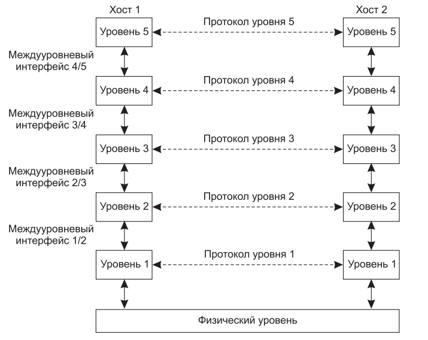
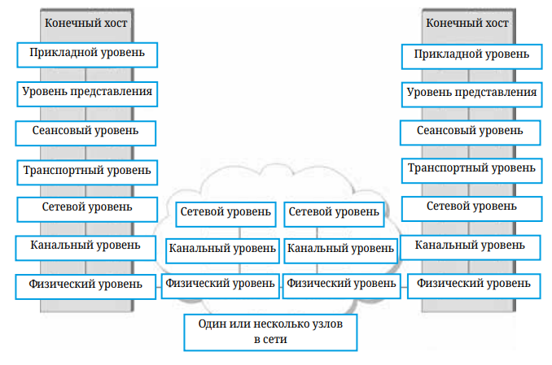

# Архитектура

Мы сформулировали внушительный набор требований к проектированию сетей. Сеть должна быть:
- Универсальной
- Экономически эффективной
- Создавать справедливое и надежное соединение между большим количеством компьютеров
- Адаптивной к изменениям
- Управляемой

Помимо выдвинутых требований сама по себе передача данных от одного компьютера к другому, представляет собой сложную техническую задачу, даже если они соединены напрямую. А это обычно не так, компьютеры обычно не соединяются напрямую, мы можем это увидеть просто понаблюдав за теми компьютерными сетями, которыми пользуемся каждый день, более того, зачастую они ещё и находятся на значительном географическом удалении. 

## Иерархия протоколов 

Для упрощения структуры и проектирования большинство сетей организуются в наборы уровней или слоев, каждый последующий возводится над предыдущим. Количество уровней, их названия, содержание и назначение разнятся от сети к сети. Однако во всех сетях целью каждого уровня является предоставление неких сервисов для вышестоящих уровней. При этом от них скрываются детали реализации предоставляемого 
сервиса.

Таким образом применяются две концепции: 
- Разделяй и властвуй. Одна сложная задача разбивается на несколько простых задач, каждая из которых решается по отдельности. 
- Абстракция - это сокрытие деталей реализации за четко определенным интерфейсом. 

> Другими словами, мы прячем внутреннее устройство какого-то объекта за простым и понятным интерфейсом, через который с этим объектом можно взаимодействовать. Мы можем менять внутреннее устройство объекта удобным нам способом, оставляя неизменным внешний интерфейс. Отдельным задачам, которые мы получили применив принцип "разделяй и властвуй" вовсе необязательно знать, каким именно способом были решены их соседи. 

Уровень n одной машины поддерживает связь с уровнем n другой машины. Правила и соглашения, используемые в данном общении, называются протоколом уровня n. 
По сути, протокол является договоренностью общающихся сторон о том, как должно происходить общение. По аналогии, когда женщину представляют мужчине, она может 
протянуть ему свою руку. Он, в свою очередь, может принять решение либо пожать, либо поцеловать эту руку, в зависимости от того, является ли эта женщина американским адвокатом на деловой встрече или же европейской принцессой на официальном балу. Нарушение протокола создаст затруднения в общении, а может и вовсе сделает общение невозможным.

В действительности, данные не пересылаются с уровня n одной машины на уровень n другой машины. Вместо этого каждый уровень передает данные и управление 
уровню, лежащему ниже, пока не достигается самый нижний уровень. Ниже первого уровня располагается физическая среда, по которой и производится обмен информацией. На рисунке виртуальное общение показано пунктиром, тогда как физическое — сплошными линиями.

Между каждой парой смежных уровней находится интерфейс, определяющий 
набор примитивных операций, предоставляемых нижним уровнем верхнему. Ясно и чётко определённые интерфейсы позволяют минимизировать количество информации между уровнями, а также позволяют изменять или даже полностью заменять содержимое уровня и реализацию его протоколов, не затрагивая другие уровни. 

> Список протоколов, используемых системой, по одному протоколу на уровень, называется стеком протоколов.

Рассмотрим технический пример на примере 5-уровневой модели. Сообщение М производится приложением работающим на уровне 5, и передаётся уровню 4 для передачи. Уровень 4 добавляет к сообщению заголовок для идентификации сообщения и передаёт результат уровню 3. Заголовок включает управляющую информацию, например адреса, позволяющие уровню 4 принимающей машины доставить сообщения. Другими примерами управляющей информации, используемой в некоторых уровнях, являются порядковые номера (на случай если нижний уровень не сохраняет порядок сообщений), размеры и время. 

Во многих сетях сообщения, передаваемые на уровне 4, не ограничиваются по размеру, однако такие ограничения почти всегда накладываются протоколом следующего уровня. Следовательно, уровень 3 должен разбить входящие сообщения на более мелкие единицы - пакеты, добавляя к каждому пакету заголовок уровня 3. В данном примере сообщение М вместе с заголовком уровня 4 разбивается на две части Н1М1 и М2.

Уровень 3 решает, какую из выходных линий использовать, и передаёт пакеты уровню 2. Уровень 2 добавляет в примере к каждому пакету не только заголовок, но также и концевик (трейлер), после чего передаёт сообщение уровню 1 для физической передачи. 

На узле-получателе сообщение двигается по уровням вверх, при этом заголовки убираются на каждом уровне по мере продвижения сообщения. То есть заголовки нижних уровней более высоким уровням не передаются. 

> Сетево́й протоко́л — набор правил и действий (очерёдности действий), позволяющий осуществлять соединение и обмен данными между двумя и более включёнными в сеть устройствами.
> 
> Сетевая модель — теоретическое описание принципов работы набора сетевых протоколов, взаимодействующих друг с другом.
> 
> Инкапсуляция – это процесс передачи данных с верхнего уровня вниз (по стеку протоколов) к нижнему уровню, чтобы быть переданными по сетевой физической среде. Причём на каждом уровне различные протоколы добавляют к передающимся данным свою информацию.
>
> Декапсуляция — это процесс извлечения управляющей информации на каждом уровне модели, начиная с нижнего и передача данных на уровень выше. 

## Службы с установлением и без установления соединений

Уровни могут предлагать своим вышестоящим соседям услуги двух типов: с наличием или отсутствием соединения. 

Типичным примером сервиса с установлением соединения является телефонная связь. Чтобы поговорить с кем-нибудь, необходимо поднять трубку, набрать номер, а после окончания разговора положить трубку. Нечто подобное происходит и в компьютерных сетях: при использовании сервиса с установлением соединения абонент сначала устанавливает соединение, а после окончания сеанса разрывает его. Перед началом передачи отправляющий и принимающий узел обмениваются приветствиями, отсылая друг-другу приемлемые параметры соединения: максимальный размер сообщения, необходимое качество сервиса и т.д. 

Противоположный пример - сервисы без установления соединения, типичный пример - почтовые системы. Каждое письмо содержит полный адрес назначения и проходит по некому маршруту, который совершенно не зависит от других писем.

# Эталонные модели

Обсудив многоуровневые модели в общих чертах, можно рассмотреть несколько примеров таких моделей. 

## 7-уровневая модель OSI

ISO (международная организация по стандартизации) была одной из первых организаций, которая формально определила модель сети. Их архитектура называется OSI (взаимодействие открытых систем). 
Несмотря на то, что протоколы, которые создавались для эталонной модели OSI сейчас не используется, сама модель до сих пор актуальна. 

Модель OSI определяет разделение сети на семь уровней, где один или несколько протоколов реализует функциональность, назначенную данному уровню.

Рассмотрим уровни начиная с самого нижнего:
- Физический уровень обрабатывает передачу сырых битов по физическому каналу.
- Канальный уровень затем собирает поток битов в более крупную сущность называемую кадров. Сетевые адаптеры вместе с драйверами устройств, работающими в ОС узла, обычно реализуют уровень каннала. 
- Сетевой уровень обрабатывает маршрутизацию между узлами в сети с коммутацией пакетов. На этом уровне единица данных, которой обмениваются узлы, обычно называется пакетом, а не кадром. 
> Нижние три уровня реализуются на всех сетевых узлах, включая коммутаторы в сети и хосты.
- Транспортный уровень реализует гарантированную доставку. В модели OSI транспортный уровень обеспечивает сквозную доставку между пользовательскими приложениями на узлах. Единица данных, которая передается на транспортном уровне называется сегментом или сообщением. Транспортный уровень обычно работает только на оконечных узлах. 
- Перепрыгнув к верхнему (седьмому) уровню мы находим прикладной уровень. Протоколы прикладного уровня включат например HTTP. Тут по сути реализуются конечные приложения, которыми мы пользуемся.
- Ниже прикладного уровня находится уровень представления, который занимается форматом данных. Например, определяет длину целого числа, передается ли старший байт первым или последним. 
- И наконец сеансовый уровень, который позволяет пользователям различных компьютеров устанавливать сеансы связи друг с другом. 

## Эталонная модель TCP\IP 

Посмотрим теперь эталонную модель Интернета, или модель TCP/IP. В отличие от модели OSI, которая в первую очередь интересна своим разбиением на уровни, модель TCP/IP важна своими протоколами, потому что они реально используются в компьютерных сетях и составляют основу современного интернета. 

- Нижний, канальный уровень, или в другой терминологии уровень доступа. Тут находится множество протоколов и технологий реализующих прямое подключение между узлами в сети, такие как Ethernet или WiFi.
- Следующий уровень состоит из одного протокола — Интернет-протокола (Internet Protocol, IP). Этот протокол поддерживает взаимосвязь множества сетевых технологий в одну логическую интерсеть.
- Уровень выше IP содержит два основных протокола — протокол управления передачей (Transmission Control Protocol, TCP) и протокол пользовательских дейтаграмм (User Datagram Protocol, UDP). TCP и UDP предоставляют альтернативные логические каналы для приложений: TCP обеспечивает надежный канал передачи байтового потока, а UDP предоставляет ненадежный канал доставки дейтаграмм (дейтаграмму можно рассматривать как синоним сообщения).
- Над транспортным уровнем работает ряд прикладных протоколов, таких как HTTP, FTP, Telnet (удаленный вход) и протокол простой передачи почты (Simple Mail Transfer Protocol, SMTP), которые обеспечивают взаимодействие популярных приложений. 

# Производительность

Производительность сети измеряется двумя основными способами:
- Пропускной способностью (Bandwidth и Throughput).
- Задержкой.

Под пропускной способностью в компьютерных сетях обычно понимается количество бит, которые могут быть переданы по сети за определенный период времени. Например, если сеть имеет пропускную способность в 10 мбит/с, то это значит, что она способна передавать 10 миллионов бит в секунду. 
- 1000 бит в секунду - 1 кбит/с
- 10000000 бит в секунду - 1000 кбит/с - 1 мбит/с
- 1000000000 бит/с - 1000000 кбит/с - 1000 мбит/с - 1 гбит/с

Есть тонкая грань между терминами Bandwidth и Throughput. На русский наиболее точно их можно перевести как пропускная способность (Bandwidth) и реальная пропускная способность (Throughput).
Пропускная способность - она же ширина канала - это максимальная скорость, которую мы можем получить по каналу связи. Например, 1000Base Ethernet позволяет получить пропускную способность в 1 гбит/с.
Но поскольку в силу различных обстоятельств не всегда получается полностью реализовать возможности пропускной способности, реальная пропускная способность может быть ниже. 

Второй показатель производительности, задержка (Latency или Delay), соответствует времени, необходимому для передачи сообщения от одного конца сети до другого. Задержка измеряется исключительно во времени. В большинстве ситуаций нам важнее знать сколько времени требуется, чтобы отправить сообщение от одного конца сети до другого и обратно, а не только в одну сторону. Это называется временем кругового путешествия (round trip time) или просто RTT.

Ещё одним важным элементом измерения производительности сети является Jitter (на русский дословно переводится как "Дрожание", но обычно так и говориться джиттер). 

> Джиттер (Jitter) - это изменение во времени доставки пакетов данных, характеризующееся колебаниями задержек между последовательно передаваемыми пакетами.

Чтобы лучше понять, что такое джиттер, представьте себе приложение, которое отправляет пакет каждые 30 мс., например видео приложение, передающее кадры. Если пакеты прибывают на место назначения с интервалом в 30 мс, то можно сделать вывод, что все пакеты испытали одинаковую задержку при передаче по сети. Однако если интервал между прибытием пакетов на место назначения (inter packet gap) изменяется, то задержка испытываемая последовательностью пакетов была разная. Вот эта разность между задержкой для разных пакетов одного потока называется джиттером.

