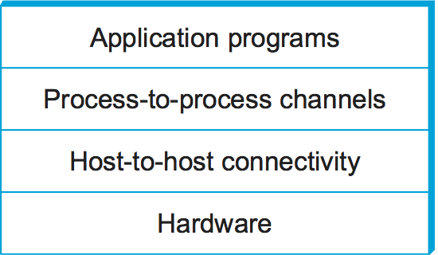
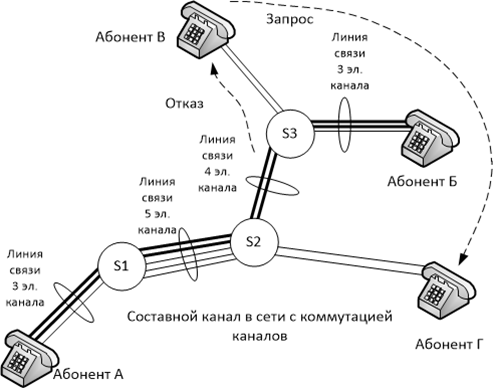

# Архитектура

Мы сформулировали внушительный набор требований к проектированию сетей. Сеть должна быть:
- Универсальной
- Экономически эффективной
- Создавать справедливое и надежное соединение между большим количеством компьютеров
- Адаптивной к изменениям
- Управляемой

Помимо выдвинутых требований сама по себе передача данных от одного компьютера к другому, представляет собой сложную техническую задачу, даже если они соединены напрямую. А это обычно не так, компьютеры обычно не соединяются напрямую, мы можем это увидеть просто понаблюдав за теми компьютерными сетями, которыми пользуемся каждый день, более того, зачастую они ещё и находятся на значительном географическом удалении. 

Отличным алгоритмом в решении таких комплексных инженерных задач себя зарекомендовал принцип "Разделяй и властвуй". Его суть состоит в том, чтобы не пытаться решить проблему с наскока, а разделить на отдельные подзадачи или группы подзадач и решать каждую из них по отдельности.
В качестве примера рассмотрит автомобиль, построение которого тоже представляет собой сложную инженерную задачу. 
- Есть задача преобразовать топливо в движение. Её решением служит двигатель. 
- Есть задача управлять крутящим моментом и скоростью движения. Её решает уже не двигатель, а коробка передач. 
- Есть задача передать крутящий момент на колеса. Этим занимается трансмиссия. 
- И есть задача превратить крутящий момент в движение автомобиля по дороге - этим занимаются колеса. 

Другим фундаментальным принципом, который используют разработчики сложных систем является абстракция. Абстракция - это сокрытие деталей реализации за четко определенным интерфейсом. 
Идея абстракции заключается в том, чтобы определить модель, которая отражает важный аспект системы, инкапсулировать эту модель в объект, предоставляющий интерфейс для взаимодействия с другими компонентами системы, и скрыть детали реализации этого объекта от тех, кто его использует.

Другими словами, мы прячем внутреннее устройство какого-то объекта за простым и понятным интерфейсом, через который с этим объектом можно взаимодействовать. Мы можем менять внутреннее устройство объекта удобным нам способом, оставляя неизменным внешний интерфейс. Отдельным задачам, которые мы получили применив принцип "разделяй и властвуй" вовсе необязательно знать, каким именно способом были решены их соседи. 
Опять в качестве примера возьмём автомобиль. Двигатель ничего не "знает" о коробке передач и том как она устроена внутри. У него есть интерфейс в виде маховика с диском сцепления и больше ему ничего не нужно. Точно также коробка передач ничего не знает о внутреннем устройстве двигателя, о свечах, цилиндрах и прочем. У неё точно так же интерфейс в виде диска сцепления. 
Если мы заменим коробку передач на другую, то двигатель этого не заметит, точно также коробка не заметит, что мы поменяли что-то в двигателе. Потому что мы оставим неизменным внешние интерфейсы, через которые они взаимодействуют. 

<!-- Хорошим пример тут будет вождение автомобиля. Сам по себе автомобиль сложная система, внутри состоящая десятков взаимосвязанных агрегатов. Но нам как водителю, чтобы управлять автомобилем, достаточно педалей и руля. Педали и руль в данном случае выступают интерфейсом автомобиля. Если мы пересядем с бензиновой машины на электромобиль, то есть изменим внутреннюю реализацию нашего объекта, то интерфейс никак не изменится, руль и педали останутся на месте.  -->

Именно эти два принципа (разделение одной большой задачи на несколько подзадач и абстракция) в итоге использовали разработчики компьютерных сетей. Они не стали упаковывать компьютерные сети в одну глобальную гипертехнологию, которая пытается решить всё и сразу, вместо этого они разделили сети на отдельные уровни, каждый из которых решает свой определённый набор задач. 

Собранные вместе эти уровни представляют собой так называемые многоуровневые модели (или архитектуры) сети.

## Многоуровневая модель

Уровни в многоуровневой модели будут организованы в стэк. Стэк представляет собой список элементов организованных по принципу LIFO (last in - first out). Представьте себе это как коробку, в которую вы слоями складываете вещи. Чтобы потом получить доступ к вещам на дне - сначала нужно будет достать всё, что лежит сверху.

Простейшую сетевую модель можно представить как четыре слоя абстракции, где в самом низу будет находиться аппаратное обеспечение, а на самом верху прикладная программа, которой пользуется конечный пользователь. Уровень, находящийся над аппаратным обеспечением, будет обеспечивать соединение между узлами (host to host connectivity), абстрагируясь от того факта, что между двумя узлами может существовать сколь угодно сложная сетевая топология. Следующий уровень строится на основе уже доступной связи между узлами (которую ему предоставил уровень ниже), и обеспечивает каналы между процессами (то есть конкретными программами), абстрагируясь, например, то того, что между узлом источника и узлом получателя вообще есть какая-то сеть.

Общая идея многоуровневой модели состоит в том, что каждый уровень реализует свой интерфейс и является поставщиком услуг для уровня выше, сам в свою очередь опираясь на услуги, которые предоставляет уровень ниже. 

Так в модели, которую мы рассмотрели выше, уровень прикладной программы — пускай это будет браузер — реализует интерфейс, через который мы, как пользователи, взаимодействуем с сетью.
Затем уровень прикладной программы через интерфейс, который создает уровень каналов между процессами, воспользуется его услугами. Уровень каналов между процессами точно также воспользуется услугами уровня связи между узлами. А тот в свою очередь воспользуется услугами аппаратного уровня. 

При этом важно отметить, что каждый из уровней считает, что он напрямую взаимодействует с соответствующим партнёром на удалённом узле, игнорируя тот факт, что эта связь на самом деле косвенная, через уровни ниже. Каждый, кроме аппаратного, где партнёры действительно общаются напрямую по физической среде.

В процессе передачи данных вниз по стеку сетевой модели каждый уровень будет воспринимать сообщения от вышестоящего уровня как сырые данные, не особо интересуясь их содержимым. Причём каждый уровень будет добавлять к этим данным свою служебную информацию. Этот процесс - передача данных от верхнего уровня и добавление к ним служебной информации называется инкапсуляцией. 

Давайте попробуем рассмотреть аналогию, что бы лучше понять эту концепцию:
- Допустим директор предприятия А пишет письмо директору предприятия Б. Он пишет письмо и передаёт секретарю, то есть пользуется услугами, которые предоставляет секретарь. 
- Секретарь здесь выступает уровнем ниже директора. Секретарь получает письмо от директора, оформляет его согласно внутренним правилам и помещает в конверт с адресом секретариата предприятия Б. Заметьте, секретарь А не пытается передать письмо напрямую получателю, то есть директору Б. Вместо этого он взаимодействует со своим одно уровневым партнёром на удалённой стороне.
- Затем секретарь А вызывает курьера. Курьер получает письмо, читает, что его нужно отнести на предприятие Б. Строит себе физический маршрут между предприятиями и несет туда письмо. По прибытию отдаёт его в секретариат.
- После получения письма секретарь предприятия Б извлекает его из конверта, обрабатывает служебную информацию и физически передаёт письмо директору Б.

Если провести параллели между этой аналогией и простейшей моделью на картинке, то мы можем сказать, что:
- Директора - это уровень связь между процессами.
- Секретари - уровень связи между узлами.
- Курьер - это уровень аппаратного обеспечения.

В этом примере каждый из уровней считает, что напрямую взаимодействует со своим одноранговым партнером на удалённой стороне. Директор с директором, секретарь с секретарём, при это каждый уровень использует услуги нижнего, для решения своих задач. И только курьер действует напрямую, так как осуществляет физическую связь.
Тут же мы видим пример инкапсуляции. Секретарь, получив письмо от вышестоящего уровня (директора), упаковывает его в конверт и указывает на конверте свои служебные данные. 

**определения**

## Протоколы

<!-- Слишком сложно
## Уровни

Абстракции естественным образом ведут к разделению на уровни (слои), особенно в сетевых системах. Общая идея состоит в том, что вы начинаете со служб (сервисов), предлагаемых аппаратным обеспечением, а затем добавляете последовательность уровней, каждый из которых предоставляет более высокий (более абстрактный) уровень обслуживания. Услуги, предоставляемые на верхних уровнях, реализуются с помощью услуг, предоставляемых нижними уровнями.

Опираясь на требования, которые мы обсудили ранее, мы можем представить себе простую модель сети, в виде двух слоёв абстракции, зажатых между прикладной программой и аппаратным обеспечением. Уровень непосредственно находящийся на аппаратным, в данном случае будет обеспечивать соединение между узлами (host to host connectivity), абстрагируясь от того факта, что между двумя узлами может существовать сколь угодно сложная сетевая топология. 

Следующий уровень строится на основе уже доступной связи между узлами (которую ему предоставил уровень ниже), и обеспечивает каналы между процессами (то есть конкретными программами), абстрагируясь, например, то того, что между узлом источника и узлом получателя вообще есть какая-то сеть, или от того, что эта сеть может время от времени терять сообщения. 

Многоуровневый подход даёт нам два полезных преимущества. Во-первых, она разбивает задачу построения сети на более простые компоненты. Вместо того чтобы создавать монолитное программное обеспечение, выполняющее абсолютно все возможные задачи, вы можете реализовать несколько уровней, каждый из которых решает отдельную часть общей проблемы. Во-вторых, это обеспечивает более модульную структуру. Если вы решите добавить какую-то новую службу, вам, возможно, потребуется изменить функциональность только на одном уровне, повторно используя функции, предоставляемые всеми остальными уровнями.

Однако представление системы в виде линейной последовательности уровней является упрощением. Зачастую на любом заданном уровне системы предоставляется несколько абстракций, каждая из которых предлагает различные услуги для более высоких уровней, но строится на одних и тех же низкоуровневых абстракциях. Чтобы убедиться в этом, вспомните два типа каналов, обсуждавшихся в предыдущем разделе. Один предоставляет услугу типа «запрос-ответ» (request/reply), а другой поддерживает службу потока сообщений (message stream). Эти два канала могут быть альтернативными вариантами на каком-то уровне многоуровневой сетевой системы, как показано на рисунке:

Каждый уровень 

## Протоколы

Сетево́й протоко́л — набор правил и действий (очерёдности действий), позволяющий осуществлять соединение и обмен данными между двумя и более включёнными в сеть устройствами.

Теперь давайте рассмотрим объекты, из которых состоят сетевые уровни. Их мы будем называть *протоколами*. Протокол с точки зрения многоуровневой модели сети представляет собой службу связи, которую объекты более высокого уровня (такие как прикладные приложения или протоколы более высокого уровня) используют для обмена сообщениями. Например, мы можем представить сеть, поддерживающую протокол «запрос-ответ» (request/reply protocol) и протокол потока сообщений (message stream protocol), соответствующих рассмотренным выше каналам.

Каждый протокол  -->